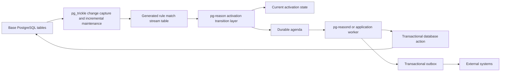
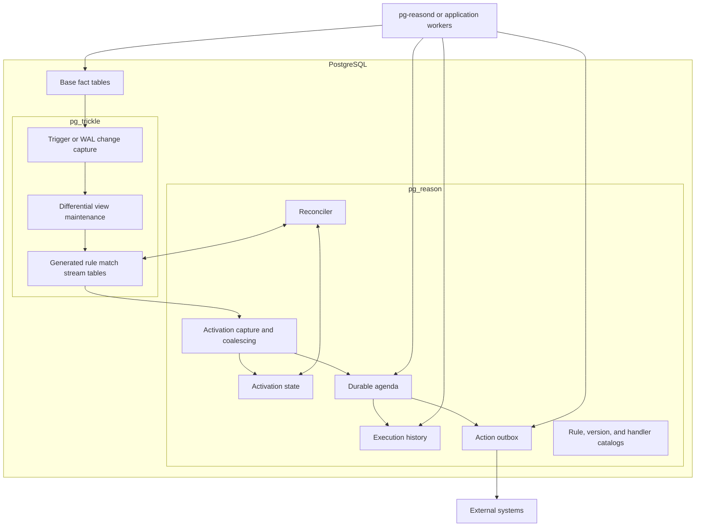
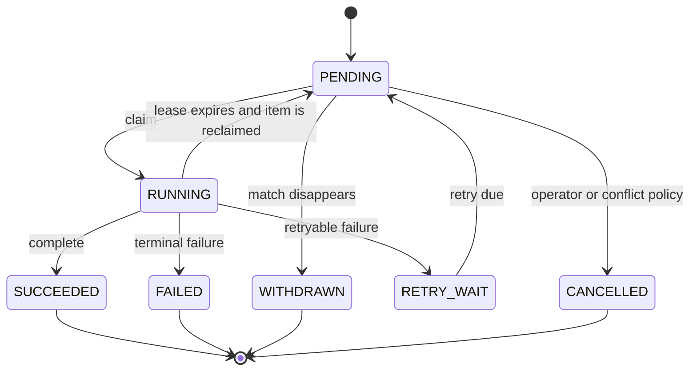

# `pg-reason`: A PostgreSQL-Native Incremental Rule and Reasoning Engine

**Status:** Proposed design  
**Document version:** 0.2  
**Date:** 2026-08-07  
**Project and repository name:** `pg-reason`  
**PostgreSQL extension name:** `pg_reason`  
**Rust crate name:** `pg_reason`  
**Public SQL schema:** `pgreason`  
**Generated runtime schema:** `pgreason_runtime`  
**Private catalog schema:** `pgreason_internal`  
**Optional worker process:** `pg-reasond`  
**Implementation language:** Rust  
**PostgreSQL extension framework:** `pgrx`  
**Required dependency:** `pg_trickle`  
**Initial platform target:** PostgreSQL 18, aligned with the supported `pg_trickle` and `pgrx` versions

> The project is branded as **pg-reason**, but PostgreSQL extension names, Rust crate names, SQL schemas, and internal symbols use underscores or unquoted identifiers. Users therefore install it with `CREATE EXTENSION pg_reason`, call functions in the `pgreason` schema, and may run the companion binary as `pg-reasond`.

---

## Reading guide

This document describes both the product semantics and the implementation architecture. The first part explains what a rule means, how a continuously maintained SQL result becomes an activation, and how command rules are scheduled and executed. The middle part describes the SQL API, the catalog, the integration contract with `pg_trickle`, and the behavior during full refreshes, crashes, and rule upgrades. The final part covers the Rust codebase, worker process, security model, testing strategy, phased delivery plan, risks, and a complete end-to-end example. Readers who only need the product model can focus on Sections 1 through 12, while implementers should also read the remaining sections in order because later decisions build on earlier semantic guarantees.

---

## 1. Executive summary

`pg-reason` is a separate PostgreSQL extension that turns the changing result of an SQL query into durable rule state. A rule contains a declarative query that describes every situation in which the rule is currently true, together with an optional consequence that should be scheduled when a match first becomes true. The query is maintained by `pg_trickle`, which already knows how to incrementally propagate inserts, updates, and deletes through filters, joins, aggregates, subqueries, windows, and supported recursive computations. `pg-reason` does not replace that engine and does not implement RETE internally. Instead, it adds the production-rule concepts that incremental view maintenance deliberately does not provide: stable activation identity, detection of false-to-true and true-to-false transitions, refraction, priorities, conflict handling, a durable agenda, leases and retries, action execution, rule versioning, recovery, and audit history.

The central design separates current truth from historical work. Each active rule version owns a generated `pg_trickle` stream table whose rows represent the matches that are true now. `pg-reason` mirrors the semantic state of those matches in an activation table and records command work in an agenda table. When a new match appears, the activation moves from inactive to active and a command rule may create one agenda episode. When the same match remains true but its payload changes, the activation is updated without firing again by default. When the match disappears, pending work may be withdrawn, but completed execution history remains intact. This separation makes the system understandable: the match table answers “what is true now?”, activation state answers “how has this match evolved?”, and the agenda answers “what work was requested and what happened to it?”.

The extension is implemented in Rust with `pgrx`, stores all authoritative state in PostgreSQL, and integrates with `pg_trickle` through a versioned SQL contract rather than through Rust ABI linkage. A companion Rust process, `pg-reasond`, is recommended for claiming and executing agenda work. Database-local actions can run transactionally through registered PostgreSQL functions, while external effects such as HTTP calls, email, message publication, and LLM requests are represented through an idempotent transactional outbox. This keeps slow or non-transactional work outside PostgreSQL refresh transactions and gives operators durable retry, lease, and failure semantics.

The initial production scope contains two rule kinds. A **constraint rule** continuously exposes all current matches and is useful for live policy violations, data-quality findings, and operational conditions. A **command rule** additionally creates durable agenda episodes on rising edges and is useful for creating tasks, emitting events, requesting classifications, or invoking database handlers. A later derivation layer can add logical support, truth maintenance, and fixed-point reasoning, allowing multiple rules to justify the same derived fact without prematurely retracting it when one justification disappears.



---

## 2. Why this project should exist

`pg_trickle` already provides the hardest and most general part of relational rule matching. It captures source changes, generates delta queries from an operator tree, maintains derived tables, orders dependent refreshes, and persists the result inside PostgreSQL. If an application needs to know which high-risk customers have large orders, which invoices are overdue without approval, or which services have violated an error-rate threshold, the condition can already be expressed as SQL and maintained incrementally. Reimplementing those relational operations in a second engine would duplicate parsing, planning, indexing, persistence, recovery, and a large body of correctness work.

A rule runtime must nevertheless answer questions that a maintained view should not answer. It must know whether a match is new or merely still present, whether that activation has already fired, which pending activation has priority, whether two actions for the same account may run concurrently, what should happen when a condition disappears before execution, and how a crashed worker can safely retry without creating duplicate external effects. It also needs immutable rule versions, audit trails, reconciliation after full rebuilds, and a way to explain why an action was requested. These concerns are not query-maintenance operators; they are runtime and application semantics. Keeping them in a separate extension allows `pg_trickle` to remain a general incremental view engine while `pg-reason` can evolve around rule-specific concepts.

The resulting architecture is more general than a classical RETE clone. The left-hand side of a rule is ordinary PostgreSQL SQL, so it can naturally use rich relational features instead of being constrained to a custom pattern language. At the same time, the runtime still provides familiar production-system behavior such as activations, priorities, refraction, agenda groups, conflict resolution, and a feedback loop in which successful actions may write new facts that later cause additional rules to match. The system therefore sits between an incremental database, a durable production-rule runtime, and a future Datalog-like reasoning layer.

---

## 3. Scope, goals, and non-goals

The primary goal is to provide a PostgreSQL-native rule system whose behavior remains deterministic, durable, and inspectable even when source data, rule definitions, workers, or the database itself change. Every authoritative object—rule definitions, activation state, agenda episodes, attempts, leases, and outbox entries—must live in PostgreSQL so that normal transactions, backups, replication, and point-in-time recovery apply. Activation identity must be based on declared semantic keys rather than on physical row identifiers. Match-to-agenda transitions must be transactional, workers must claim work safely under concurrency, and external actions must be retryable through deterministic idempotency keys. The extension must remain useful even when no worker is running, because constraint rules should continue to expose current maintained findings as queryable relations.

The design also aims to leave a clean path toward richer reasoning. Future releases should be able to represent logical support for derived facts, evaluate monotone rule sets to a fixed point, apply stratified negation, maintain temporal rules, coordinate LLM tasks, and share expensive common conditions. These capabilities should extend the same core model rather than requiring a second execution architecture. In particular, a future derivation rule should still be compiled into maintained relational state, and a future support graph should still use PostgreSQL transactions and `pg_trickle` dependency management.

The first production release deliberately avoids several tempting expansions. It will not implement RETE or DBSP again, will not provide a CLIPS- or Drools-compatible parser, and will not attempt to hide PostgreSQL concepts from rule authors. It will not execute arbitrary remote calls inside backend processes, promise exactly-once behavior for unrelated external systems, infer a semantically correct activation key for every possible SQL query, or guarantee the exact one-activation-at-a-time global ordering of a classical single-threaded production system. It will also avoid depending on private `pg_trickle` catalogs, Rust types, or `__pgt_*` columns. Those boundaries keep the first release focused on correctness and make the dependency relationship maintainable.

---

## 4. Core concepts and terminology

A **rule** is the stable logical object that users name, own, enable, pause, replace, and inspect. A rule has one or more immutable **rule versions**, because changing the query, key definition, handler, or firing policy changes the meaning of past and future executions. Each rule version has a **match query**, which is an SQL `SELECT` describing all current situations in which the rule is true. The compiler wraps this query and asks `pg_trickle` to maintain a generated **match stream table**. Every row in that relation is a current **activation**.

An activation is identified by user-declared **activation key columns**. These columns should describe the semantic object or tuple to which the rule applies, such as an `order_id`, an `(account_id, policy_id)` pair, or a `(tenant_id, invoice_id, reminder_stage)` tuple. `pg-reason` converts the typed key values and the rule-version identifier into a deterministic **activation ID**. The ID is stable while that rule version remains active and does not change when unrelated payload fields change, when indexes are rebuilt, when PostgreSQL restarts, or when `pg_trickle` changes its internal row hashing strategy.

A continuous interval during which one activation remains true is an **episode**. The transition from absent to present is a **rising edge**, the transition from present to absent is a **falling edge**, and a payload change while the activation remains present is an **update**. A command rule normally creates one agenda episode on the rising edge and does not create another while the same activation remains continuously true. This behavior is called **refraction**. If the activation later becomes false and then true again, a new episode is created even though the stable activation ID is the same.

The **agenda** is the durable set of command episodes that are pending, leased, retrying, completed, failed, withdrawn, or cancelled. **Salience** is the priority assigned to a rule or an individual match. An **agenda group** is a routing label such as `risk`, `billing`, or `llm`. A **conflict key** identifies actions that should not run concurrently, such as all work for the same account. A **handler** describes how an episode is processed, either by invoking a registered database function, by creating an outbox message, or by leaving it for a manual or application-specific consumer.

**Reconciliation** is the process of comparing the generated match relation with durable activation state and repairing any differences. It is required after initialization, full refresh, reinitialization, restore, or any event in which per-row semantic transitions might not have been observed. A **frontier** is the `pg_trickle` progress marker associated with a completed refresh and is recorded for correlation and recovery. Later derivation features will add **supports**, where one activation justifies a derived fact, and **truth maintenance**, where that fact remains true for as long as at least one active support remains.

---

## 5. Design principles

### 5.1 Matching is declarative, while consequences are explicit

The condition side of a rule is a pure relational query. It can select, filter, join, aggregate, use subqueries, and use any other construct that the selected `pg_trickle` mode can maintain correctly. The consequence side is not arbitrary code embedded after a textual `THEN`. Instead, a command rule refers to a registered handler with a declared execution kind, owner, role, retry policy, and timeout. This separation gives the compiler a stable query boundary and gives the runtime a clear security and failure boundary.

### 5.2 Current truth is different from historical work

A generated match table and the activation-state catalog represent what is true now. The agenda and execution history represent what work was requested and what occurred in the past. If a match disappears, its current activation is deactivated, but a task that already ran must remain in the audit history. Treating these as separate relations avoids a common mistake in simple trigger-based systems, where deleting current state accidentally erases or obscures the reason an earlier action happened.

### 5.3 Public identity must survive implementation changes

A stable activation cannot depend on whether `pg_trickle` happened to express a semantic change as an SQL `UPDATE`, a `DELETE` followed by an `INSERT`, or a complete rebuild. It also cannot depend on relation OIDs, index layouts, hidden columns, or an internal row hash. `pg-reason` therefore generates activation identity from the rule version and the declared typed key values. Physical storage may change while the semantic identity remains understandable and testable.

### 5.4 External effects are at-least-once and idempotent

PostgreSQL cannot atomically commit its transaction together with an unrelated HTTP API, email server, or model endpoint without a distributed transaction protocol. `pg-reason` therefore commits an outbox entry and the episode state in one PostgreSQL transaction, then allows a separate consumer to deliver the message at least once. Every external action receives a deterministic idempotency key. This design is honest about failure modes and makes duplicate delivery manageable instead of hiding it behind an impossible exactly-once promise.

### 5.5 Rule versions are immutable

The query, key columns, handler, salience rules, and firing semantics of a deployed version are never edited in place. A change creates a new version that is compiled and initialized alongside the active one, then activated through a controlled cutover. Immutable versions make execution history meaningful, allow rollback, and prevent ambiguous situations in which an old episode is interpreted using a newly edited rule.

### 5.6 Epochal execution is the default

A traditional production system may select one activation, execute it immediately, update facts, and then select the next activation on the same call stack. `pg-reason` instead uses explicit transaction and refresh boundaries. Source changes commit, `pg_trickle` refreshes maintained match relations, `pg-reason` records activation transitions and agenda work, and workers execute that work in later transactions. Any new facts written by handlers are processed by a later refresh. This epochal model is easier to batch, parallelize, audit, recover, and reproduce. A stricter single-step mode can be explored later for workloads that truly depend on classical firing order.

---

## 6. High-level architecture

The system is divided into three layers inside PostgreSQL and one optional process outside it. Base tables remain the application’s authoritative facts. `pg_trickle` observes those tables and maintains generated rule-match stream tables. `pg-reason` observes the semantic contents of those match tables, keeps activation state, creates or withdraws agenda episodes, records execution attempts, and writes outbox messages. The optional `pg-reasond` process claims agenda work and invokes the database-side execution functions. Because the worker is stateless, multiple instances can run concurrently and PostgreSQL remains the single source of truth.



The extension uses three SQL schemas. `pgreason` contains the supported public types, functions, and views. `pgreason_runtime` contains generated match stream tables and, later, generated shared conditions. `pgreason_internal` contains catalogs, buffers, agenda tables, outbox tables, and internal functions. Users may inspect public views but should never write directly to the runtime or internal schemas. Generated runtime relation names are deliberately not part of the compatibility contract, because the compiler may change naming or sharing strategies in later releases.

The core extension does not need its own postmaster background worker. Command episodes can be processed by `pg-reasond`, by application workers that call the supported claim and completion functions, or eventually by an optional PostgreSQL worker for carefully restricted SQL-only handlers. Keeping the recommended worker outside the server avoids another `shared_preload_libraries` requirement and ensures that network calls, long-running model requests, and other unpredictable work do not block PostgreSQL backend processes.

---

## 7. Rule kinds

### 7.1 Constraint rules

A constraint rule continuously maintains the set of rows that satisfy or violate a condition. The result itself is the product; no agenda or worker is required. A security team might define all large refunds that do not have approval, a data platform might define malformed records, and an operations team might define all services currently outside an SLA. Applications can query the stable `pgreason.current_matches` interface, dashboards can count or group the matches, and operators can inspect the generated typed relation when deeper diagnostics are needed.

```sql
SELECT o.id AS order_id,
       o.customer_id,
       o.amount
FROM orders AS o
JOIN customers AS c ON c.id = o.customer_id
WHERE o.amount > 10000
  AND c.risk = 'high';
```

### 7.2 Command rules

A command rule uses the same maintained match model but creates durable work when an activation has a rising edge. For example, the first time order 42 becomes both large and associated with a high-risk customer, the rule may create one manual-review task. Increasing the order amount while the condition remains true updates the current bindings but does not create another task under the default policy. If the condition later becomes false and then true again, a new episode is created. Command rules are suitable for task creation, event publication, notifications, database transitions, and requests to external systems such as an LLM classifier.

### 7.3 Derivation rules

A derivation rule will eventually produce logical support for a derived fact instead of scheduling an imperative action. One rule may support `Fever(patient)` because the temperature is high, while another supports the same fact because a test is positive. The derived fact remains true while at least one support exists. This is a stronger and safer model than having one rule directly insert the fact and later delete it without knowing whether another rule still justifies it. The initial release prepares the catalog boundaries needed for support and provenance but keeps derivation semantics experimental until fixed-point, deletion, and stratification behavior have been thoroughly tested.

---

## 8. Public SQL API

### 8.1 Installation and dependency validation

Users install the dependency first and then install `pg_reason`:

```sql
CREATE EXTENSION pg_trickle;
CREATE EXTENSION pg_reason;
```

The extension control file uses the PostgreSQL-safe package name and declares the dependency:

```ini
comment = 'Incremental SQL rule and reasoning engine built on pg_trickle'
default_version = '@CARGO_VERSION@'
module_pathname = 'pg_reason'
requires = 'pg_trickle'
relocatable = false
superuser = true
trusted = false
```

The `requires` field guarantees installation order but cannot express a compatible version range. The installation and startup checks therefore read `pg_extension.extversion`, compare it with the compatibility matrix compiled into `pg_reason`, and fail with a clear message when the installed `pg_trickle` line is unsupported. A public `pgreason.compatibility_status()` function exposes the detected versions and required integration capabilities.

### 8.2 Registering a database handler

A database handler is an explicitly registered PostgreSQL function with a fixed signature. It receives the activation ID, the latest bindings, and a context object that identifies the rule, episode, attempt, worker, and idempotency key. Registration records the execution role, retry policy, and timeout, so a rule cannot invoke arbitrary functions merely by naming them in its definition.

```sql
CREATE FUNCTION app.create_manual_review(
    activation_id uuid,
    bindings      jsonb,
    context       jsonb
)
RETURNS jsonb
LANGUAGE plpgsql
SECURITY INVOKER
AS $$
BEGIN
    INSERT INTO app.manual_reviews (
        activation_id,
        order_id,
        customer_id,
        reason
    )
    VALUES (
        activation_id,
        (bindings->>'order_id')::bigint,
        (bindings->>'customer_id')::bigint,
        'high-risk large order'
    )
    ON CONFLICT (activation_id) DO NOTHING;

    RETURN jsonb_build_object('created', true);
END
$$;

SELECT pgreason.register_handler(
    name            => 'create_manual_review',
    handler_kind    => 'DATABASE',
    function_name   => 'app.create_manual_review(uuid,jsonb,jsonb)'::regprocedure,
    run_as_role     => 'pgreason_worker',
    max_attempts    => 8,
    initial_backoff => interval '1 second',
    max_backoff     => interval '15 minutes'
);
```

### 8.3 Creating a command rule

The SQL-first creation API accepts one match query, a declared activation key, and optional scheduling and execution policies. The example below creates a command rule that produces one review episode for each order that first satisfies the condition. The order ID is the stable activation key, the customer ID forms the conflict key, and workers may route this work through the `risk` agenda group.

```sql
SELECT pgreason.create_rule(
    name => 'manual_review_required',
    kind => 'COMMAND',

    match_query => $rule$
        SELECT
            o.id          AS order_id,
            o.customer_id AS customer_id,
            o.amount      AS amount,
            c.risk        AS customer_risk
        FROM orders AS o
        JOIN customers AS c
          ON c.id = o.customer_id
        WHERE o.amount > 10000
          AND c.risk = 'high'
    $rule$,

    key_columns => ARRAY['order_id'],
    handler => 'create_manual_review',
    salience => 100,
    conflict_key_columns => ARRAY['customer_id'],
    agenda_group => 'risk',
    schedule => '1s',
    refresh_mode => 'DIFFERENTIAL',
    bootstrap_policy => 'SEED_CURRENT',

    options => jsonb_build_object(
        'withdrawal_policy', 'CANCEL_PENDING',
        'recheck_before_execute', true,
        'refire_policy', 'ON_REACTIVATION'
    )
);
```

### 8.4 Creating and querying a constraint rule

A constraint rule uses the same compiler but omits the handler. Existing and future matches are simply current maintained findings. The generic public function returns a stable row shape with JSONB bindings, allowing applications to query any rule without knowing the generated table schema.

```sql
SELECT pgreason.create_rule(
    name => 'unapproved_large_refunds',
    kind => 'CONSTRAINT',
    match_query => $rule$
        SELECT
            r.id AS refund_id,
            r.customer_id,
            r.amount
        FROM refunds AS r
        WHERE r.amount > 5000
          AND NOT EXISTS (
              SELECT 1
              FROM refund_approvals AS a
              WHERE a.refund_id = r.id
          )
    $rule$,
    key_columns => ARRAY['refund_id'],
    schedule => '2s',
    refresh_mode => 'DIFFERENTIAL',
    bootstrap_policy => 'SEED_CURRENT'
);

SELECT activation_id,
       activation_key,
       bindings,
       salience,
       conflict_key,
       active_since
FROM pgreason.current_matches('unapproved_large_refunds');
```

`pgreason.current_matches(name)` returns a fixed composite type containing the logical and version identifiers, activation ID, activation key, bindings, salience, conflict key, active timestamp, and payload hash. Advanced users can call `pgreason.match_relation(name)` to discover the generated typed relation for diagnostics or indexing, but its physical name is not guaranteed across versions.

### 8.5 Rule lifecycle and runtime operations

Rules are paused and resumed without deleting their definitions or history. Replacing a rule creates an immutable new version, initializes it alongside the current version, and applies an explicit deployment policy. Rollback uses the same machinery rather than merely changing a catalog pointer, because the old and new match relations may have diverged while inactive.

```sql
SELECT pgreason.pause_rule('manual_review_required');
SELECT pgreason.resume_rule('manual_review_required');

SELECT pgreason.replace_rule(
    name => 'manual_review_required',
    match_query => $rule$ ... $rule$,
    key_columns => ARRAY['order_id'],
    deployment_policy => 'PRESERVE_ACTIVE_KEYS'
);

SELECT pgreason.rollback_rule(
    'manual_review_required',
    target_version => 3
);

SELECT pgreason.drop_rule(
    name => 'manual_review_required',
    pending_policy => 'CANCEL',
    retain_history => true
);
```

Workers use supported functions rather than modifying agenda rows directly. Claiming returns a lease token, and every heartbeat, completion, or failure call must present that token so that a stale worker cannot complete work after another worker has reclaimed it.

```sql
SELECT *
FROM pgreason.claim(
    worker_id => 'worker-01',
    max_items => 50,
    lease_for => interval '30 seconds',
    agenda_groups => ARRAY['risk']
);

SELECT pgreason.heartbeat(
    episode_id => 1234,
    worker_id => 'worker-01',
    lease_token => '00000000-0000-0000-0000-000000000000'::uuid,
    extend_by => interval '30 seconds'
);

SELECT pgreason.complete(
    episode_id => 1234,
    worker_id => 'worker-01',
    lease_token => '00000000-0000-0000-0000-000000000000'::uuid,
    result => '{"created":true}'::jsonb
);
```

The main diagnostic functions are `pgreason.rule_status()`, `pgreason.agenda_status()`, `pgreason.execution_history()`, `pgreason.explain_rule()`, `pgreason.reconcile_rule()`, and `pgreason.health_check()`. Each returns stable structured information rather than requiring users to inspect private catalogs.

---

## 9. Rule definition and query contract

A rule definition records the stable rule name, kind, match query, key columns, optional handler, priority policy, agenda group, conflict-key definition, `pg_trickle` schedule and refresh mode, bootstrap behavior, and a versioned JSON options object. The match query must be exactly one `SELECT` statement with uniquely named output columns. It must return every declared key column, may not use reserved output names beginning with `__pgr_`, and must produce no more than one row for each activation key. Every key component must be non-null. Duplicate or null keys are treated as hard definition or runtime errors because ambiguous identity would make refraction and audit history unreliable.

The compiler validates statement shape with PostgreSQL’s parser, resolves output names and type OIDs through SPI, verifies that the evaluation role can read all referenced objects, checks function volatility, and asks `pg_trickle` whether the query is maintainable in the requested mode. `IMMUTABLE` functions are accepted, `STABLE` functions are accepted with explicit temporal warnings where appropriate, and `VOLATILE` functions are rejected by default. A query using `now()` or another time-dependent expression must opt into a temporal maintenance policy, because the result can change even when no source row changes.

Good activation keys identify the semantic subject of the rule and remain stable when payload fields change. An order rule should normally use `order_id`, while a policy rule might use `(customer_id, policy_id)`. Including mutable fields such as amount, status, or current timestamp in the key means that changing those values deactivates one activation and creates another. That behavior can be correct for staged reminders or threshold bands, but it must be an intentional part of the rule’s semantics.

The compiler wraps the user query and adds reserved generated columns. These include the rule-version ID, deterministic activation ID, canonical activation key, conflict key, effective salience, payload hash, and JSONB bindings. The original typed output columns remain present in the generated match relation so PostgreSQL can index and inspect them efficiently. JSONB is used at the runtime boundary, not as a substitute for typed relational processing.

A conceptual wrapper looks like this:

```sql
SELECT
    '<rule-version-uuid>'::uuid AS __pgr_rule_version_id,

    pgreason.activation_id(
        '<rule-version-uuid>'::uuid,
        jsonb_build_array(q.order_id)
    ) AS __pgr_activation_id,

    jsonb_build_array(q.order_id) AS __pgr_activation_key,

    pgreason.conflict_key(
        jsonb_build_array(q.customer_id)
    ) AS __pgr_conflict_key,

    100::integer AS __pgr_salience,
    pgreason.payload_hash(to_jsonb(q)) AS __pgr_payload_hash,
    to_jsonb(q) AS __pgr_bindings,
    q.*
FROM (
    -- user match query
) AS q;
```

The production implementation must not depend on the textual rendering of JSONB for identity. Rust code will encode each value with its type OID, null marker, byte length, and stable binary representation before hashing. This prevents changes in formatting, collation, or ambiguous concatenation from altering the activation ID.

---

## 10. Activation identity

The activation ID must be deterministic, collision-resistant, independent of physical relation OIDs, and stable across restart, replication, index rebuild, refresh-mode changes, and `pg_trickle` implementation changes. The proposed construction uses the rule-version UUID as a namespace and the typed canonical encoding of the activation key as the name. A SHA-256 digest is computed over the namespace and encoded key, the first 128 bits are stored as a UUID with an RFC-compatible variant and a private version nibble, and the complete digest may be retained for diagnostics. The generated match row also stores the human-readable activation key as JSONB, so an extremely unlikely UUID collision can be detected by comparing the canonical key and raising a hard invariant error.

A new rule version normally creates new activation IDs because the rule-version UUID is part of the namespace. This is desirable for audit clarity: an episode produced by version 4 should never be confused with one produced by version 3. When a deployment policy needs to preserve continuous activations across compatible versions, the deployment algorithm maps old and new rows using the declared canonical key schema and creates explicit continuity records. It never assumes that the version-specific UUID remains unchanged.

---

## 11. Activation transitions and semantic coalescing

The runtime recognizes four semantic outcomes. An inactive activation that is present at the end of the refresh has a rising edge. An active activation that remains present has either no meaningful change or a payload update. An active activation that is absent has a falling edge. An inactive activation that remains absent has no transition. Command behavior is based on these semantic states, not on the physical SQL statements used to maintain the generated table.

This distinction matters because one logical update may be implemented as an SQL `UPDATE`, as a `DELETE` followed by an `INSERT`, or as several physical operations that collapse to the same final row. Firing a new command merely because an internal delete and insert occurred would leak storage strategy into rule semantics. `pg-reason` therefore compares the durable activation state before the refresh with final membership in the match relation after all maintenance for that transaction has completed.

The compatibility implementation uses transaction-deferred coalescing. A generic row trigger attached to each generated match table writes one buffer row for `(rule_version_id, activation_id, current_xid)`. It records whether inserts, updates, or deletes were observed and retains the newest bindings and payload hash. A `DEFERRABLE INITIALLY DEFERRED` constraint trigger on the buffer finalizes the activation near transaction end. The first finalizer invocation locks the buffer row, loads prior activation state, queries the generated match relation by activation ID, determines the final state, applies exactly one semantic transition, and marks the buffer entry processed. Any additional deferred invocations for the same activation become no-ops.

This means that the physical sequence below is interpreted as one active-to-active update rather than as a falling edge followed by a new rising edge:

```text
DELETE activation 42
INSERT activation 42 with new payload
```

The finalizer follows this logic:

```text
finalize(rule_version_id, activation_id, xid):
    lock the matching delta-buffer row

    if the row is already processed:
        return

    previous = durable activation state
    current  = row in the generated match relation, if present

    if previous is inactive and current exists:
        apply RISE
    else if previous is active and current exists:
        apply UPDATE or NOOP
    else if previous is active and current is absent:
        apply FALL
    else:
        apply NOOP

    mark the buffer row processed
```

Activation-state writes and agenda writes occur in the same PostgreSQL transaction as the `pg_trickle` refresh. If the refresh rolls back, the generated match changes, activation transition, and agenda change all roll back together. The deferred-trigger path is a compatibility mechanism rather than the ideal long-term boundary; a synchronous `pg_trickle` refresh observer described later provides a cleaner production contract and avoids assumptions about constraint timing.

---
## 12. Refraction, priority, conflict resolution, and the agenda

### 12.1 Default refraction behavior

The default firing policy is `ON_REACTIVATION`. One command episode is created for each continuous interval in which an activation is true. A false-to-true transition creates an episode, changes to non-key payload fields while the activation remains true update the current state without creating another episode, a true-to-false transition closes the active interval, and a later false-to-true transition creates a new episode. This policy provides the most useful form of “no repeated firing” without requiring every source write to carry causal metadata.

Other policies can be added for explicit use cases. `ON_PAYLOAD_CHANGE` creates a new episode when the payload hash changes, which is useful for staged notifications but dangerous when volatile fields are included. `ON_EACH_REFRESH` creates at most one episode per successful refresh while a match remains true and should be discouraged because it couples action volume to scheduling. `MANUAL_RESET` fires once until an operator resets the activation, while `NEVER` gives constraint-only behavior. Each policy must define an enforceable uniqueness rule for open episodes and must be visible in execution history.

Classical Drools-style `no-loop`, where a rule is prevented from reactivating solely because of facts written by its own consequence, is not claimed in the first release. Generic PostgreSQL DML does not carry durable causation metadata through CDC and later refresh transactions. `pg-reason` instead provides rising-edge refraction, idempotent handlers, optional origin metadata for writes made through managed APIs, loop diagnostics, bounded retries, and operational limits. A stricter causal suppression model can later be added for applications that write facts through a `pg-reason` fact API.

### 12.2 Salience and deterministic claim order

Salience expresses priority but does not by itself define the entire conflict-resolution strategy. A rule can declare static salience, or it can name an output column that supplies dynamic salience for each activation. Dynamic salience is materialized in the match relation and copied into pending episodes. If it changes before an episode is claimed, the pending episode is reordered; once the episode is running, its priority is not retroactively changed.

The default claim order is deterministic: agenda-group priority descending, salience descending, activation time ascending, and episode ID ascending. The final episode-ID tie-breaker ensures that equal-priority work is returned in a stable order. This ordering is local to claimable work and does not imply a global serial history across all rules, databases, or worker groups. Applications that require one serial order can route work through one agenda group and one shared conflict key, accepting the resulting throughput limit.

### 12.3 Agenda groups and conflict keys

Agenda groups provide coarse routing and operational isolation. Groups such as `risk`, `billing`, `notifications`, `llm`, and `maintenance` allow independent worker pools, connection limits, and service-level objectives. A worker declares the groups it is allowed to claim, and the database authorizes that routing rather than trusting the client to filter arbitrary rows.

A conflict key identifies work that must not execute concurrently. Examples include `customer:42`, `account:7`, or `tenant:4:invoice:991`. The simplest policy, `SERIALIZE`, allows at most one running episode for the same key. `FIRST_SUCCESS_WINS` serializes candidates and cancels remaining pending episodes after one succeeds. `LATEST_WINS` keeps the newest pending request, while `HIGHEST_SALIENCE_WINS` retains the most important candidate. These policies are useful when different rules propose incompatible or redundant actions for the same entity.

Claiming with conflicts happens inside one PostgreSQL transaction. The Rust implementation selects candidates with `FOR UPDATE SKIP LOCKED`, attempts to acquire durable conflict leases, skips candidates whose key is already held, marks accepted episodes as running, and returns the accepted rows together with unique lease tokens. A simpler SQL-only path can be used when no conflict policy is configured.

### 12.4 Episode lifecycle

An agenda episode begins in `PENDING`, may become `RUNNING` when claimed, and then ends as `SUCCEEDED`, `FAILED`, `WITHDRAWN`, or `CANCELLED`. A retryable failure moves it to `RETRY_WAIT` until its next `available_at` time. A running episode whose lease expires is considered stale and can be reclaimed. Staleness may be represented as a derived status rather than as a separate persisted state, which keeps the state machine smaller while still exposing stale work through public views.



Under default refraction, at most one open episode may exist for a `(rule_version_id, activation_id)` pair. A partial unique index enforces this invariant for `PENDING`, `RUNNING`, and `RETRY_WAIT` states. Completed or terminal episodes remain in history and do not block a new episode after a later reactivation.

### 12.5 Payload updates and withdrawals

When an activation remains true but its payload changes, `activation_state` always records the latest bindings and payload hash. The treatment of an existing episode is policy-controlled. The recommended default updates a pending or retry-wait episode to the newest bindings but freezes the snapshot once execution begins. This gives workers a current view before claim while ensuring that an execution attempt has a stable input. An alternative immutable-snapshot policy can preserve the exact bindings from the rising edge, and `ON_PAYLOAD_CHANGE` can deliberately create additional episodes.

When a match disappears, a pending episode is normally marked `WITHDRAWN`. A running episode cannot always be stopped safely, so the withdrawal policy must be explicit. `RECHECK_BEFORE_EXECUTE` is recommended for actions that should occur only while the condition remains true; the database execution function verifies current activation state immediately before invoking the handler. Other policies may allow a running action to finish, request compensation after success, or ignore withdrawal entirely. The runtime records both the withdrawal time and the policy decision so operators can explain why an action did or did not proceed.

### 12.6 Leases, heartbeats, and retries

Every claim stores the worker ID, a random lease token, claim time, lease expiry, and incremented attempt count. Heartbeat, completion, and failure operations require both the worker identity and the lease token. This prevents a worker that paused or lost connectivity from completing an episode after another worker reclaimed it. Worker IDs are useful for observability, but the unguessable lease token is the authority.

Retry timing uses the handler’s configured initial delay, exponential multiplier, maximum delay, optional jitter, and current attempt count. The resulting next-attempt timestamp is stored in `available_at`, making PostgreSQL the source of truth. When the attempt limit is reached, the episode becomes terminally failed and emits an operational event. Operators can later retry or cancel it through audited public functions.

---

## 13. Action execution and the feedback loop

### 13.1 Handler kinds

The initial runtime supports four handler kinds. A `DATABASE` handler calls a registered PostgreSQL function. An `OUTBOX` handler writes a durable message that another process delivers. A `MANUAL` handler leaves the episode for an application or operator that follows the claim protocol. A `NOOP` handler records successful scheduling without performing work and is useful for dry runs, testing, and staged deployments. The handler kind is part of the immutable rule version because it changes failure and transactional semantics.

### 13.2 Database handlers

A database handler has the following signature:

```sql
handler(
    activation_id uuid,
    bindings      jsonb,
    context       jsonb
) RETURNS jsonb
```

The context object contains the rule ID, rule-version ID, episode ID, attempt number, activation time, worker ID, and deterministic idempotency key. The worker does not call the user handler directly and then update the agenda in separate client statements. Instead, it invokes a server-side function such as `pgreason.execute_claimed_episode`, which revalidates the lease, applies `SET LOCAL ROLE`, optionally rechecks the activation, calls the registered handler, records the attempt, and completes the episode in one PostgreSQL transaction. If the transaction aborts, both the handler’s database writes and the completion record roll back.

This gives exactly-once commit semantics relative to PostgreSQL state, but it does not make arbitrary code exactly once. A transaction may be retried after an ambiguous client disconnect, and a handler may be invoked again after a prior attempt aborted. Database handlers must therefore avoid non-transactional side effects and should normally use the activation ID or episode idempotency key in unique constraints.

### 13.3 Outbox handlers

An outbox handler constructs a message containing the episode ID, idempotency key, topic, partition key, payload, and headers. The outbox row and successful episode completion commit atomically. A relay or application consumer later delivers the message at least once and records delivery progress. The consumer must deduplicate using the idempotency key, because a network timeout can make it impossible to know whether the external system accepted a previous delivery.

`pg_tide` may be supported as an optional companion when installed, but `pg-reason` must not require it. The core extension therefore includes a small generic outbox contract or an adapter interface. External HTTP calls, email, local file writes, LLM requests, and other irreversible effects are prohibited inside registered database handlers and belong behind this outbox boundary.

### 13.4 Feedback-loop semantics

A successful action may write new PostgreSQL facts, which can cause other rules—or the same rule—to match during a later `pg_trickle` refresh. The default loop is therefore explicit and epochal:

```text
source transaction commits
    → pg_trickle refreshes match relations
    → pg-reason records activation transitions and agenda episodes
    → worker executes one or more episodes in later transactions
    → handler writes new facts
    → a later pg_trickle refresh observes those facts
```

This design avoids hidden recursive execution on a backend call stack and gives every step a visible transaction boundary. The system is operationally quiescent when relevant source changes have been consumed, match tables are current, no pending or retryable command episodes remain, and no running handler is producing new facts. A future `SINGLE_STEP` mode could execute one episode, synchronously refresh affected rules, and repeat, but it would trade throughput and parallelism for stronger classical production-system ordering and is not part of the first release.

---

## 14. Compiling rules into `pg_trickle`

Each immutable rule version normally owns one generated match stream table, one unique activation-ID index, optional secondary indexes for conflict keys and inspection, one transition-capture binding, and catalog metadata that links the logical rule version to its generated relation. A generated name might look like `pgreason_runtime.r_7c12d4_v_0003_matches`, but applications must discover it through `pgreason.match_relation` rather than depending on the naming convention.

Compilation begins with a `RuleSpec`. The compiler parses and validates the SQL shape, resolves output columns and types, checks key and policy columns, verifies volatility and permissions, creates the wrapped query with generated metadata columns, and asks the `pg_trickle` adapter to validate the requested refresh mode. It then creates the stream table, builds indexes, attaches activation capture, performs initialization and reconciliation, and finally marks the version ready or active. Failure leaves a structured error in the version catalog and either rolls back all transactional DDL or records artifacts that the repair subsystem can remove safely.

PostgreSQL remains the SQL parser and type authority. Rust code uses PostgreSQL parser entry points for statement-shape checks, SPI prepare and describe operations for resolved column names and OIDs, and system catalogs for volatility and dependency inspection. `pg_trickle` remains the final authority on whether the query can be maintained differentially, immediately, or only through a full fallback. `pg-reason` does not maintain a competing SQL grammar or a private copy of `pg_trickle`’s operator rules.

All generated identifiers are quoted with PostgreSQL-safe utilities, and all value parameters use parameterized SPI. The match query itself is executable SQL supplied by an authorized rule author, so it is treated as code rather than as untrusted data. Rule names, column names, handler names, and role names are never interpolated into raw statements without identifier validation and quoting.

---

## 15. Integration contract with `pg_trickle`

### 15.1 Dependency boundary

`pg-reason` depends on `pg_trickle` as an installed PostgreSQL extension and communicates through public SQL functions and documented relation behavior. It does not import `pg_trickle` Rust modules, link to private symbols, read private catalogs, or assume the layout of internal Rust structures. This boundary allows the two projects to release independently, keeps packaging straightforward, makes version mismatch detectable, and avoids unstable Rust ABI coupling inside one PostgreSQL process.

The baseline capabilities required from `pg_trickle` are stream-table creation and lifecycle functions, differential and immediate maintenance where supported, ordinary PostgreSQL storage relations for stream-table results, dependency-aware scheduling, health and explain diagnostics, and a reliable way to observe completed refreshes. The compatibility implementation can attach user triggers to differentially maintained stream-table storage and can reconcile after full or reinitializing refreshes, but a stable observer contract is strongly preferred for production.

### 15.2 Compatibility implementation

With the current public surface, `pg-reason` can create a generated match stream table, attach transition-capture triggers, coalesce differential DML transactionally, seed activation state after initialization, and monitor for full refreshes or reinitialization that require reconciliation. This path proves the architecture and can support an early release, but it depends on details such as user-trigger behavior and deferred finalization timing. Compatibility tests must therefore pin each `pg-reason` minor line to an explicitly supported `pg_trickle` minor line.

### 15.3 Required refresh-observer contract

The recommended production contract is a synchronous observer API owned by `pg_trickle`. `pg-reason` registers one critical callback, and `pg_trickle` invokes it after the stream-table storage has reached its final transaction state but before commit. A conceptual registration looks like this:

```sql
SELECT pgtrickle.register_refresh_observer(
    observer_name => 'pg_reason',
    callback =>
        'pgreason_internal.on_stream_table_refresh(regclass,bigint,text,jsonb,bigint,bigint)'
        ::regprocedure,
    critical => true
);
```

The callback receives the stream-table relation, refresh ID, refresh action, frontier, and inserted and deleted row counts. For `DIFFERENTIAL` and `IMMEDIATE` refreshes, row-transition coalescing handles the detailed changes and the callback records correlation metadata. For `FULL`, `REINITIALIZE`, or `RESTORE`, the callback performs or schedules reconciliation while claims remain blocked. If a critical observer fails, the refresh transaction must fail and roll back, preserving atomicity between the maintained match state and rule-runtime state.

A later optimization may expose a consolidated temporary delta relation to registered consumers. That would allow `pg-reason` to process one set-based delta instead of per-row user triggers. Even with such an API, full-refresh reconciliation remains necessary, and the public activation identity remains owned by `pg-reason` rather than by `pg_trickle`.

### 15.4 Version compatibility

Before the observer and lifecycle APIs are declared stable, compatibility should be exact and conservative, for example `pg_reason 0.1.x` supporting `pg_trickle 0.81.x`. After stable integration contracts exist, the accepted range may widen. Installation, startup, rule compilation, and `pgreason.health_check()` all verify the installed dependency version and required functions. An incompatible version prevents new deployments and marks existing runtime state as requiring operator attention rather than attempting an unsafe best effort.

---

## 16. Full refresh, initialization, and reconciliation

Per-row triggers cannot be assumed to observe every semantic transition during a full rebuild, restore, or reinitialization. The authoritative invariant after reconciliation is simple: the rows marked active in `pgreason_internal.activation_state` must exactly equal the rows currently present in the generated match stream table, with matching payload hashes, salience values, conflict keys, and current bindings.

For one rule version, reconciliation acquires a rule-version advisory lock, marks the version `RECONCILING`, and prevents new claims. It then identifies current match rows that are missing from active state and applies rising transitions, identifies active-state rows that are missing from the match relation and applies falling transitions, and updates rows whose payload or priority metadata differs. Finally, it records the observed refresh ID and frontier, marks the version ready, and releases the lock. The same transition functions used by normal differential finalization are reused, making reconciliation idempotent and preventing duplicate agenda episodes.

Representative set comparisons are:

```sql
-- Matches that are currently present but not recorded as active.
SELECT m.*
FROM pgreason_runtime.generated_match AS m
LEFT JOIN pgreason_internal.activation_state AS s
  ON s.rule_version_id = $1
 AND s.activation_id = m.__pgr_activation_id
 AND s.active
WHERE s.activation_id IS NULL;

-- Activations recorded as active but no longer present.
SELECT s.activation_id
FROM pgreason_internal.activation_state AS s
LEFT JOIN pgreason_runtime.generated_match AS m
  ON m.__pgr_activation_id = s.activation_id
WHERE s.rule_version_id = $1
  AND s.active
  AND m.__pgr_activation_id IS NULL;

-- Activations present in both places with changed payload.
SELECT m.*
FROM pgreason_runtime.generated_match AS m
JOIN pgreason_internal.activation_state AS s
  ON s.rule_version_id = $1
 AND s.activation_id = m.__pgr_activation_id
WHERE s.active
  AND s.payload_hash IS DISTINCT FROM m.__pgr_payload_hash;
```

Initial deployment uses an explicit bootstrap policy. `FIRE_CURRENT` treats all existing matches as rising edges and creates command episodes. `SEED_CURRENT` records them as already active without firing, which is the recommended default for command rules. `REQUIRE_EMPTY` rejects deployment when the query already matches rows and is useful when historical actions would be unsafe. Constraint rules simply expose all current matches regardless of bootstrap choice. The selected policy is stored in the immutable version so later audits can explain why pre-existing conditions did or did not produce work.

---

## 17. Rule versioning and deployment

The stable `rules` catalog identifies a logical rule, while `rule_versions` contains immutable definitions and generated artifact references. Version states include `DRAFT`, `COMPILING`, `INITIALIZING`, `READY`, `ACTIVE`, `DRAINING`, `RETIRED`, and `ERROR`. Only one version is normally active for a logical rule, although the previous version may remain draining while already claimed work completes.

An initial deployment inserts the logical rule if necessary, creates a draft version, validates and compiles it, creates its match relation and indexes, reconciles according to the bootstrap policy, and then atomically marks it active. A replacement uses a blue/green process. The new version is compiled and initialized alongside the old version, its key and match statistics can be compared, and an explicit deployment policy determines how active keys and pending episodes cross the cutover. Only after the new runtime state is ready does the active-version pointer change.

`REFIRE_ALL` treats every match in the new version as a new rising edge. `SEED_NEW` initializes matches without firing. `PRESERVE_ACTIVE_KEYS` maps compatible canonical keys from the old version to the new one and preserves continuous episodes. `DRAIN_OLD` allows old pending and running episodes to finish while new rising edges use the new version. `CANCEL_OLD` cancels old pending work at cutover. Policies that preserve continuity are allowed only when key schemas are type-compatible and the mapping is unambiguous.

Rollback reactivates a retained version through the same initialization and reconciliation machinery. It is not a raw pointer update, because source data and match contents may have changed while that version was inactive. Retired runtime relations are kept for a configurable rollback window and then dropped, while rule, activation, agenda, and execution history remain according to retention policy.

---
## 18. Catalog and storage design

The catalogs below are authoritative PostgreSQL state. Exact physical column types can evolve during implementation, but the ownership boundaries and invariants should remain stable. Public functions mediate all writes so that catalog changes, generated artifacts, activation state, and audit events remain consistent. Direct privileges on `pgreason_internal` are revoked from `PUBLIC`, and even administrative tooling should prefer supported functions over ad hoc DML.

### 18.1 Logical rules

`pgreason_internal.rules` stores the stable identity and ownership of each logical rule. It contains `rule_id uuid` as the primary key, user-visible schema and rule names, the owner role OID, the rule kind, the currently active version ID, an enabled flag, and audit timestamps. A unique constraint on `(schema_name, rule_name)` gives familiar PostgreSQL-style naming. The table intentionally does not store mutable query text or handler policy; those belong to immutable versions.

| Column | Type | Meaning |
|---|---|---|
| `rule_id` | `uuid` | Stable logical identity |
| `schema_name` | `name` | User-visible namespace |
| `rule_name` | `name` | User-visible name |
| `owner_oid` | `oid` | Owning PostgreSQL role |
| `kind` | enum | `CONSTRAINT`, `COMMAND`, or later `DERIVE` |
| `active_version_id` | `uuid` nullable | Current deployed version |
| `enabled` | `boolean` | Logical master switch |
| `created_at` | `timestamptz` | Creation time |
| `updated_at` | `timestamptz` | Last metadata change |

### 18.2 Immutable rule versions

`pgreason_internal.rule_versions` contains the complete immutable definition and deployment state. It stores the original match query, wrapped compiled query, key columns and type OIDs, handler reference, salience settings, agenda and conflict policies, refire and withdrawal behavior, schedule, refresh mode, generated relation identifiers, query and schema fingerprints, options, creator, state timestamps, and the last structured error. The relation links to `pg_trickle` using public identifiers such as the stream-table ID or result relation OID when those are part of the documented integration surface.

```text
rule_version_id uuid primary key
rule_id uuid references pgreason_internal.rules
version_no bigint
state enum
match_query text
compiled_query text
key_columns text[]
key_type_oids oid[]
kind enum
handler_id uuid null
static_salience integer
salience_column text null
agenda_group text null
conflict_key_columns text[] null
conflict_policy enum
refire_policy enum
withdrawal_policy enum
bootstrap_policy enum
schedule text
refresh_mode text
pgtrickle_pgt_id bigint null
match_relid oid null
match_schema name null
match_table name null
query_fingerprint bytea
schema_fingerprint bytea
options jsonb
created_by oid
created_at timestamptz
activated_at timestamptz null
retired_at timestamptz null
last_error jsonb null
```

A unique constraint on `(rule_id, version_no)` provides a readable monotonically increasing version number within the logical rule, while the UUID remains the durable global identity used by generated artifacts and execution records.

### 18.3 Handler registry

`pgreason_internal.handlers` records every approved execution target. A handler has a stable UUID and unique name, a kind, an optional function OID, optional execution role, optional outbox topic, default headers, retry limits, backoff settings, timeout, enabled flag, owner, and creation time. Storing function OIDs rather than unresolved text prevents `search_path` changes from silently redirecting execution. DDL hooks or validation checks mark handlers invalid when referenced functions are dropped or their signatures change.

```text
handler_id uuid primary key
handler_name name unique
handler_kind enum
function_oid oid null
run_as_role oid null
topic text null
default_headers jsonb
max_attempts integer
initial_backoff interval
max_backoff interval
timeout interval
enabled boolean
owner_oid oid
created_at timestamptz
```

### 18.4 Activation state

`pgreason_internal.activation_state` is the durable semantic mirror of current match membership. It records whether an activation is active, its generation number, canonical key, current payload hash and bindings, salience, conflict key, first and last seen times, deactivation time, open episode reference, latest transition, source transaction, refresh ID, and frontier. The generation increments on every rising edge, allowing repeated active intervals to be distinguished while retaining the same activation ID within one rule version.

```text
rule_version_id uuid
activation_id uuid
activation_key jsonb
active boolean
generation bigint
payload_hash bytea
bindings jsonb
salience integer
conflict_key text null
first_seen_at timestamptz
last_seen_at timestamptz
deactivated_at timestamptz null
open_episode_id bigint null
last_transition text
last_transition_xid xid8 null
last_refresh_id bigint null
last_frontier jsonb null
primary key (rule_version_id, activation_id)
```

Indexes cover active scans by rule version, conflict-key lookup among active rows, and non-null open episode references. Typed key columns remain available in generated match relations; the JSONB activation key in this catalog is for generic APIs, audit, and cross-version mapping rather than for large relational joins.

### 18.5 Transition buffer

`pgreason_internal.activation_delta_buffer` supports transaction-deferred coalescing in the compatibility integration. One row exists for each activation touched by a transaction. It records the observed DML shapes, latest payload, source relation, processed flag, and timestamps. The primary key is `(rule_version_id, activation_id, xid)`. Rows are short-lived and removed after successful finalization or by bounded cleanup. They are not an event log and must not grow indefinitely.

```text
rule_version_id uuid
activation_id uuid
xid xid8
source_relid oid
saw_insert boolean
saw_update boolean
saw_delete boolean
latest_payload_hash bytea null
latest_bindings jsonb null
processed boolean
created_at timestamptz
processed_at timestamptz null
primary key (rule_version_id, activation_id, xid)
```

### 18.6 Durable agenda

`pgreason_internal.agenda` stores one row per command episode. The row identifies the rule, version, activation, and activation generation; holds its state, routing and priority values, bindings, payload hash, lifecycle timestamps, lease data, attempt counters, failure detail, result, and idempotency key. The idempotency key is deterministic for the episode and may be used by database handlers, outbox consumers, and external APIs.

```text
episode_id bigserial primary key
rule_id uuid
rule_version_id uuid
activation_id uuid
activation_generation bigint
state enum
agenda_group text
salience integer
conflict_key text null
conflict_policy enum
bindings jsonb
payload_hash bytea
activated_at timestamptz
available_at timestamptz
withdrawn_at timestamptz null
claimed_at timestamptz null
started_at timestamptz null
completed_at timestamptz null
worker_id text null
lease_token uuid null
leased_until timestamptz null
attempt_count integer
max_attempts integer
last_error jsonb null
result jsonb null
idempotency_key text
```

The primary claim index begins with state and availability, then agenda group, descending salience, activation time, and episode ID. Additional indexes support lookup by activation, conflict key, and expired running lease. A partial unique index enforces the open-episode invariant for the default refraction policy.

### 18.7 Execution attempts

`pgreason_internal.executions` is an append-only attempt history. It records the episode, attempt number, worker, lease token, start and finish times, result status, error code and detail, handler result, measured duration, and PostgreSQL transaction ID. The agenda row provides current status, while the execution table preserves the full sequence needed for debugging, compliance, and reliability analysis.

```text
execution_id bigserial primary key
episode_id bigint
attempt_no integer
worker_id text
lease_token uuid
started_at timestamptz
finished_at timestamptz null
status text
error_code text null
error_detail jsonb null
result jsonb null
handler_duration_ms bigint null
transaction_id xid8 null
```

### 18.8 Action outbox

`pgreason_internal.action_outbox` stores external messages. Each row has a unique outbox ID, unique episode reference, unique idempotency key, topic, partition key, payload, headers, delivery state, attempt count, next availability time, optional delivery lease, creation time, delivered time, and last error. Retention can remove delivered entries after an acknowledgement window, while failed and pending entries remain queryable through public views.

```text
outbox_id bigserial primary key
episode_id bigint unique
idempotency_key text unique
topic text
partition_key text null
payload jsonb
headers jsonb
state enum
attempt_count integer
available_at timestamptz
leased_until timestamptz null
created_at timestamptz
delivered_at timestamptz null
last_error jsonb null
```

### 18.9 Runtime events and conflict leases

`pgreason_internal.runtime_events` is an append-only operational stream containing severity, event type, rule and version identifiers, optional episode and refresh IDs, timestamp, and structured detail. It records deployments, reconciliation, automatic suspension, repeated failures, compatibility problems, and repair actions. A separate `conflict_leases` table may be used when policies require serialization across episodes. The lease table is deliberately small and contains only the conflict key, owning episode, token, expiry, and update time.

---

## 19. Logical support, truth maintenance, and richer reasoning

The strongest long-term synergy between `pg-reason` and `pg_trickle` is a truth-maintenance layer. A naive derivation rule might directly insert `Fever(patient)` and delete it when its own condition disappears. That is incorrect when a second rule independently supports the same fact. The correct primitive is a support relation in which each activation contributes one justification. The derived fact exists whenever the number of active supports for its identity is greater than zero.

A future `pgreason_internal.supports` catalog stores a support ID, rule-version ID, activation ID, fact type, fact key, fact value, payload hash, provenance, and active state. A maintained derived-fact relation groups active supports by fact identity. When one support disappears, the fact remains as long as another support exists. This allows the system to answer “why is this fact true?”, “which rules support it?”, “which source bindings produced each support?”, and “what would need to change for it to become false?”.

Derived facts may feed additional derivation rules. Monotone rule sets can therefore form a feedback graph that is driven to a fixed point: base facts produce supports, supports produce derived facts, and those facts produce more supports until no new rows appear. `pg_trickle` already provides the relevant relational and cyclic-maintenance substrate where its monotonicity rules permit. `pg-reason` should build on that capability rather than implementing a separate fixed-point scheduler.

Negation, aggregates, and other non-monotone dependencies require stratification. Rules in the same stratum may depend positively on one another, while negative or aggregate dependencies must point to lower strata whose results have already converged. The first stable release should not expose derivation rules until cycle behavior, retractions, deployment across strongly connected components, and generic-versus-typed fact representation have all been tested. The catalog can reserve the necessary concepts without promising incomplete semantics.

---

## 20. Shared conditions and common subplans

A simple compiler creates one match stream table for each active rule version. This isolation is attractive because it makes ownership, scheduling, diagnostics, deployment, and rollback easy to understand. It can, however, repeat expensive conditions when many rules use the same filters and joins. A hundred rules may all begin with “high-risk customers” or with the same customer-order join.

The initial solution is explicit named conditions. A user can create a maintained condition with its own key and then reference the public condition view from multiple rules. Because the sharing is explicit, security and scheduling remain visible and there is no need to prove arbitrary SQL plan equivalence.

```sql
SELECT pgreason.create_condition(
    name => 'high_risk_customers',
    query => $condition$
        SELECT id AS customer_id
        FROM customers
        WHERE risk = 'high'
    $condition$,
    key_columns => ARRAY['customer_id']
);
```

A later compiler can use normalized operator fingerprints or a public `pg_trickle` plan representation to discover repeated subplans automatically. It should materialize a subplan only when multiple active versions use it, the computation is sufficiently expensive or selective, the state size is acceptable, and refresh cadence and security contexts are compatible. Automatic sharing is an optimization and must never change activation identity, visibility, or rule semantics.

---

## 21. Rust implementation architecture

### 21.1 Repository layout

The repository uses the public project name `pg-reason`, while the crate and extension library use `pg_reason`. The optional daemon is a separate binary target named `pg-reasond`. The module structure keeps PostgreSQL-facing APIs, catalog access, compilation, activation semantics, agenda logic, action execution, integration adapters, and reconciliation separate enough to test independently.

```text
pg-reason/
├── Cargo.toml
├── Cargo.lock
├── pg_reason.control
├── src/
│   ├── lib.rs
│   ├── api/
│   │   ├── mod.rs
│   │   ├── rules.rs
│   │   ├── handlers.rs
│   │   ├── agenda.rs
│   │   ├── diagnostics.rs
│   │   └── reconcile.rs
│   ├── catalog/
│   │   ├── mod.rs
│   │   ├── rules.rs
│   │   ├── versions.rs
│   │   ├── activations.rs
│   │   ├── agenda.rs
│   │   └── outbox.rs
│   ├── compiler/
│   │   ├── mod.rs
│   │   ├── validate.rs
│   │   ├── describe.rs
│   │   ├── identity.rs
│   │   ├── query_wrap.rs
│   │   └── deploy.rs
│   ├── integration/
│   │   ├── mod.rs
│   │   └── pg_trickle.rs
│   ├── activation/
│   │   ├── mod.rs
│   │   ├── trigger.rs
│   │   ├── buffer.rs
│   │   ├── finalize.rs
│   │   └── transition.rs
│   ├── agenda/
│   │   ├── mod.rs
│   │   ├── claim.rs
│   │   ├── lease.rs
│   │   ├── retry.rs
│   │   └── conflicts.rs
│   ├── actions/
│   │   ├── mod.rs
│   │   ├── database.rs
│   │   ├── outbox.rs
│   │   └── registry.rs
│   ├── reconciliation/
│   │   ├── mod.rs
│   │   └── diff.rs
│   ├── security.rs
│   ├── telemetry.rs
│   ├── error.rs
│   └── types.rs
├── src/bin/
│   └── pg_reasond.rs
├── sql/
├── tests/
│   ├── integration/
│   └── e2e/
└── docs/
```

### 21.2 Cargo and platform baseline

The initial build should align exactly with the supported `pg_trickle` baseline. At the time of this design, the referenced `pg_trickle` main branch targets PostgreSQL 18, Rust edition 2024, and `pgrx` 0.18.0. Representative extension dependencies are shown below; exact versions should follow the project’s security and compatibility policy.

```toml
[package]
name = "pg_reason"
edition = "2024"

[features]
default = ["pg18"]
pg18 = ["pgrx/pg18", "pgrx-tests/pg18"]

[dependencies]
pgrx = "=0.18.0"
serde = { version = "1", features = ["derive"] }
serde_json = "1"
thiserror = "2"
uuid = { version = "1", features = ["v4", "serde"] }
sha2 = "0.11"
chrono = "0.4"
rand = "0.9"

[dev-dependencies]
pgrx-tests = "=0.18.0"
proptest = "1"
testcontainers = "0.27"
tokio = { version = "1", features = ["rt-multi-thread", "macros"] }
tokio-postgres = "0.7"
```

The `pg-reasond` binary additionally uses an asynchronous runtime, PostgreSQL client, command-line parser, and structured tracing stack. Its dependencies do not become part of the loaded PostgreSQL extension library unless shared deliberately.

### 21.3 Adapter and core traits

The `PgTrickleAdapter` encapsulates every cross-extension call. It reads the installed version, creates and drops stream tables, requests refresh and explain information, registers observers, and translates dependency errors into `PgReasonError`. This adapter is exercised against real supported `pg_trickle` versions in compatibility tests. No other module issues ad hoc calls to `pgtrickle.*`, which keeps the integration surface reviewable.

Representative internal traits make pure logic testable without a running backend:

```rust
trait RuleCompiler {
    fn validate(&self, spec: &RuleSpec) -> Result<ValidatedRule, PgReasonError>;
    fn compile(&self, rule: &ValidatedRule) -> Result<CompiledRule, PgReasonError>;
    fn deploy(&self, compiled: &CompiledRule) -> Result<DeployedRule, PgReasonError>;
}

trait PgTrickleAdapter {
    fn version(&self) -> Result<Version, PgReasonError>;
    fn create_stream_table(
        &self,
        spec: &StreamTableSpec,
    ) -> Result<StreamTableRef, PgReasonError>;
    fn drop_stream_table(&self, table: &StreamTableRef) -> Result<(), PgReasonError>;
    fn refresh_stream_table(
        &self,
        table: &StreamTableRef,
    ) -> Result<RefreshResult, PgReasonError>;
    fn explain(&self, table: &StreamTableRef)
        -> Result<serde_json::Value, PgReasonError>;
}

trait ActivationTransitionSink {
    fn rise(&self, activation: &ActivationRow) -> Result<(), PgReasonError>;
    fn update(&self, activation: &ActivationRow) -> Result<(), PgReasonError>;
    fn fall(&self, key: &ActivationKey) -> Result<(), PgReasonError>;
}

trait ActionExecutor {
    fn execute(&self, episode: &ClaimedEpisode)
        -> Result<ActionResult, PgReasonError>;
}
```

Inside the extension, database transactions are controlled by PostgreSQL rather than by a custom transaction object exposed through these public traits. Pure transition planning can return a set of intended catalog mutations, while a thin backend layer applies them through SPI in the current transaction.

### 21.4 Error model

The Rust error type is `PgReasonError`. It includes structured categories such as invalid rule, unsupported query, duplicate or null activation key, incompatible `pg_trickle`, compilation or deployment failure, reconciliation required, lease lost, handler failure, permission denied, catalog corruption, and invariant violation. Public errors include a stable code, rule name and version when known, relevant generated artifact, and a practical remediation hint. Internal causes are logged with correlation identifiers, while sensitive bindings are excluded unless an authorized diagnostic mode is enabled.

---

## 22. `pg-reasond` worker process

`pg-reasond` is the recommended executor for command episodes. It listens for agenda notifications, claims bounded batches, invokes database execution functions or outbox operations, sends heartbeats for long-running work, reports success or failure, sweeps expired leases and due retries, triggers reconciliation when the compatibility integration detects a full refresh, and emits metrics and structured logs. It does not own rule definitions or keep durable offsets in local files.

Workers are stateless and horizontally scalable. Any number may run, constrained only by PostgreSQL connections, agenda-group routing, handler concurrency settings, and conflict keys. All coordination uses catalog rows and leases, so terminating or replacing a worker does not lose committed work. A worker identity should combine deployment, host, process, and random instance information for observability, while the lease token remains the actual authority for state transitions.

`LISTEN/NOTIFY` is used as a wake-up optimization rather than as a queue. A worker polls immediately on startup, subscribes to `pgreason_agenda`, claims after notifications, and also polls periodically so lost notifications cannot strand work. On graceful shutdown, it stops claiming, continues heartbeating work that it intends to finish, and releases or allows leases to expire according to a configured grace period. A forced exit requires no special recovery beyond lease expiry and idempotent execution semantics.

---

## 23. Transactions, consistency, and recovery

### 23.1 Match-to-agenda atomicity

For differential maintenance, the generated match-table change, activation-state transition, and agenda insertion or withdrawal commit together. If any critical step fails, the `pg_trickle` refresh transaction aborts. Workers see only committed agenda rows, so they can never act on a match that was later rolled back in the same transaction. This is the most important consistency guarantee in the system.

### 23.2 Database and outbox action atomicity

For database handlers, lease validation, optional activation recheck, handler database writes, execution-attempt completion, and episode success commit in one transaction. For outbox handlers, outbox insertion and episode completion commit together. External delivery remains separate and at least once. These boundaries make ambiguous client disconnects safe: a worker can query the authoritative episode state and retry according to lease and idempotency rules.

### 23.3 Snapshot and dependency consistency

A worker claims committed rows under normal PostgreSQL MVCC and cannot see an in-progress refresh. When a rule depends on multiple derived branches sharing a common ancestor, its generated match table should use `pg_trickle` atomic diamond consistency where available so it does not observe one new branch and one stale branch. There is no implied total ordering across independent rules beyond PostgreSQL commit visibility and configured agenda policies.

### 23.4 PostgreSQL and worker crashes

A PostgreSQL crash during refresh either leaves the entire refresh, activation transition, and agenda update committed or leaves none of them committed. A worker crash leaves a running episode with a finite lease. After expiry, another worker may reclaim it, and execution history records the stale attempt. Handlers and external consumers use deterministic idempotency keys to tolerate the possibility that the previous worker completed an effect but failed before recording its success.

A crash during full refresh is handled through the synchronous observer when available. Under the compatibility path, the version records the last observed refresh generation or frontier, and the post-restart reconciler compares it with `pg_trickle` state. A rule marked as requiring reconciliation is not claimable until repaired, preventing actions from being scheduled against an uncertain activation snapshot.

### 23.5 PITR, restore, and repair

After point-in-time recovery or restoration, operators first run the documented `pg_trickle` health and repair procedures. `pg-reason` then verifies generated relations and transition bindings, compares stored refresh identifiers and frontiers, reconciles every active rule version, expires invalid worker leases, and checks outbox state against its relay or consumers. These operations are exposed through `pgreason.repair_rule`, `pgreason.repair_all`, and `pgreason.rebuild_runtime_artifacts`. Repair actions are explicit, transactional where possible, and written to runtime events; they never silently delete execution history.

`pgreason.health_check()` detects active versions without match relations, orphan generated relations, missing transition bindings, activation rows referencing missing versions, incompatible open episodes, stale leases, unsupported dependency versions, reconciliation lag, duplicate activation keys, and disabled or missing handlers. The output contains severity and remediation guidance so it can be used by monitoring systems and deployment gates.

---
## 24. Security model

Security is based on PostgreSQL roles, object ownership, and explicit execution identities. The extension creates no broad grants to `PUBLIC`. Recommended predefined roles are `pgreason_admin`, `pgreason_author`, `pgreason_operator`, `pgreason_worker`, and `pgreason_reader`. Administrators manage all rules, handlers, compatibility settings, and repairs. Authors create and replace rules they own. Operators pause, resume, reconcile, retry, and cancel work. Workers claim episodes and invoke only registered execution paths. Readers inspect public status, current matches, and history subject to normal grants.

Installation initially requires superuser because `pg_trickle` itself has privileged requirements, generated schemas and triggers must be created, and observer registration may require elevated rights. Normal rule authoring should not require superuser. Every rule version records an evaluation role, and compilation verifies that this role can read every referenced object. A critical integration question is whether `pg_trickle` refresh execution preserves the intended role and row-level-security semantics. Until that guarantee is explicit and tested, production rule creation over RLS-protected multi-tenant data should be restricted to trusted administrators, and generated match relations should not be broadly readable.

Every handler records a `run_as_role`. The server-side execution function uses `SET LOCAL ROLE` only after verifying that the worker may execute the episode and that the registered role remains valid. The role should have the minimum privileges required by the handler. Public management functions may use `SECURITY DEFINER` only where necessary, and every such function must set a fixed safe `search_path`, resolve object OIDs before execution, check ownership explicitly, and use parameterized SPI. User-controlled identifiers are validated and quoted rather than concatenated into raw SQL.

Bindings can contain sensitive values, so rule queries should project only what the consequence actually needs. Retention and visibility policies apply separately to current matches, activation state, agenda payloads, execution history, and outbox messages. Tenant identifiers should normally participate in activation keys, conflict keys, routing, indexes, and authorization checks. Generic JSONB filtering is not treated as a security boundary. A later release may provide tenant-partitioned runtime catalogs, but the first release should make no claim of secure self-service rule authoring across tenants without dedicated evaluation and RLS guarantees.

---

## 25. Observability and explainability

The public schema exposes stable views for logical rules, versions, current activations, pending and running agenda work, failures, execution attempts, outbox state, and runtime health. These views join private identifiers into understandable names, hide implementation-only columns, and apply ownership or reader-role checks. Operators should not need to query `pgreason_internal` to answer ordinary questions.

`pgreason.explain_rule(name)` returns a JSON document that combines the logical rule definition, active version, generated match relation, activation-key columns, handler, priority and conflict policies, `pg_trickle` refresh configuration and explain output, current match count, agenda depth, last refresh and frontier, and whether reconciliation is required. This gives one entry point for both query-planning and runtime diagnostics.

```json
{
  "rule": "manual_review_required",
  "kind": "COMMAND",
  "active_version": 3,
  "match_relation": "pgreason_runtime.r_7c12d4_v_0003_matches",
  "activation_key_columns": ["order_id"],
  "handler": "create_manual_review",
  "salience": 100,
  "agenda_group": "risk",
  "conflict_policy": "SERIALIZE",
  "refresh_mode": "DIFFERENTIAL",
  "schedule": "1s",
  "pg_trickle_plan": {},
  "current_matches": 18,
  "pending_episodes": 4,
  "running_episodes": 2,
  "last_refresh_id": 991,
  "last_frontier": {},
  "reconciliation_required": false
}
```

Every log and runtime event carries the available rule ID, version ID, activation ID, episode ID, execution ID, refresh ID, frontier, worker ID, and lease token. The lease token should be redacted in ordinary logs but retained in protected attempt records where needed for forensic analysis. This correlation makes it possible to follow one source condition from a `pg_trickle` refresh through activation, claim, handler execution, outbox delivery, and any new facts it creates.

Core metrics include the number of rules by kind and state, current activations per rule, agenda items by state and group, transition counts, episode creation and completion rates, end-to-end episode latency, handler duration, lease expirations, reconciliation runs and lag, and outbox delivery state. PostgreSQL notifications such as `pgreason_agenda`, `pgreason_alert`, `pgreason_rule_changed`, and `pgreason_reconciliation_required` provide low-latency hints, but catalog state remains authoritative because notifications are not durable.

Explainability for constraint and command rules is straightforward because the current match row contains the typed outputs and JSON bindings that caused the activation. The system can show the exact rule version and query, key, first-seen time, current payload, and execution history. Future derivation support adds explicit provenance edges so the system can explain not only which rule matched but which supports currently justify a derived fact.

---

## 26. Performance and scaling

The end-to-end cost has six main components: source change capture and match maintenance in `pg_trickle`, storage for generated match relations, activation-transition processing, agenda and history writes, action execution, and retention or vacuum overhead. When the selected query operators are maintained differentially, matching work should remain proportional to the source delta rather than the full source size. `pg-reason` must avoid turning that gain into excessive per-activation overhead.

One match stream table per active rule version provides strong isolation and simple lifecycle management, but it creates catalog and scheduler overhead and may repeat common subplans. Early releases should accept this clear model, retire old versions promptly, encourage explicit shared conditions, and use batch deployment APIs. Automatic subplan sharing should follow measurements rather than precede them. `pg_trickle` already shares source change capture across dependent stream tables, which reduces some fan-out cost even when terminal match relations remain separate.

The compatibility trigger path may cause `pg_trickle` to use an explicit-DML maintenance path rather than its fastest merge path. Benchmarks must measure no-change refreshes, insert-only deltas, update-shaped deltas, delete-plus-insert coalescing, large activation batches, and high rule fan-out. A future set-based delta-consumer API is expected to reduce trigger overhead and should be designed as a general `pg_trickle` feature rather than as a private exception for `pg-reason`.

Typed columns remain in match relations and are used for indexes, joins, and inspection. JSONB bindings are produced only at the terminal runtime boundary and must not become the basis for high-volume joins or conflict searches. Agenda claims are index-driven, bounded, and batched. Workers may claim several items at once but execute each in its own transaction by default so one slow or failing handler does not hold locks for an entire batch. A handler can explicitly declare batch safety in a future release.

Large installations may eventually partition agenda, execution history, outbox, and activation state by time, rule, state, or tenant. Partitioning complicates partial uniqueness and cross-partition claim order, so it should be introduced only after measured need. Retention defaults should keep current activation state for the lifetime of a rule version, terminal agenda rows for a moderate audit window such as 30 days, execution attempts for a longer period such as 90 days, delivered outbox rows only until consumer acknowledgement is safely retained, and retired generated match tables for a short rollback window.

`IMMEDIATE` `pg_trickle` maintenance is appropriate only for simple conditions, low fan-out, and applications that require read-your-writes rule state inside the source transaction. It adds rule-maintenance cost directly to application writes and can make action scheduling part of a latency-sensitive transaction. Scheduled `DIFFERENTIAL` mode is the default because it batches changes, protects OLTP latency, and fits the epochal execution model.

---

## 27. Testing and verification strategy

The testing strategy treats semantic correctness as more important than raw feature count. Pure Rust unit tests cover typed activation-key encoding, deterministic UUID generation, transition planning, refraction policies, retry backoff, conflict selection, state-machine transitions, deployment compatibility, and error mapping. Property-based tests generate long sequences of physical match-table changes and verify that the final activation state equals the semantic set of current matches, that default refraction creates at most one open episode per continuous active interval, that reconciliation is idempotent, and that claim and lease operations never allow two successful owners.

Integration tests run PostgreSQL with both extensions installed. They create rules over filters, joins, aggregates, anti-joins, windows, temporal predicates, and supported recursion; exercise `INSERT`, `UPDATE`, `DELETE`, `TRUNCATE`, full refresh, reinitialization, pause, replacement, and rollback; and verify catalog, match, activation, agenda, and execution state after each step. Every DML shape that `pg_trickle` may use must be tested explicitly, including direct `UPDATE`, delete-plus-insert, merge-style maintenance, explicit DML used for user-trigger support, and full rebuilds that suppress row-level transitions.

Failure injection is essential. Tests terminate workers after external delivery but before completion, abort handler transactions, expire leases during execution, fail observer callbacks, restart PostgreSQL during refresh, drop generated triggers, corrupt or remove runtime artifacts in controlled environments, and restore from a backup with pending work. The expected recovery path must either repair state automatically under a proven invariant or mark the affected version unclaimable with a precise health error.

Concurrency tests run multiple workers claiming the same agenda groups, overlapping conflict keys, and mixed priority levels. They verify deterministic ordering where promised, fairness under sustained high-priority load, stale-worker rejection, and absence of duplicate open episodes. Upgrade tests install an older extension version, create active rules and pending episodes, upgrade both `pg_reason` and supported `pg_trickle` versions, and confirm that active state, history, leases, and outbox data survive.

Compatibility tests are maintained for every supported `pg_trickle` minor line and cover installation, rule compilation, refresh observation, differential transitions, full-refresh reconciliation, and health diagnostics. Benchmarks report source-write overhead, refresh latency, transition throughput, agenda claim rate, handler transaction cost, reconciliation speed, and the effect of rule fan-out. Performance gates should be tied to realistic workloads and clearly separate time spent in PostgreSQL planning, `pg_trickle` maintenance, `pg-reason` runtime work, and user handlers.

---

## 28. Operational deployment

A PostgreSQL deployment installs `pg_trickle` and `pg_reason` in every database that needs rules. The exact `shared_preload_libraries` and worker settings follow `pg_trickle`; `pg_reason` itself does not add a preload requirement in the initial design. Operators configure catalog retention, maximum claims, lease duration bounds, retry sweeps, compatibility policy, and notification behavior through documented GUCs or catalog settings. Sensible defaults should allow a small installation to work without extensive tuning.

`pg-reasond` runs as a normal service, container, or Kubernetes deployment. It uses a dedicated database role with only the public worker privileges, maintains a bounded connection pool, advertises selected agenda groups, and exposes health and metrics endpoints. Multiple replicas are safe because claims use row locks and leases. During rolling upgrades, old and new worker versions may overlap only when the database extension reports protocol compatibility; otherwise workers stop claiming before the extension upgrade and resume afterward.

On a physical standby, generated match tables, activation state, agenda, and history replicate as ordinary PostgreSQL data and remain readable. Workers must not claim from a read-only standby. After promotion, the normal health and lease sweep verifies that the database is writable, refresh scheduling is active, and stale leases can be reclaimed. Backups include all catalogs and runtime state. Restore procedures always include `pg_trickle` repair followed by `pg-reason` verification and reconciliation before workers resume.

Connection poolers are supported because the public API is transaction-oriented and does not depend on session-local queues. Worker connections that use `LISTEN` require session affinity or a direct connection, while claim and execution calls can use ordinary pooled connections. Prepared statements and temporary objects must follow the compatibility guidance of both extensions.

---

## 29. Phased delivery plan

### Phase 0: integration spike

The first phase proves the critical boundary with the current `pg_trickle` release. It creates one generated match stream table, attaches the compatibility transition triggers, demonstrates correct coalescing for insert, update, delete, and delete-plus-insert maintenance, and reconciles after a full refresh. It also validates extension dependency checks and documents the proposed synchronous observer API. This phase is successful only if the semantic transition invariant can be demonstrated under transaction rollback and PostgreSQL restart.

### Phase 1: constraint rules

The first usable product release implements rule and version catalogs, SQL query validation, deterministic activation identity, generated match relations, stable `current_matches` views, pause and resume, explain and health functions, bootstrap and reconciliation, ownership checks, and basic deployment and rollback. Constraint rules deliver immediate value without requiring agenda or worker semantics and exercise most of the compiler and integration surface.

### Phase 2: command rules and durable agenda

The next phase adds handler registration, rising-edge episodes, refraction, payload updates, withdrawals, salience, agenda groups, claim and lease APIs, retry behavior, database handlers, execution history, the generic outbox, and the first `pg-reasond` implementation. The phase is gated by concurrency, crash, and idempotency tests rather than by API breadth.

### Phase 3: production hardening

This phase adds the stable `pg_trickle` observer integration if available, automated compatibility matrices, stronger repair tooling, metrics, structured runtime events, PITR procedures, rolling-upgrade support, retention management, performance gates, and security review. It also resolves the evaluation-role and RLS contract or clearly documents remaining limitations.

### Phase 4: reusable conditions and optimization

Explicit named conditions, rule packs, batch deployment, schedule coordination, and better cost diagnostics are introduced. Compiler-assisted common-subplan sharing remains experimental until plan fingerprints and security compatibility can be proven.

### Phase 5: logical support and derivation rules

The truth-maintenance phase implements supports, derived facts, provenance, monotone fixed-point evaluation, and atomic deployment of recursive components. Stratified negation and aggregate recursion are added only where `pg_trickle` provides a sound execution model and the deletion semantics have passed property and end-to-end tests.

### Phase 6: richer authoring and ecosystem integration

A higher-level rule DSL, natural-language-assisted rule authoring with validation, optional `pg_tide` adapters, LLM task patterns, visual dependency graphs, and domain-specific rule packages can be built on the stable SQL and catalog model. These are product layers rather than changes to the foundational runtime semantics.

---

## 30. Risks and mitigations

| Risk | Consequence | Mitigation |
|---|---|---|
| `pg_trickle` changes its public behavior | Missed or duplicate transitions | Pin compatible versions, maintain integration tests, and establish a stable observer API |
| Full refresh bypasses row triggers | Activation state diverges | Block claims and reconcile in the refresh transaction or immediately through a recorded generation barrier |
| Poor activation keys | Duplicate or surprising episodes | Require explicit keys, validate uniqueness, reject nulls, and document key design prominently |
| User handlers perform irreversible effects in PostgreSQL | Unsafe retries and blocked refreshes | Prohibit such handlers by policy and route external work through the outbox |
| Worker dies after an external effect | Duplicate delivery on retry | Deterministic idempotency keys, leases, attempt history, and consumer deduplication |
| One stream table per rule creates overhead | Catalog growth and repeated work | Retention, explicit shared conditions, batch deployment, measurements, and later plan sharing |
| Security context differs during refresh | Data leakage or incorrect matches | Restrict trusted authors, validate roles, require explicit `pg_trickle` RLS guarantees before multi-tenant self-service |
| Rule feedback creates oscillation or storms | Endless work and database load | Refraction, retry and episode limits, loop diagnostics, rate limits, and fixed-point restrictions |
| JSONB payloads become large | Storage and vacuum pressure | Project minimal bindings, retain typed columns, apply configurable history and outbox retention |
| Rule replacement duplicates actions | Incorrect business effects | Immutable versions, explicit deployment policy, key compatibility checks, and dry-run comparison |
| Global priority expectations exceed the distributed model | Surprising order | Clearly define local ordering and offer explicit serialization through groups and conflict keys |

The most important technical risk is the refresh-observation boundary. A superficially simple design that attaches a trigger to a maintained relation can silently produce duplicate rising edges when maintenance uses delete-plus-insert, or miss transitions during a full rebuild. The architecture therefore treats semantic coalescing and reconciliation as first-class features, not as repair work added after the agenda exists.

---

## 31. Open design questions

The implementation should resolve several questions through targeted prototypes and explicit decisions. The first is whether `pg_trickle` will provide a synchronous critical refresh observer and, later, a consolidated delta relation. The second is whether `pg_trickle` can accept a stable external row-identity hint that improves storage and update efficiency without making its internal row ID part of rule semantics. The third is the exact evaluation-role and RLS behavior during scheduled and immediate refreshes.

Product decisions also remain. The team must choose whether command rules default to `SEED_CURRENT` or require every author to state a bootstrap policy, whether pending episodes use latest-value or rising-edge snapshots by default, how running work behaves when a version is retired, and which metadata changes are safe without creating a new version. The outbox may remain a small built-in primitive or delegate more strongly to optional `pg_tide` integration. Named conditions may be visible as public relations or only through stable views.

The future derivation layer must decide whether logical facts use one generic JSONB relation, typed user-defined fact tables, or a hybrid registry. It must also define atomic deployment across recursive strongly connected components and the supported boundary for stratified negation. These questions should not delay constraint and command rules, but the initial catalog and naming choices should avoid blocking the later design.

---

## 32. Initial release acceptance criteria

A release candidate is correct only when a source change that creates a match creates exactly one active activation, a continuously true activation fires no more than once under default refraction, a non-key payload update does not create a new episode, and a physical delete-plus-insert update is coalesced into an active-to-active update. A falling edge must withdraw pending work according to policy, full refresh followed by reconciliation must produce the same activation state as equivalent differential maintenance, reconciliation must be idempotent, and rule replacement must follow its declared deployment policy without silent duplication.

The agenda and worker protocol must prove that two workers cannot successfully own the same lease, a stale worker cannot complete an episode that another worker reclaimed, retry timing is durable, and every external action has a deterministic idempotency key. PostgreSQL restart must lose no committed agenda work, worker restart must resume pending and expired work, an aborted refresh must create neither activation state nor agenda transitions, an aborted database-handler transaction must create neither handler writes nor completion, and outbox insertion must be atomic with episode completion.

Security acceptance requires that public users cannot modify private catalogs, authors can manage only rules they own unless broader rights are granted, workers can execute only enabled registered handlers, generated SQL is injection-safe, and every `SECURITY DEFINER` function has a fixed safe search path and ownership checks. Operational acceptance requires health checks for missing relations and triggers, incompatible dependency versions, stale leases, and reconciliation requirements; metrics for queue depth, failures, latency, and reconciliation lag; upgrade tests that preserve active and pending state; and a documented PITR procedure that succeeds in end-to-end testing.

---

## 33. End-to-end example

The following example creates a rule that opens one review task whenever an order first becomes both large and associated with a high-risk customer.

### 33.1 Source facts

```sql
CREATE TABLE customers (
    id bigint PRIMARY KEY,
    risk text NOT NULL
);

CREATE TABLE orders (
    id bigint PRIMARY KEY,
    customer_id bigint NOT NULL REFERENCES customers(id),
    amount numeric NOT NULL
);
```

### 33.2 Transactional handler

The task table uses the activation ID as a unique idempotency key. Reinvoking the handler after an aborted or ambiguous attempt does not create a duplicate task.

```sql
CREATE TABLE manual_review_tasks (
    activation_id uuid PRIMARY KEY,
    order_id bigint NOT NULL,
    customer_id bigint NOT NULL,
    created_at timestamptz NOT NULL DEFAULT now()
);

CREATE FUNCTION app.create_review_task(
    activation_id uuid,
    bindings jsonb,
    context jsonb
)
RETURNS jsonb
LANGUAGE plpgsql
SECURITY INVOKER
AS $$
DECLARE
    inserted_count bigint;
BEGIN
    INSERT INTO manual_review_tasks (
        activation_id,
        order_id,
        customer_id
    )
    VALUES (
        activation_id,
        (bindings->>'order_id')::bigint,
        (bindings->>'customer_id')::bigint
    )
    ON CONFLICT (activation_id) DO NOTHING;

    GET DIAGNOSTICS inserted_count = ROW_COUNT;
    RETURN jsonb_build_object('created', inserted_count > 0);
END
$$;

SELECT pgreason.register_handler(
    name => 'create_review_task',
    handler_kind => 'DATABASE',
    function_name => 'app.create_review_task(uuid,jsonb,jsonb)'::regprocedure,
    run_as_role => current_user
);
```

### 33.3 Rule definition

```sql
SELECT pgreason.create_rule(
    name => 'high_risk_large_order',
    kind => 'COMMAND',
    match_query => $rule$
        SELECT
            o.id AS order_id,
            o.customer_id,
            o.amount
        FROM orders AS o
        JOIN customers AS c ON c.id = o.customer_id
        WHERE c.risk = 'high'
          AND o.amount > 10000
    $rule$,
    key_columns => ARRAY['order_id'],
    handler => 'create_review_task',
    salience => 100,
    conflict_key_columns => ARRAY['customer_id'],
    agenda_group => 'risk',
    schedule => '1s',
    refresh_mode => 'DIFFERENTIAL',
    bootstrap_policy => 'SEED_CURRENT'
);
```

### 33.4 Rising edge and execution

The application inserts a high-risk customer and a large order:

```sql
INSERT INTO customers VALUES (7, 'high');
INSERT INTO orders VALUES (42, 7, 15000);
```

After the relevant `pg_trickle` refresh, the generated match relation contains one row with a deterministic activation ID, `order_id = 42`, `customer_id = 7`, and `amount = 15000`. The transition finalizer sees that the prior state was inactive and the final match is present, so it records generation 1 as active and inserts one pending agenda episode with salience 100 and conflict key derived from customer 7. `pg-reasond` claims the episode, invokes `pgreason.execute_claimed_episode`, and the handler, execution attempt, task row, and successful episode completion commit together.

### 33.5 Updates, falling edge, and reactivation

If the order amount changes from 15000 to 17000, the activation key remains `order_id = 42`, so the match remains continuously true. The current bindings and payload hash are updated, but no new episode is created under `ON_REACTIVATION`. If the amount later falls to 9000, the match disappears and the activation becomes inactive. A pending episode would be withdrawn according to policy, while the already completed task and history remain. If the amount later rises to 20000, the same activation ID enters generation 2 and a new agenda episode is created because a new continuous active interval has begun.

---

## 34. Alternatives considered

Adding agenda, retry, handler, and side-effect semantics directly to `pg_trickle` was rejected because those are not incremental view-maintenance responsibilities. Keeping a separate extension allows both projects to remain coherent and gives the rule runtime its own release cadence. Implementing classical RETE in Rust was rejected because it would duplicate PostgreSQL and `pg_trickle` functionality for parsing, joins, persistence, indexing, recovery, aggregates, and recursion while providing a less familiar authoring language.

Using only triggers on base tables was rejected because multi-table joins, negation, aggregates, windows, and recursive conditions become difficult to maintain correctly. Polling every match query was rejected because it discards incremental maintenance and repeats full computation. Executing actions directly from match-table triggers was rejected because slow or external work would block refresh transactions, retries would be unsafe, and unrelated rules could be stalled by one handler failure.

`NOTIFY` was rejected as the agenda because it is not durable and cannot provide leases, replay, or large payloads. `pg_trickle` internal row IDs were rejected as public activation identity because they are execution details rather than semantic keys. Making an external service own all rule state was also rejected as the default because it would introduce a second authoritative state system and complicate backup, restore, and transactionality. The external worker should execute work, not own it.

---

## 35. Reference baseline

This design is based on the current `pg_trickle` repository and its documented architecture, including its core overview, SQL and DVM architecture, DBSP comparison, outbox integration, patterns, user-trigger behavior, and Rust build configuration. The project repository is <https://github.com/trickle-labs/pg-trickle>. Relevant documents include `ESSENCE.md`, `docs/ARCHITECTURE.md`, `docs/research/DBSP_COMPARISON.md`, `docs/OUTBOX.md`, `docs/PATTERNS.md`, `plans/sql/PLAN_USER_TRIGGERS_EXPLICIT_DML.md`, and `tests/e2e_user_trigger_tests.rs`.

At the time this document was rewritten, the referenced `pg_trickle` main branch identified itself as version `0.81.0`, targeted PostgreSQL 18, used Rust edition 2024, and pinned `pgrx` 0.18.0. This is a design baseline rather than a permanent compatibility promise. Every `pg_reason` release must publish and enforce its own supported `pg_trickle` version range.

---

## 36. Final recommendation

Build **pg-reason** as a PostgreSQL-native runtime around three durable concepts: current matches, current activation state, and agenda episodes. Let `pg_trickle` own incremental maintenance of current matches. Let `pg-reason` own semantic identity, transitions, priorities, versioning, reconciliation, and execution history. Keep database-local effects inside controlled transactional handlers and place every external effect behind an idempotent outbox.

The first implementation should favor correctness over breadth. Deterministic activation keys, semantic coalescing of physical DML, full-refresh reconciliation, immutable deployment, worker leases, and explicit external idempotency are the areas where a seemingly simple “trigger on a maintained table” design otherwise loses or duplicates work. Once those guarantees are stable, named conditions, logical support, fixed-point derivation, stratified reasoning, LLM orchestration, and compiler optimization can expand the product without changing its foundational architecture.
