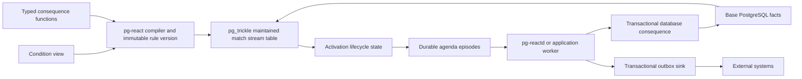
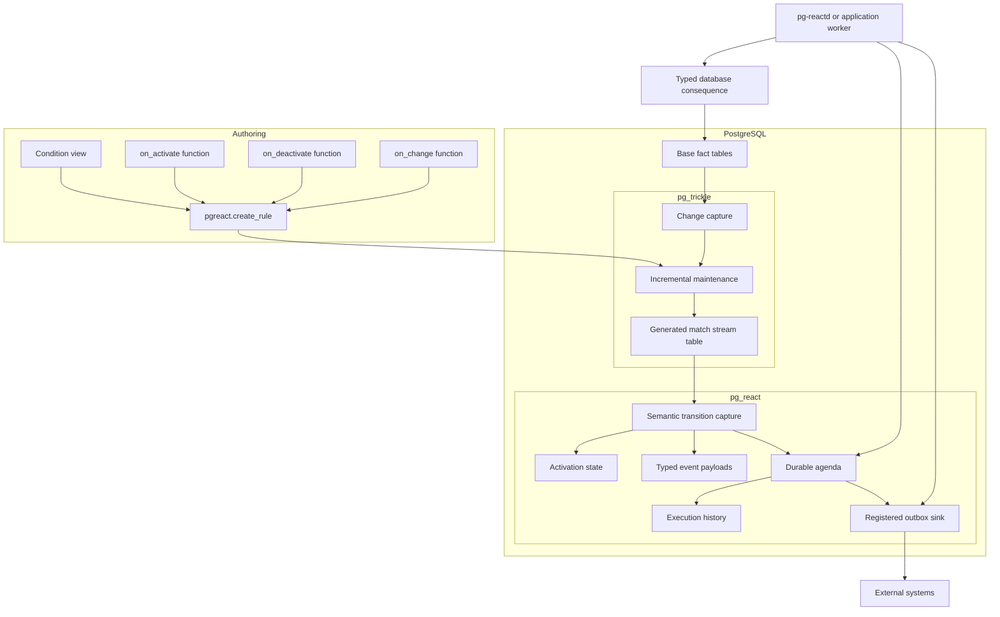
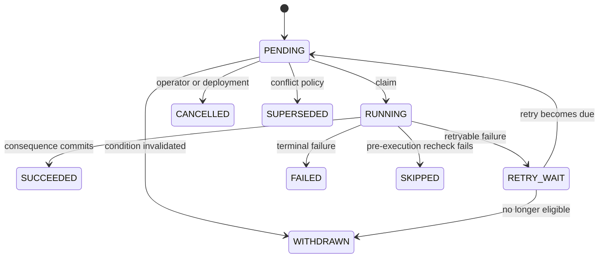

# `pg-react`: A PostgreSQL-Native Incremental Rule and Reasoning Engine

**Status:** M5 implementation contract complete\
**Document version:** 0.7\
**Date:** 2026-08-09\
**Project and repository name:** `pg-react`  
**PostgreSQL extension name:** `pg_react`  
**Rust crate name:** `pg_react`  
**Public SQL schema:** `pgreact`  
**Generated runtime schema:** `pgreact_runtime`  
**Private catalog schema:** `pgreact_internal`  
**Optional worker process:** `pg-reactd`  
**Implementation language:** Rust  
**PostgreSQL extension framework:** `pgrx`  
**Required dependency:** `pg_trickle`  
**Initial platform target:** PostgreSQL 18, aligned with the supported `pg_trickle` and `pgrx` versions\
**Delivery authority:** [`ROADMAP.md`](ROADMAP.md) owns milestone scope, ordering, and exit evidence

> The project is branded as **pg-react**, but PostgreSQL extension names, Rust crate names, SQL schemas, and internal symbols use underscores or unquoted identifiers. Users therefore install it with `CREATE EXTENSION pg_react`, call functions in the `pgreact` schema, and may run the companion binary as `pg-reactd`.

---

## Reading guide

[`CONTEXT.md`](CONTEXT.md) is the canonical project vocabulary. This document describes both the product semantics and the implementation architecture. The first part explains what a rule means, how a continuously maintained SQL result becomes an activation, and how command rules are scheduled and executed. The middle part describes the SQL API, the catalog, the integration contract with `pg_trickle`, and the behavior during full refreshes, crashes, and rule upgrades. The final part covers the Rust codebase, worker process, security model, testing strategy, delivery authority, risks, and a complete end-to-end example. Readers who only need the product model can focus on Sections 1 through 12, while implementers should also read the remaining sections in order because later decisions build on earlier semantic guarantees.

### Revision 0.8

This revision implements M6 audited batching. An immutable declaration limits
protocol-2 batches to one exact typed binding, role, event, fresh-recheck
policy, and compatible conflict scope. The complete batch is revalidated under
the existing lifecycle and DDL locks before invocation; per-item consequence
errors retain the established retry semantics. Protocol 1 and one episode per
transaction remain the default, while public history links every batch item to
its per-episode attempt and outcome.

### Revision 0.7

This revision fixes the M5 rule-pack contract. A format-versioned JSON manifest names existing view-backed constraint and command rules through logical identities; environment maps resolve those identities without storing OIDs. Preview returns an object- and work-sensitive digest, deployment revalidates it under the existing lifecycle and DDL locks, and one PostgreSQL transaction commits or rolls back the complete pack. Dependencies, removals, old-work policy, history, diagnostics, and portable promotion are explicit.

### Revision 0.6

This revision makes M0 implementable. It removes the duplicate phased plan, bounds the trigger-based integration spike to pinned `DIFFERENTIAL` maintenance, defines a portable versioned activation-key codec and runtime key-invariant failures, adds a durable lifecycle-event identity ledger, fixes the alpha reconciliation and worker contracts, and makes role, drift, typed-payload lifetime, and outbox ownership explicit. The roadmap is now the sole delivery-order authority.

### Revision 0.5

This revision makes several previously implicit contracts normative: watched-column change comparison, preflight validation and preview, replacement cutover, reconciliation audit, external-consumer idempotency, retention, operational fairness and backpressure, and the boundary between operational explanation and complete tuple lineage. It also narrows the common registration path and makes the project's poor-fit cases explicit.

### Revision 0.4

Revision 0.4 made a PostgreSQL view the canonical rule-condition contract, typed PostgreSQL functions the preferred database-local consequences, and activation, change, and deactivation explicit lifecycle events. It aligned the catalog, Rust architecture, worker protocol, recovery model, tests, rollout plan, and example; strengthened one-episode-at-a-time execution, definition-drift detection, PostgreSQL-major upgrade behavior, and the concurrency contract; and retained raw-query authoring only as convenience syntax.

---

## 1. Executive summary

`pg-react` is a separate PostgreSQL extension that turns the changing result of an ordinary SQL query into durable rule state. The preferred authoring model uses three native PostgreSQL objects: a view that defines the condition, one or more typed SQL functions that define the consequences, and a small `pgreact.create_rule` call that registers those objects and their execution policy. The rows returned by the view are the matches that are true now. When a semantic match enters that result, `pg-react` records an activation; when it leaves, `pg-react` records a deactivation; and when the row remains present but its non-key values change, `pg-react` records a change. This makes the system easy to reason about because the rule language is SQL, the action language is PostgreSQL functions or outbox messages, and the runtime metadata is explicit rather than hidden inside a second expression language.

`pg_trickle` remains the incremental matching engine. At deployment time, `pg-react` snapshots and validates the registered view definition, wraps it with deterministic activation metadata, and asks `pg_trickle` to maintain a generated match stream table. `pg-react` does not implement RETE, DBSP, source-table change capture, joins, aggregation, negation, windows, or recursion a second time. Instead, it adds the production-rule concerns that an incremental view does not provide: stable semantic identity, activation generations and revisions, lifecycle events, refraction, salience, agenda groups, conflict handling, durable leases and retries, typed consequence invocation, rule versioning, reconciliation, recovery, and audit history.

The design separates current truth from historical work. A generated match relation answers “which conditions are true now?”, activation state answers “what is the current lifecycle state?”, the lifecycle-event ledger records each semantic transition exactly once, and the agenda answers “which consequences were requested and what happened to them?”. A command rule may define `on_activate`, `on_deactivate`, and `on_change` consequences. Each consequence is optional, and each event has a deterministic idempotency key whether or not it creates work. Constraint rules need no worker at all; they simply expose the maintained result as a live relation. Database-local consequences run through registered typed PostgreSQL functions, while external effects are transactionally enqueued through a registered outbox sink and delivered by its separate relay.

The initial identity model is deliberately semantic. Rule authors declare one or more non-null key columns from the condition view, such as `order_id` or `(tenant_id, account_id, policy_id)`, and the view must produce at most one row for each key. The system does not require authors to expose every primary key from every participating base-table alias merely for internal bookkeeping. A future `FACT_TUPLE` identity mode may derive activation identity from participating source facts for rules that truly need classical tuple-level activations, but the first release uses explicit semantic keys because they are more predictable for business commands, aggregates, and desired-state rules.

The extension is implemented in Rust with `pgrx`, stores all authoritative state in PostgreSQL, and communicates with `pg_trickle` through a versioned SQL contract rather than through Rust ABI linkage. The M1 companion service, `pg-reactd`, claims one agenda row and executes it in its own transaction; M2 may claim bounded sets but still executes one episode per transaction by default. Immediately before calling a consequence, the server revalidates the lease and the event’s current eligibility so that one action can invalidate later work before it executes. Batching is an explicit later opt-in for consequences that are declared and tested as commutative and unable to invalidate one another.



---

## 2. Why this project should exist

`pg_trickle` already provides the hardest and most general part of relational rule matching. It captures source changes, generates delta queries from an operator tree, maintains derived tables, orders dependent refreshes, and persists the result inside PostgreSQL. If an application needs to know which high-risk customers have large orders, which invoices are overdue without approval, or which services have violated an error-rate threshold, the condition can already be expressed as SQL and maintained incrementally. Reimplementing those relational operations in a second engine would duplicate parsing, planning, indexing, persistence, recovery, and a large body of correctness work.

A rule runtime must nevertheless answer questions that a maintained view should not answer. It must know whether a match is new or merely still present, whether that activation has already fired, which pending activation has priority, whether two actions for the same account may run concurrently, what should happen when a condition disappears before execution, and how a crashed worker can safely retry without creating duplicate external effects. It also needs immutable rule versions, audit trails, reconciliation after full rebuilds, and a way to explain why an action was requested. These concerns are not query-maintenance operators; they are runtime and application semantics. Keeping them in a separate extension allows `pg_trickle` to remain a general incremental view engine while `pg-react` can evolve around rule-specific concepts.

The resulting architecture is more general than a classical RETE clone. The left-hand side of a rule is ordinary PostgreSQL SQL, so it can naturally use rich relational features instead of being constrained to a custom pattern language. At the same time, the runtime still provides familiar production-system behavior such as activations, priorities, refraction, agenda groups, conflict resolution, and a feedback loop in which successful actions may write new facts that later cause additional rules to match. The system therefore sits between an incremental database, a durable production-rule runtime, and a future Datalog-like reasoning layer.

---

## 3. Scope, goals, and non-goals

The primary goal is to provide a PostgreSQL-native rule system whose behavior remains deterministic, durable, and inspectable even when source data, rule definitions, workers, or the database itself change. Every authoritative object—logical rules, immutable versions, source-definition fingerprints, activation state, lifecycle episodes, typed event payloads, execution attempts, leases, and outbox entries—must live in PostgreSQL so that normal transactions, backups, replication, and point-in-time recovery apply. Rule authors should be able to debug a condition with normal `SELECT` and `EXPLAIN`, PostgreSQL should type-check database consequences when they are created, and the runtime should reject ambiguous activation keys or incompatible function signatures before a rule becomes active.

The first production release focuses on constraint and command rules. Constraint rules continuously expose the current result of a registered view. Command rules additionally schedule optional activation, deactivation, and change consequences. The default execution model is epochal: committed source changes are incorporated by `pg_trickle`, semantic transitions and agenda rows commit with the maintained match state, and workers execute consequences in later transactions. This model provides durable concurrency, recovery, and audit semantics without making application writes wait for arbitrary user code or external systems.

The design also leaves a clean path toward richer reasoning. Future releases should be able to represent logical support for derived facts, evaluate monotone rule sets to a fixed point, apply stratified negation, maintain temporal rules, coordinate LLM tasks, and share expensive common conditions. These features should extend the same relational and transactional model. In particular, a future derivation rule should still compile to maintained relations, and a future support graph should still rely on PostgreSQL durability and `pg_trickle` dependency management rather than introducing a second in-memory truth store.

Several boundaries are intentional. `pg-react` will not implement RETE or DBSP again, install a second set of source-table change-capture triggers, or maintain its own alpha and beta memories. It will not invent a custom top-level command such as `CREATE REASON RULE`, because PostgreSQL already has an unrelated `CREATE RULE` statement and extensions do not have a portable raw-grammar extension point. It will not execute arbitrary remote calls inside backend processes, promise exactly-once behavior for unrelated external systems, infer the business meaning of an activation key for every possible query, or promise one global firing order across independent workers. It is not a warehouse-scale distributed batch engine, a long-running human-workflow system, or a host for dynamically supplied untrusted code. Work that must complete before the source write returns belongs in the application transaction unless it fits a future narrowly restricted database-local fixed-point mode; that mode would not be a general synchronous workflow engine. `pg-react` also avoids private `pg_trickle` catalogs, Rust types, and `__pgt_*` storage columns. These limits keep the first release understandable and allow both extensions to evolve independently.

---

## 4. Core concepts and terminology

A **rule** is the stable logical object that users name, own, enable, pause, replace, and inspect. A rule has one or more immutable **rule versions**, because changing the condition, activation key, consequence functions, or firing policy changes the meaning of both past and future work. The preferred source definition for a version is a PostgreSQL **condition view**. Its selected columns are the typed bindings available to consequences, and its rows describe the situations in which the rule is true. A raw `SELECT` may be accepted as convenience input, but the extension converts it into a private versioned view so that every compilation path has the same named row type and dependency model.

The source view is an authoring object, not mutable runtime state. When a version is deployed, `pg-react` records the view OID and qualified name, its row type and columns, `pg_get_viewdef` output, a definition hash, resolved dependencies, and the PostgreSQL objects used by the analyzed query. The generated `pg_trickle` stream table is built from that snapshotted definition. Replacing the source view later does not silently alter an active version; it creates detectable **source drift** and requires an explicit new rule version.

Every row in the maintained match relation is a current **activation**. In the default `SEMANTIC_KEY` identity mode, the author declares one or more view columns that identify the subject of the rule. `pg-react` encodes those typed values together with the rule-version UUID to produce a deterministic **activation ID**. A continuous interval during which the activation remains present is an **activation generation**. The false-to-true transition is an **activation event**, the true-to-false transition is a **deactivation event**, and a meaningful non-key payload change while the match remains present is a **change event**. Changes within one generation receive monotonically increasing revision numbers. Every such transition has one immutable row in the **lifecycle-event ledger**, even when no consequence is bound.

A **consequence** is the declared response to one lifecycle event. A command rule may have an `on_activate` consequence, an `on_deactivate` consequence, an `on_change` consequence, or any combination of them. The preferred database consequence is a typed PostgreSQL function that accepts `pgreact.activation_context` and the composite row type of the condition view. An activation consequence receives the new match, a deactivation consequence receives the last match from the generation that ended, and a change consequence receives both the previous and new match values. Outbox and manual consequences use a stable JSON envelope but retain the same event identity and idempotency model.

An **episode** is one durable agenda item created when a lifecycle event has a bound consequence. It references the immutable event instead of serving as the event's uniqueness boundary. The **agenda** contains episodes that are pending, leased, retrying, completed, failed, withdrawn, skipped, or cancelled. **Salience** is the priority assigned to a rule or match. An **agenda group** routes work to an appropriate worker pool. A **conflict key** identifies episodes that should not execute concurrently, such as all actions for the same account. A **lease** gives a worker temporary authority to execute one episode, and the event's deterministic **idempotency key** makes safe retry possible.

**Reconciliation** compares the generated match relation with durable activation state and repairs differences after initialization, full refresh, reinitialization, restore, or uncertain recovery. A **frontier** is the `pg_trickle` progress marker associated with a completed refresh. Later derivation features will add **supports**, where one activation justifies a derived fact, and **truth maintenance**, where the fact remains true for as long as at least one active support remains.

---

## 5. Design principles

### 5.1 SQL is the condition language

The public condition language is PostgreSQL SQL. The preferred definition is a normal view because PostgreSQL parses and type-checks it, records native dependencies, gives it a named composite row type, allows authors to query it manually, and makes full-query `EXPLAIN` available without a second diagnostic language. `pg-react` treats incremental execution as an implementation strategy supplied by `pg_trickle`; it does not expose alpha nodes, beta memories, or other execution-plan concepts in the authoring model.

### 5.2 Consequences are explicit PostgreSQL objects

A consequence is not arbitrary code embedded after a textual `THEN`. Database consequences are registered `regprocedure` values whose signatures are checked against the source view’s composite type. SQL-standard `BEGIN ATOMIC` function bodies are recommended because PostgreSQL parses them at function creation and can record body-level dependencies. External consequences are represented as outbox messages. This gives the compiler a stable condition boundary and gives the runtime a clear security, idempotency, and failure boundary.

### 5.3 Current truth is different from historical work

The generated match table and activation catalog represent what is true now. Agenda episodes and execution records represent historical lifecycle events and attempted work. If a match disappears, its activation becomes inactive, but a completed activation consequence remains part of the audit trail. If an optional deactivation consequence exists, it is scheduled as a new event rather than being treated as an automatic rollback of the earlier action. Separating current truth from historical work prevents cleanup of current state from erasing the reason a prior action happened.

### 5.4 Semantic identity is the default

Public activation identity must survive index rebuilds, full refreshes, relation replacement, PostgreSQL restart, and changes in `pg_trickle`’s internal row-hashing strategy. The default identity is therefore based on explicit typed semantic keys selected from the condition view. The author does not need to expose every participating base-table key merely for internal matching. A future fact-tuple mode may derive identity from source aliases and stable source keys, including alias position for self-joins, but that mode is optional and never uses `ctid` as a durable identifier.

### 5.5 External effects are at least once and idempotent

PostgreSQL cannot atomically commit a local transaction together with an unrelated HTTP API, email server, or model endpoint without a distributed transaction protocol. `pg-react` therefore invokes an exact registered transactional outbox sink and completes the episode in one PostgreSQL transaction. The sink may be the optional `pg_tide` adapter or another reviewed local outbox implementation; transport and delivery state remain owned by that system. Every external event has a deterministic idempotency key and is delivered at least once. This design makes failure behavior explicit and avoids building a second message relay inside `pg-react`.

### 5.6 Rule versions and source snapshots are immutable

A deployed version records the exact condition definition, row signature, activation-key schema, consequence signatures, priority rules, and execution policies that gave the version its meaning. A source view may remain a convenient authoring object, but changing it does not mutate a deployed version. `pg-react` detects definition or row-type drift and requires `replace_rule` to create and initialize a new version. Immutable versions make history interpretable and allow controlled rollback.

### 5.7 Epochal execution is the default, and one episode executes at a time

A traditional production system may select one activation, run it immediately, update facts, and then choose the next activation on the same call stack. `pg-react` instead uses explicit refresh and transaction boundaries. Workers may claim several rows to reduce queue overhead, but each episode is revalidated and executed in its own transaction by default. This matters because one consequence can change facts and invalidate another pending activation. A consequence may opt into batching only when it is declared `batch_safe`, meaning that the batched operations are commutative and cannot invalidate or change the eligibility of another episode in the same batch.

### 5.8 Durable definitions use SQL text and qualified identities, not serialized parse trees

During compilation, Rust code may use PostgreSQL relation, function, operator, type, and collation OIDs to work with analyzed definitions safely. Those OIDs are cached compiled metadata, not the only durable representation. Rule versions also retain the source SQL, qualified object names, row signature, and fingerprints needed to resolve the definition again after dump and restore or a PostgreSQL major-version upgrade. Version-sensitive parser and planner access is isolated behind a small compatibility module, and compiled metadata is rebuilt rather than treating serialized parse trees as portable state.

---

## 6. High-level architecture

The architecture has an authoring layer, a matching layer, a lifecycle layer, and an execution layer. Authors create a condition view and, for command rules, one or more typed consequence functions. `pg-react` validates and snapshots those objects into an immutable version. It then generates a wrapped SQL query containing activation metadata and asks `pg_trickle` to maintain the current match relation. As that relation changes, `pg-react` coalesces physical maintenance operations into semantic activation, change, and deactivation events, updates durable activation state, and creates agenda episodes for lifecycle events that have registered consequences.

`pg-react` does not attach a second change-capture system to base fact tables. Source changes flow through `pg_trickle`’s trigger, WAL, immediate, or other supported CDC paths exactly once. The compatibility integration may attach transition-capture triggers to the generated match relation, because that relation is the boundary between incremental matching and rule lifecycle semantics. The preferred long-term integration is a synchronous `pg_trickle` refresh observer with an optional consolidated delta relation.

Typed database consequences are invoked by a server-side execution function that validates the lease, event kind, generation, revision, source-definition compatibility, and current eligibility before calling the registered function under its configured execution role. The runtime stores an exact typed event payload for each database consequence so deactivation and change consequences can receive values even after the current match row has disappeared or changed. JSONB bindings are also stored for generic APIs, outbox sinks, diagnostics, and clients that do not know the view row type.



The core extension does not need its own postmaster background worker. Command episodes can be processed by `pg-reactd`, by application workers that use the supported claim and execution functions, or eventually by an optional PostgreSQL worker for carefully restricted SQL-only consequences. Keeping the recommended executor outside the server avoids another `shared_preload_libraries` requirement and ensures that slow model calls, network operations, and long-running external work cannot block PostgreSQL backend processes.

---

## 7. Rule kinds

### 7.1 Constraint rules

A constraint rule continuously maintains the set of rows that satisfy or violate a condition. The result itself is the product; no agenda or worker is required. A security team might define large refunds without approval, a data platform might define malformed records, and an operations team might define services currently outside an SLA. Applications can query `pgreact.current_matches`, inspect the original condition view, and use `pgreact.explain_rule` to connect the source definition to the maintained `pg_trickle` plan.

### 7.2 Command rules

A command rule adds lifecycle consequences to the same maintained match model. `on_activate` runs when a semantic match first becomes true in a generation. `on_deactivate` runs when that generation ends and receives the last typed match value. `on_change` runs when the activation remains true but its meaningful payload changes, and receives both the previous and current typed values. Every consequence is optional. A rule that only defines `on_activate` behaves like a conventional rising-edge command, while a rule with activation and deactivation consequences can act as a desired-state controller.

The runtime does not assume that a deactivation consequence reverses the activation consequence. They are independent durable events with separate idempotency keys, retry histories, and recheck policies. This distinction matters for actions such as sending a notification, where no automatic reversal exists, and for external side effects that may already have completed by the time a condition becomes false.

### 7.3 Derivation rules

A derivation rule creates logical support for a derived fact instead of scheduling an imperative consequence. One rule may support `Fever(patient)` because the temperature is high, while another supports the same fact because a test is positive. The derived fact remains true while at least one support exists. M7 admits only authoritative source relations. M8 extends the same model to positive derivation programs: derived relations may feed other derivation rules, including cycles, and the visible result is the least fixed point grounded in authoritative input. A cycle alone is not support. M9 adds safe stratified negation: every negative dependency points to a lower stratum whose positive fixed point is already stable, and every cycle through negation is rejected. Aggregation and temporal dependencies remain outside this boundary.

---

## 8. Public SQL API

### 8.1 Installation and dependency validation

Users install `pg_trickle` first and then install `pg_react`:

```sql
CREATE EXTENSION pg_trickle;
CREATE EXTENSION pg_react;
```

The extension control file declares the dependency using PostgreSQL’s package-safe name:

```ini
comment = 'Incremental SQL rule and reasoning engine built on pg_trickle'
default_version = '@CARGO_VERSION@'
module_pathname = 'pg_react'
requires = 'pg_trickle'
relocatable = false
superuser = true
trusted = false
```

The `requires` field guarantees installation order but cannot express a compatible version range. Installation, rule compilation, worker startup, and `pgreact.health_check()` therefore read `pg_extension.extversion` and verify the installed `pg_trickle` line against the compatibility matrix compiled into `pg_react`.

### 8.2 Defining a condition as a view

The preferred condition is a normal PostgreSQL view. Its selected columns are the bindings exposed to the rule runtime and typed database consequences. The view must include the semantic activation-key columns, but it does not need to expose every primary key from every joined source merely for internal bookkeeping.

```sql
CREATE SCHEMA IF NOT EXISTS rule_def;

CREATE VIEW rule_def.high_value_risky_order AS
SELECT
    o.id          AS order_id,
    o.customer_id AS customer_id,
    o.amount      AS amount
FROM app.orders AS o
JOIN app.customers AS c
  ON c.id = o.customer_id
WHERE o.amount > 10000
  AND c.risk_level = 'HIGH';
```

This object can be queried directly while debugging, PostgreSQL validates its column types and dependencies, and `EXPLAIN SELECT * FROM rule_def.high_value_risky_order` shows the complete non-incremental evaluation plan. At rule deployment, `pg-react` snapshots the view definition and row signature. Authors should treat a view used by an active rule as versioned source code: edits create detectable drift and are deployed through `replace_rule`, not picked up silently.

### 8.3 Defining typed database consequences

The extension provides a stable context type. The exact physical definition may grow by appending fields across major versions, but the initial logical fields are:

```sql
CREATE TYPE pgreact.activation_context AS (
    activation_id   uuid,
    episode_id      bigint,
    rule_id         uuid,
    rule_version_id uuid,
    generation      bigint,
    revision        bigint,
    event_kind      text,
    attempt_no      integer,
    event_at        timestamptz,
    worker_id       text,
    idempotency_key text
);
```

The preferred activation consequence accepts the context and the condition view’s composite row type, and returns `void`. A SQL-standard atomic body is recommended because PostgreSQL validates it when the function is created and records dependencies on referenced objects.

```sql
CREATE SCHEMA IF NOT EXISTS rule_action;

CREATE FUNCTION rule_action.activate_high_value_risky_order(
    context pgreact.activation_context,
    match   rule_def.high_value_risky_order
)
RETURNS void
LANGUAGE SQL
SECURITY INVOKER
BEGIN ATOMIC
    INSERT INTO app.manual_review_tasks (
        activation_id,
        order_id,
        customer_id,
        amount,
        condition_active
    )
    VALUES (
        (context).activation_id,
        (match).order_id,
        (match).customer_id,
        (match).amount,
        true
    )
    ON CONFLICT (activation_id) DO UPDATE
       SET customer_id = EXCLUDED.customer_id,
           amount = EXCLUDED.amount,
           condition_active = true,
           deactivated_at = NULL;
END;
```

A deactivation consequence uses the same row type and receives the last value from the generation that ended:

```sql
CREATE FUNCTION rule_action.deactivate_high_value_risky_order(
    context    pgreact.activation_context,
    last_match rule_def.high_value_risky_order
)
RETURNS void
LANGUAGE SQL
SECURITY INVOKER
BEGIN ATOMIC
    UPDATE app.manual_review_tasks
       SET condition_active = false,
           deactivated_at = clock_timestamp()
     WHERE activation_id = (context).activation_id;
END;
```

A change consequence, when used, has the signature `(pgreact.activation_context, definition_row_type, definition_row_type) RETURNS void` and receives the previous and current match values. The compiler verifies every `regprocedure`, return type, argument count, composite row type, owner, volatility, and execution-role policy before activation.

### 8.4 Validating and registering a command rule

Authors can validate a rule before creating durable runtime objects. In M1, `pgreact.validate_rule` reports source and consequence compatibility, incremental-maintenance support, resolved key-codec semantics, expected refresh mode, dependencies, generated-object estimates, and bootstrap warnings. M2 adds watched-column and external-effect diagnostics with those features. `pgreact.preview_rule` evaluates the current rows and shows the activations or bootstrap outcomes that the proposed policy would create. Preview is advisory and does not reserve a snapshot; registration repeats every safety check against the deployment transaction.

M1 diagnostic rows use a versioned envelope with stable fields `contract_version`, `code`, `severity`, `object_identity`, `message`, `hint`, and `details jsonb`. New detail fields may be appended without breaking clients; removing or changing a stable field requires a new contract version. Human-readable text is not a machine contract. Preview also reports the source fingerprint and snapshot time so callers cannot mistake it for a deployment reservation.

```sql
SELECT *
FROM pgreact.validate_rule(
    definition => 'rule_def.high_value_risky_order'::regclass,
    key_columns => ARRAY['order_id'],
    on_activate => 'rule_action.activate_high_value_risky_order(
        pgreact.activation_context,
        rule_def.high_value_risky_order
    )'::regprocedure
);

SELECT *
FROM pgreact.preview_rule(
    definition => 'rule_def.high_value_risky_order'::regclass,
    key_columns => ARRAY['order_id'],
    bootstrap_policy => 'SEED_CURRENT'
);
```

The canonical registration call connects the condition view to its lifecycle consequences and runtime policy. Function identities are passed as `regprocedure`, so `search_path` changes cannot silently redirect execution.

```sql
SELECT pgreact.create_rule(
    name       => 'manual_review_required',
    kind       => 'COMMAND',
    definition => 'rule_def.high_value_risky_order'::regclass,

    key_columns => ARRAY['order_id'],

    on_activate =>
        'rule_action.activate_high_value_risky_order(
            pgreact.activation_context,
            rule_def.high_value_risky_order
         )'::regprocedure,

    on_deactivate =>
        'rule_action.deactivate_high_value_risky_order(
            pgreact.activation_context,
            rule_def.high_value_risky_order
         )'::regprocedure,

    salience => 100,
    conflict_key_columns => ARRAY['customer_id'],
    agenda_group => 'risk',
    schedule => '1s',
    refresh_mode => 'DIFFERENTIAL',
    bootstrap_policy => 'SEED_CURRENT',

    options => jsonb_build_object(
        'withdrawal_policy', 'CANCEL_PENDING',
        'recheck_before_execute', true,
        'refire_policy', 'ON_REACTIVATION',
        'payload_policy', 'RISING_EDGE_SNAPSHOT'
    )
);
```

A conceptual SQL signature is:

```sql
pgreact.create_rule(
    name text,
    definition regclass,
    key_columns text[],
    kind text DEFAULT NULL,
    on_activate regprocedure DEFAULT NULL,
    on_deactivate regprocedure DEFAULT NULL,
    on_change regprocedure DEFAULT NULL,
    on_activate_consequence uuid DEFAULT NULL,
    on_deactivate_consequence uuid DEFAULT NULL,
    on_change_consequence uuid DEFAULT NULL,
    change_columns text[] DEFAULT NULL,
    salience integer DEFAULT 0,
    conflict_key_columns text[] DEFAULT NULL,
    agenda_group text DEFAULT 'default',
    schedule text DEFAULT 'calculated',
    refresh_mode text DEFAULT NULL,
    bootstrap_policy text DEFAULT 'SEED_CURRENT',
    options jsonb DEFAULT '{}'::jsonb
) RETURNS uuid;
```

The common command-rule path needs only `name`, `definition`, `key_columns`, and `on_activate`; `kind` can be inferred from the consequence, and scheduling, routing, refresh, and lifecycle policies use documented safe defaults. A null `refresh_mode` resolves to `DIFFERENTIAL` for command rules and `AUTO` for constraint rules. Command rules never inherit `pg_trickle`'s adaptive full fallback silently because a full refresh requires a reconciliation barrier. The full signature remains available for rules whose semantics require an explicit choice. Policy profiles may package proven combinations, but they do not introduce a second registration model.

The canonical API does not require a separate handler-registration step for typed database functions. An event binds either an exact typed `regprocedure` through `on_activate`, `on_deactivate`, or `on_change`, or a registered `OUTBOX`, `MANUAL`, or `NOOP` consequence through the corresponding `*_consequence` UUID; supplying both for one event is an error. This keeps one rule-registration call while allowing reusable non-function templates. Internally, each referenced consequence receives an immutable registry row containing its OID or template identity, signature, execution role, retry policy, recheck policy, timeout, and enabled state.

### 8.5 Constraint rules and raw-query convenience

A constraint rule registers a condition view without lifecycle consequences:

```sql
CREATE VIEW rule_def.unapproved_large_refund AS
SELECT
    r.id AS refund_id,
    r.customer_id,
    r.amount
FROM app.refunds AS r
WHERE r.amount > 5000
  AND NOT EXISTS (
      SELECT 1
      FROM app.refund_approvals AS a
      WHERE a.refund_id = r.id
  );

SELECT pgreact.create_rule(
    name => 'unapproved_large_refunds',
    kind => 'CONSTRAINT',
    definition => 'rule_def.unapproved_large_refund'::regclass,
    key_columns => ARRAY['refund_id'],
    schedule => '2s',
    refresh_mode => 'DIFFERENTIAL'
);

SELECT activation_id,
       activation_key,
       bindings,
       active_since
FROM pgreact.current_matches('unapproved_large_refunds');
```

Raw-query convenience is deferred until after the view-backed API is proven. A future `pgreact.create_rule_from_query` may accept one `SELECT` string, create a private versioned view, and delegate to the same `regclass` compilation path. It will remain convenience syntax rather than a separate semantic model. M0 and the developer alpha reject non-view definitions.

### 8.6 Rule lifecycle and worker operations

Replacing a rule creates an immutable new version from a new or changed source view and applies an explicit deployment policy. The existing version remains understandable because its snapshotted SQL and source fingerprints do not change.

```sql
SELECT pgreact.pause_rule('manual_review_required');
SELECT pgreact.resume_rule('manual_review_required');

SELECT pgreact.replace_rule(
    name => 'manual_review_required',
    definition => 'rule_def.high_value_risky_order_v2'::regclass,
    key_columns => ARRAY['order_id'],
    on_activate => 'rule_action.activate_high_value_risky_order_v2(
        pgreact.activation_context,
        rule_def.high_value_risky_order_v2
    )'::regprocedure,
    on_deactivate => 'rule_action.deactivate_high_value_risky_order_v2(
        pgreact.activation_context,
        rule_def.high_value_risky_order_v2
    )'::regprocedure,
    continuity_policy => 'PRESERVE_ACTIVE_KEYS',
    old_work_policy => 'DRAIN_OLD'
);

SELECT pgreact.rollback_rule(
    'manual_review_required',
    target_version => 3
);
```

Workers use supported functions rather than modifying agenda rows directly. M1 enforces `max_items = 1`. From M2, `claim` may reserve a bounded set efficiently, but the worker still executes each returned episode through `pgreact.execute_claimed_episode` in a separate transaction. Every completion, failure, skip, and later heartbeat operation must present the current lease token.

```sql
SELECT *
FROM pgreact.claim(
    worker_id => 'worker-01',
    max_items => 1,
    lease_for => interval '30 seconds',
    agenda_groups => ARRAY['risk']
);
```

The main diagnostic functions are `pgreact.validate_rule()`, `pgreact.preview_rule()`, `pgreact.rule_status()`, `pgreact.agenda_status()`, `pgreact.execution_history()`, `pgreact.explain_rule()`, `pgreact.explain_activation()`, `pgreact.explain_episode()`, `pgreact.reconcile_rule()`, `pgreact.source_drift()`, and `pgreact.health_check()`.

### 8.7 Safe rule-pack deployment

Extension `0.2.0` adds a deployment layer over the frozen v1 single-rule APIs; worker protocol `1`, outbox envelope `1`, lifecycle semantics, and the compatibility matrix do not change. A pack is an immutable manifest with `format_version`, logical `pack`, `version`, and `owner` strings, an ordered `rules` array, and an explicit `remove` array. Each rule uses the existing v1 fields and may bind typed or outbox consequences. Unknown fields and unsupported format versions fail validation so misspellings cannot silently change a deployment.

Pack names are globally unique and owned by the session role. Version strings are immutable within a pack. The durable manifest contains qualified logical names only. A separate `objects` map resolves view and exact function identities in each environment, while a `roles` map resolves the logical owner; the mapped owner must still be `session_user`. Neither definition nor promotion copies relation OIDs, function OIDs, generated names, or private catalog rows.

Dependencies are deployment-order `REQUIRES` edges only; they do not add runtime firing semantics. Every dependency must name a rule in the same version and appear earlier in the manifest. Missing edges, cycles, duplicate rules, and invalid order fail before deployment. Removal is never inferred: every former member omitted from `rules` must appear in `remove`, and a remaining rule cannot depend on a removed member.

`pgreact.validate_pack` returns the versioned diagnostic envelope without durable mutation. `pgreact.preview_pack` reports `ADD`, `REPLACE`, and `REMOVE` actions, ordered dependencies, generated-object changes, old work, and lifecycle risks. One SHA-256 plan digest covers the canonical manifest and mappings, mapped owner and object fingerprints, current pack and rule versions, generated bindings, and agenda states. `pgreact.deploy_pack` accepts that digest, acquires the existing refresh/claim lock and the expanded source/consequence DDL lock in their established order, repeats validation and digest calculation, and rejects stale previews.

The atomicity boundary is one PostgreSQL transaction, including pg_trickle stream creation and retirement, pack catalogs, rule catalogs, active-version changes, and history. An error therefore preserves the complete old pack and rolls back new generated objects. Successful history is public through `pgreact.pack_history`; failed attempts are diagnosed by the raised public error and leave no misleading durable deployment row. `pgreact.explain_pack` reports current members, source drift, outstanding work, draining old versions, and complete successful history.

Every replacement or removal declares `DRAIN_OLD` or `CANCEL_OLD`. `DRAIN_OLD` leaves pending, retrying, and leased episodes executable through their exact immutable binding. `CANCEL_OLD` cancels only unleased pending or retrying episodes; leased work is never ambiguously revoked and continues under the immutable binding. The retired match stream is removed in the deployment transaction because old episodes use durable payloads and dispatchers, not live match state. Generated bindings needed by draining work remain version-owned history rather than orphans.

### 8.8 No custom top-level grammar

The canonical representation remains valid PostgreSQL SQL: `CREATE VIEW`, `CREATE FUNCTION`, and `SELECT pgreact.create_rule(...)`. PostgreSQL already uses the term `CREATE RULE` for query-rewrite rules, which are unrelated to this system, and a portable extension cannot add arbitrary new raw grammar without a core patch or external preprocessor. A client-side DSL may later compile into these native objects, but it is never the durable source of truth.

---

## 9. Rule definition and query contract

The preferred source definition is a regular PostgreSQL view referenced by `regclass`. Registration verifies that the relation is a view, that its output columns have unique names, that it contains every declared activation-key and policy column, and that those key values are non-null and unique for the current contents. The selected columns are the typed bindings exposed to consequences. Authors do not need to project every base-table identity unless those values are part of the semantic activation or are otherwise useful to the action.

Non-nullness and uniqueness are runtime invariants, not one-time preflight checks. Key encoding raises on a null key before a match can commit. The refresh finalizer or observer verifies that each touched canonical key has exactly one final row before changing activation state. A violation aborts the refresh, so no partial lifecycle state or agenda work commits; the previous match and activation state remain authoritative. The implementation never chooses an arbitrary duplicate row or collapses duplicates silently.

Because the abort also rolls back writes made by the failing refresh transaction, it cannot install its own claim barrier. The refresh coordinator therefore installs the barrier before refresh: it acquires an exclusive session-level advisory lock for the rule, commits a `REFRESHING` row in `rule_barriers`, and only then starts the refresh transaction. Claims take the matching shared transaction-level lock and reject any barrier row. After a successful refresh and lifecycle commit, the coordinator clears the barrier in a fresh transaction before releasing the session lock. On refresh error, process death, or disconnect, the durable pre-existing barrier remains; a supervisor may annotate it but is not needed to close the claim race. A successful retry plus `STATE_ONLY` verification clears it. M0 must prove this ordering under injected key violations, driver disconnect, and worker races; if the pinned `pg_trickle` path cannot wrap refresh this way, the observation experiment has a negative result and command work remains blocked.

At compilation, `pg-react` records both human-readable and resolved forms of the definition. Durable metadata includes the qualified view name, `pg_get_viewdef` output, a normalized definition hash, the composite row type and ordered column signature, dependency identities, and the source role. Compiled metadata may additionally contain relation, function, operator, type, and collation OIDs obtained from PostgreSQL’s analyzed structures. The generated `pg_trickle` query is based on the snapshotted definition, so an in-place `CREATE OR REPLACE VIEW` does not mutate the behavior of a deployed version. A DDL hook or periodic verifier detects source drift and marks the authoring object as changed; deployment continues from the immutable snapshot until an operator creates a replacement version, unless row-type drift makes typed execution unsafe, in which case claims are blocked with an actionable error.

Snapshotting view SQL does not freeze the implementation of referenced functions, operators, types, or collations. M1 therefore permits only built-in condition functions, operators, casts, types, and deterministic collations covered by the pinned compatibility suite; user-defined executable condition dependencies are deferred. Every supported dependency has a fingerprint, and semantic dependency drift blocks refresh and claims rather than pretending the old behavior was preserved. Later support for user-defined dependencies requires pre-refresh verification plus DDL serialization that closes the check-to-execution race.

The query has PostgreSQL semantics, including null handling, collation, casts, operator resolution, and function behavior. `pg-react` does not reinterpret those semantics through a custom rule language. M1 accepts only the pinned built-in subset described above. In later milestones, fingerprinted `IMMUTABLE` functions may be accepted once dependency DDL is serialized; `VOLATILE` functions remain rejected. `STABLE` functions are accepted only when the selected `pg_trickle` mode and an explicit temporal policy make changes observable. A sliding predicate such as `expires_at < now()` should use `pg_trickle` temporal maintenance when supported; an explicit clock relation remains a valid deterministic alternative when users want time to be represented as ordinary data.

SQL support is defined by rule kind and by the capabilities of the compatible `pg_trickle` release rather than by an artificial RETE subset. Constraint rules may use any deterministic query that `pg_trickle` can maintain correctly in the requested mode. Command rules add stricter requirements: the activation key must be non-null and unique, transition volume must be bounded operationally, and lifecycle semantics must be well defined. Filters, joins, `EXISTS`, `NOT EXISTS`, algebraic aggregates, and supported temporal predicates are expected first-class use cases. Windows, Top-K queries, outer joins, set-returning functions, and recursion may be gated behind explicit capability flags until their transition behavior and performance have dedicated tests. M7 derivation rules accept only authoritative inputs; M8 adds a validated, range-restricted positive subset over derived inputs. M9 adds a validated, range-restricted stratified-negation subset over declared authoritative or lower-stratum derived inputs and rejects negative cycles and unsupported absence idioms before deployment. Recursive aggregation remains later work.

The compiler asks `pg_trickle` to validate the requested refresh mode and remains conservative when a full fallback would make lifecycle transitions expensive or ambiguous. A query accepted for a constraint rule is not automatically accepted for a high-volume command rule. `pgreact.explain_rule` reports the SQL features found, the chosen `pg_trickle` strategy, temporal requirements, key uniqueness checks, expected update shape, and any command-specific warnings.

The following conceptual mapping is useful for understanding the system, although these are compiler and execution details rather than user-visible language constructs:

| SQL concept | Rule-runtime meaning |
|---|---|
| Base relation or source view | Facts available to the condition |
| `WHERE` predicate | Filter on possible matches |
| `JOIN` predicate | Combination of facts |
| `EXISTS` / `NOT EXISTS` | Presence or absence condition |
| `GROUP BY` and aggregate | Maintained summary condition |
| Condition-view result row | Current semantic match |
| Row enters result | Activation event |
| Row changes under the same key | Change event |
| Row leaves result | Deactivation event |
| Typed function or outbox template | Consequence |
| Salience and conflict policy | Agenda ordering and serialization |

A future raw-query convenience API must create a private view and follow the same rules. No durable compiled state consists solely of serialized PostgreSQL parse trees, because internal node layouts and OIDs are not portable across PostgreSQL major versions or dump and restore. After such a transition, `pg-react` resolves the stored SQL and qualified identities again, verifies fingerprints, and rebuilds its compiled metadata and generated runtime artifacts.

---

## 10. Activation identity

The default `SEMANTIC_KEY` identity mode uses the key columns declared by the rule author. Those values define the subject whose continuous truth interval should create one activation generation. An order rule normally uses `order_id`; an account-policy rule may use `(tenant_id, account_id, policy_id)`; and an aggregate rule may use its group-by key. Mutable fields such as amount, current status, or time should appear in the key only when changing them is intentionally meant to end one activation and begin another.

Projected values alone are not automatically a safe identity. A view that selects only `country` from a customer-order join may return several identical `NO` rows that correspond to different orders. Under semantic identity, the author must decide whether those should be one country-level activation, one customer activation, or one order activation, and must expose and declare the corresponding key. If the desired semantics are one row per country, the query should aggregate or deduplicate accordingly. If duplicate rows exist for one declared key, compilation or runtime validation fails instead of silently choosing one.

The activation ID is deterministic, collision-resistant, independent of physical relation OIDs, and stable across restart, replication, index rebuild, physical restore, refresh-mode changes, and `pg_trickle` implementation changes within the codec's published compatibility contract. The rule-version UUID acts as a namespace. A versioned canonical key codec writes a codec version, a portable type tag, and a length-delimited canonical value for each key column; it never hashes a local type OID, `regtype` output, session-dependent text output, or an undocumented type send format. Equal supported PostgreSQL values must encode identically. Collatable keys require a deterministic collation, and unsupported types are rejected unless a future explicitly versioned codec is registered.

M0 supports only the reference rule's non-null `bigint` key, encoded as signed 64-bit network-order bytes. M1 may add types only with cross-restart and logical dump/restore fixtures, equality edge cases, and an immutable codec version. SHA-256 is computed over the rule-version UUID and canonical key; the first 128 bits are stored as a UUID with an RFC-compatible variant and private version nibble. The complete digest and canonical key bytes are stored with activation state. If a truncated UUID ever resolves to a different complete digest or key, the refresh fails as an invariant violation rather than merging the activations.

A future `FACT_TUPLE` identity mode may be useful for rules whose semantics truly require one activation for each exact combination of participating source facts. That compiler mode would derive identity from each source alias and its primary key or explicitly registered non-null unique key. Alias position must be included for self-joins, and a primary-key update is treated as removal of the old fact followed by insertion of the new fact. `ctid` is never a persistent identity because it names a physical row version and can change after ordinary maintenance. `FACT_TUPLE` is not required for semantic command rules and is not part of the first release.

A new rule version normally creates new activation IDs because the version UUID is part of the namespace. Deployment policies that preserve continuous activations across compatible versions map rows using the declared canonical semantic key and record explicit continuity. They do not pretend that two version-specific IDs are the same historical object.

---

## 11. Activation transitions and semantic coalescing

The runtime recognizes three meaningful lifecycle events and one no-op outcome. An inactive activation that is present at the end of maintenance produces `ACTIVATE`. An active activation that remains present produces either `CHANGE` when its watched values differ or `NOOP` when they do not. An active activation that is absent produces `DEACTIVATE`. An inactive activation that remains absent produces no event. The activation generation increments on `ACTIVATE`; the revision begins at zero and increments on each `CHANGE` within that generation; `DEACTIVATE` closes the generation.

By default, the watched values are all projected non-key columns. A rule may set `change_columns` to a subset when a value is needed by a consequence but should not create a new revision. Key changes are never `CHANGE` events: they deactivate the old semantic activation and activate the new one. The authoritative comparison is the equivalent of applying PostgreSQL `IS DISTINCT FROM` to each watched column using the type, domain, and collation resolved in the immutable rule version. This means PostgreSQL's own equality semantics apply, including its treatment of arrays, `jsonb`, and floating-point `NaN`. A watched type without equality semantics, such as `json`, is rejected unless the column is excluded or converted to a comparable type. Payload hashes may accelerate comparison, but a hash alone never defines equality.

Adding, removing, reordering, or changing the type or collation of a key or watched column requires a new rule version. The immutable version records the watched-column list and comparison identities so restore and upgrade can verify or rebuild transient metadata without changing historical meaning. An empty watched-column list disables `CHANGE` generation and is invalid when `on_change` is registered.

These outcomes are semantic rather than physical. One logical update may be maintained as an SQL `UPDATE`, a `DELETE` followed by an `INSERT`, or several operations that collapse to the same final row. Scheduling a deactivation and a fresh activation merely because an internal maintenance plan emitted delete-plus-insert would leak storage strategy into rule semantics. `pg-react` therefore compares durable activation state before the refresh with final membership and watched values after all maintenance for the transaction has completed.

M0 may use transaction-deferred coalescing only as a feasibility instrument against one pinned `pg_trickle` build. A generic trigger on each generated match table writes one buffer row for `(rule_version_id, activation_id, current_xid)`, recording which physical operations were observed and retaining the newest visible values. A deferred finalizer locks the buffer entry, loads prior activation state, looks up final match membership, and applies exactly one semantic outcome.

This path is supported only for scheduled, explicitly selected `DIFFERENTIAL` maintenance with `pg_trickle` user triggers enabled and a DML shape covered by the compatibility suite. `AUTO`, adaptive `FULL`, `FULL`, `REINITIALIZE`, `RESTORE`, `TRUNCATE`, and relation replacement establish a reconciliation barrier instead. PostgreSQL allows deferred constraint triggers to be forced early with `SET CONSTRAINTS`, so this mechanism is not a production observation contract and cannot gate M1 command execution. M1 requires a synchronous critical observer or another upstream boundary that proves final-state observation before commit. Both paths apply the same state machine.

```text
finalize(rule_version_id, activation_id, xid):
    lock the coalesced transition record
    previous = durable activation state and last typed snapshot
    current  = final row in the generated match relation, if present

    if previous is inactive and current exists:
        generation += 1
        revision = 0
        emit ACTIVATE(new = current)

    else if previous is active and current exists:
        if meaningful payload changed:
            revision += 1
            emit CHANGE(old = previous, new = current)
        else:
            emit NOOP

    else if previous is active and current is absent:
        emit DEACTIVATE(old = previous)
        mark generation inactive

    else:
        emit NOOP
```

For typed database consequences, the runtime creates a durable typed event payload before the current row can disappear or be overwritten. Each rule version owns a generated payload relation whose composite columns use the source view row type. An activation event stores `new_match`; a deactivation event stores `old_match`; and a change event stores both. Generic JSONB bindings and payload hashes are recorded alongside the typed values for stable cross-rule APIs, outbox sinks, diagnostics, and replay tooling. Event payloads are immutable; `activation_state` separately tracks the latest current value.

Activation-state writes, typed payload writes, and agenda writes occur in the same PostgreSQL transaction as the `pg_trickle` refresh. If the refresh rolls back, all of them roll back together. Full refreshes, restores, and other paths that cannot expose row-level semantic deltas use reconciliation, which applies this same state machine from set differences and an explicit event-emission policy.

---

## 12. Refraction, priority, conflict resolution, and the agenda

### 12.1 Lifecycle refraction

The default activation policy is `ON_REACTIVATION`. One `ACTIVATE` episode is created for each continuous generation in which a semantic activation is true. Payload changes under the same key do not create another activation episode. If an `on_change` consequence is registered, each meaningful revision may create one `CHANGE` episode. When the generation ends, an optional `on_deactivate` consequence creates one `DEACTIVATE` episode. The uniqueness key therefore includes `(rule_version_id, activation_id, generation, event_kind, revision)`, with revision zero for activation and deactivation events.

Other explicit policies may be useful. `ON_PAYLOAD_CHANGE` may route changes through the activation consequence rather than a separate change consequence. `MANUAL_RESET` may suppress later activation generations until an operator resets state. `NEVER` gives constraint-only behavior. Every policy must have an enforceable database uniqueness rule and must be visible in the immutable version and execution history.

Classical causal `no-loop`, where a rule is suppressed solely because its own consequence wrote the facts that matched it, is not claimed in the first release. Ordinary PostgreSQL DML and later CDC do not carry universal durable causation metadata. `pg-react` instead provides generation-based refraction, deterministic idempotency, optional origin metadata for managed writes, loop diagnostics, episode-rate limits, and future causal suppression for applications that opt into a managed fact API.

### 12.2 Salience and deterministic claim order

Salience is an integer evaluated when an episode is created or updated. A rule can use one static value or a validated integer column from the condition view. Eligible episodes are ordered by descending salience, then event time, then episode ID. This produces deterministic order among rows visible to one claim transaction. It is not a promise of one global execution order across independent worker transactions, because locks, conflict keys, retries, agenda-group routing, and concurrent commits affect what is eligible at any moment.

### 12.3 Agenda groups and conflict keys

Agenda groups provide coarse routing and operational isolation. Groups such as `risk`, `billing`, `notifications`, `llm`, and `maintenance` allow independent worker pools, connection budgets, and service-level objectives. A worker declares the groups it may claim, and PostgreSQL authorizes that routing.

Conflict keys provide finer serialization. `SERIALIZE` allows at most one running episode for a key. `DROP_LOWER` keeps the highest-priority pending episode and supersedes lower-priority work. `KEEP_ALL` retains all episodes but still allows workers to serialize execution. `NONE` adds no conflict behavior. A common policy serializes by tenant and account while permitting unrelated accounts to run concurrently.

### 12.4 Episode lifecycle and event payloads

A newly scheduled episode begins `PENDING`, becomes `RUNNING` when leased, moves to `RETRY_WAIT` after a retryable failure, and ends as `SUCCEEDED`, `FAILED`, `WITHDRAWN`, `SKIPPED`, `CANCELLED`, or `SUPERSEDED`. Each episode identifies its lifecycle event and typed payload row. The event kind determines which registered consequence is called and which eligibility check applies.



When an activation deactivates, a pending activation episode is normally withdrawn if its policy requires the condition still to be true. A separate deactivation episode may be created in the same transition. If the activation reappears before that deactivation episode executes, its configured recheck policy decides whether the historical deactivation event still matters or whether it is now superseded by the new active generation.

### 12.5 Payload-update policy

`activation_state` always records the latest bindings and payload hash. `RISING_EDGE_SNAPSHOT` is the v1 default: activation events preserve the row that began the generation, which keeps event identity and payload immutable. A consequence that needs current data may query it during execution after the eligibility recheck. `LATEST_UNTIL_CLAIM` is deferred until M2 because it mutates pending event payloads. Change episodes always preserve their explicit old and new revision values. Deactivation episodes preserve the last row from the generation that ended.

### 12.6 One-at-a-time execution and pre-execution rechecks

M1 claims exactly one episode. From M2, `claim(max_items => N)` may reserve several episodes to amortize queue access, but the standard worker executes each episode in a separate transaction. Before invocation, `pgreact.execute_claimed_episode` revalidates the lease and applies the consequence’s recheck policy. For an activation event, the default requires the same generation to remain active. For a deactivation event, the default desired-state policy skips the episode if a newer generation is active. For a change event, the default requires that the revision has not been superseded unless the consequence is explicitly historical.

Batch execution is an advanced opt-in. A consequence may be declared `batch_safe` only when operations are commutative, use compatible execution roles and policies, and cannot invalidate or alter another activation in the batch. Merely accepting an array argument does not make a consequence batch safe.

### 12.7 Leases, heartbeats, and retries

Every claim stores the worker ID, a random lease token, claim time, lease expiry, and incremented attempt number. Heartbeat, completion, failure, and skip operations require both the worker identity and the lease token. This prevents a paused or partitioned worker from completing an episode after another worker has reclaimed it.

Retry timing uses the consequence’s configured initial delay, multiplier, maximum delay, optional jitter, and attempt count. The next eligible time is stored in PostgreSQL. When the attempt limit is reached, the episode becomes terminally failed and emits an operational event. Operators may retry or cancel it through audited public functions.

---

## 13. Consequence execution and the feedback loop

### 13.1 Consequence kinds

The runtime supports four consequence kinds over time. `DATABASE_TYPED` invokes a registered PostgreSQL function whose arguments are validated against the condition view’s row type. `OUTBOX` invokes an exact transactional outbox sink with the stable envelope. `MANUAL` leaves the episode for an application or operator that follows the claim protocol. `NOOP` records successful scheduling without performing work and is useful for dry runs and staged deployments. M1 implements only `DATABASE_TYPED`; the other kinds enter at the milestone named in the roadmap. The consequence kind and signature are part of the immutable rule version.

A generic `DATABASE_JSON` adapter may be retained for generated integrations and backwards compatibility, but it is not the preferred authoring form. Typed consequences make schema mistakes visible during DDL and rule registration instead of failing later while unpacking arbitrary JSON.

### 13.2 Typed database consequences

The accepted signatures are:

```text
on_activate(context pgreact.activation_context,
            match   <condition-view-row-type>) RETURNS void

on_deactivate(context    pgreact.activation_context,
              last_match <condition-view-row-type>) RETURNS void

on_change(context  pgreact.activation_context,
          old_match <condition-view-row-type>,
          new_match <condition-view-row-type>) RETURNS void
```

A simpler one-argument form without context may be supported for local rules, but the two- or three-argument context form is recommended because it exposes the episode, generation, revision, attempt, and idempotency key. `pg-react` invokes these functions through a server-side function rather than through several client statements. `pgreact.execute_claimed_episode` revalidates the lease, source and signature fingerprints, event eligibility, conflict lease, and exact dispatcher identity; loads the typed payload; invokes the binding-specific dispatcher; records the execution attempt; and completes or skips the episode in one PostgreSQL transaction.

Consequence invocation runs in an internal subtransaction. Success releases it before the outer transaction records `SUCCEEDED`; an error rolls back every consequence write to the savepoint, then the outer transaction records the sanitized failure and `FAILED` or `RETRY_WAIT` state. Process death still aborts the entire outer transaction. This is required because an uncaught PostgreSQL error would otherwise abort the transaction that needs to preserve the failed attempt.

This gives exactly-once commit semantics relative to PostgreSQL state, not global exactly-once invocation. A transaction may be retried after an ambiguous client disconnect, and a consequence may be entered again after a prior transaction aborted. Database consequences must avoid irreversible non-transactional effects and should use the context idempotency key or activation ID in unique constraints when duplicate invocation would otherwise matter.

### 13.3 Typed event payload storage

The current match row may no longer exist when a deactivation consequence executes, and a change episode needs both the previous and current values. Each command-rule version therefore owns a small generated payload relation with composite columns of the condition view’s row type. A conceptual shape is:

```sql
CREATE TABLE pgreact_runtime.<version_payload_table> (
    event_id   bigint PRIMARY KEY,
    event_kind text NOT NULL,
    old_match  rule_def.high_value_risky_order,
    new_match  rule_def.high_value_risky_order,
    created_at timestamptz NOT NULL
);
```

The exact table uses the immutable version’s recorded row type and may be implemented with generated composite columns or an equivalent typed layout. The agenda stores a reference to the lifecycle event plus JSONB bindings for generic consumers. Payload retention cannot retire a row needed by executable work, and supported management APIs rely on PostgreSQL dependencies to reject incompatible source-type cleanup. `CASCADE` is not a supported rule-management path.

### 13.4 Outbox consequences

An outbox consequence constructs a message containing the rule, event kind, activation ID, generation, revision, episode ID, idempotency key, payload, topic, partition key, and headers. `pgreact.execute_claimed_episode` invokes the binding's exact sink function, conceptually `(pgreact.activation_context, jsonb) RETURNS void`, and completes the episode in the same transaction. The sink must durably enqueue or raise; it must not perform the remote effect. The stable envelope exposes the idempotency key in a documented field, and replay preserves both that key and the original canonical JSON value.

The consumer contract is explicit: the receiver persists successful idempotency keys for at least the published delivery-and-replay window and makes handling one key atomic with its own effect. Duplicates may arrive after timeouts, relay restarts, manual replay, failover, or archive restoration. Delivery order is not guaranteed across partition keys or retries, and a later lifecycle event may supersede an earlier desired state. If a consumer discards deduplication state before the documented replay horizon, replay is no longer guaranteed to suppress its duplicate effect. `pg-react` supplies deterministic event identity and at-least-once delivery; the receiving system enforces idempotency.

`pg_tide` is the recommended optional sink and relay; a small adapter maps the stable envelope to its public enqueue API. `pg-react` does not own a second outbox table, lease protocol, or delivery worker. Deployments may register another sink only if it provides the same transactional enqueue and idempotency contract. External HTTP calls, email, local file writes, LLM requests, and other irreversible effects are prohibited inside database consequences and belong behind this boundary.

### 13.5 Feedback-loop semantics

A successful consequence may write new PostgreSQL facts, which can cause other rules—or the same rule—to match during a later `pg_trickle` refresh. The default loop is explicit and epochal:

```text
source transaction commits
    → pg_trickle refreshes maintained match relations
    → pg-react records lifecycle events and agenda episodes
    → worker executes one eligible episode in its own transaction
    → the consequence writes new facts or invokes a transactional outbox sink
    → a later pg_trickle refresh observes those facts
```

This model avoids hidden recursive execution on one backend call stack and gives every step a visible transaction boundary. A pending episode is rechecked immediately before execution, so a previous consequence can invalidate it. A future strict `SINGLE_STEP` mode could execute one episode, synchronously refresh affected rules, and repeat until quiescence, but it would have much stronger locking and isolation requirements and is not part of the first release.

---

## 14. Compiling rules into `pg_trickle`

Each immutable rule version normally owns one generated match stream table, one unique activation-ID index, optional indexes for conflict keys and diagnostics, one transition-capture binding, and, for typed command consequences, one generated typed event-payload relation. Applications discover generated relations through public functions and never rely on physical naming conventions.

Compilation begins by resolving the registered view and capturing an immutable `DefinitionSnapshot`. The compiler verifies that the object is a view, obtains its exact SQL, ordered output columns, composite row type, dependencies, owner, and definition fingerprint, and resolves key, salience, and conflict columns. It validates each consequence `regprocedure` against the expected event signature and records both its OID and qualified identity. It then constructs the wrapped match query with generated activation metadata, asks the `PgTrickleAdapter` to validate and create the stream table, creates runtime indexes and typed payload storage, attaches transition observation, initializes and reconciles state, and finally marks the version ready or active.

PostgreSQL remains the parser and type authority. Rust code may inspect analyzed `Query` structures, catalogs, and OIDs through a small version-specific compatibility layer, while SPI prepare and describe calls provide resolved output information. `pg_trickle` remains the final authority on whether the snapshotted query can be maintained differentially, immediately, temporally, recursively, or only with fallback. `pg-react` does not maintain a competing grammar or a private copy of `pg_trickle`’s operator rules.

The durable version stores source SQL, qualified identities, row and dependency signatures, and fingerprints. Cached analyzed metadata and generated artifacts are rebuildable. Object re-resolution therefore recompiles from durable SQL rather than reusing serialized parse trees or blindly trusting old OIDs. A future logical migration or PostgreSQL-major-upgrade procedure must apply the same rule to pg-react and also prove that pg_trickle can safely reconstruct its corresponding metadata; v1 supports neither transition for live rule state.

All generated identifiers use PostgreSQL-safe quoting, and all runtime values use parameterized SPI. The condition definition and consequence functions are executable database code supplied by authorized authors, so creation privileges are treated as code-deployment privileges. Rule names, object names, roles, and options are never interpolated into raw SQL without validation and quoting.

---

## 15. Integration contract with `pg_trickle`

### 15.1 Dependency boundary

`pg-react` depends on `pg_trickle` as an installed PostgreSQL extension and communicates through public SQL functions and documented relation behavior. It does not import `pg_trickle` Rust modules, link to private symbols, read private catalogs, or assume private row-ID layouts. This boundary allows independent releases and avoids unstable Rust ABI coupling inside one PostgreSQL process.

The required M0 capabilities are stream-table creation, pinned scheduled `DIFFERENTIAL` maintenance, ordinary PostgreSQL result relations, explain and health diagnostics, and the observation experiment. Immediate, temporal, recursive, and other lifecycle capabilities become requirements only when their roadmap milestones enable them. The generated match relation—not the source tables—is the semantic handoff from `pg_trickle` to `pg-react`.

### 15.2 No duplicate source change capture

`pg-react` must not install its own statement triggers on every base fact table or maintain independent alpha and beta memories. Doing so would duplicate `pg_trickle`’s CDC, query maintenance, scheduling, persistence, and recovery, and could produce inconsistent results when the two systems observe different transaction boundaries. The compatibility path may use user triggers on the generated match table because those triggers observe the final maintained relation. The production path should use a general refresh-observer or delta-consumer API supplied by `pg_trickle`.

### 15.3 Compatibility implementation

With the current public surface, `pg-react` can create the generated match stream table, attach transition-capture triggers in `DIFFERENTIAL` mode, coalesce covered DML transactionally, seed activation state after initialization, and reconcile behind a claim barrier. `pg_trickle` suppresses user triggers during full refresh, and `AUTO` may adapt to a full refresh, so neither mode is eligible for trigger-observed command rules. PostgreSQL's deferred-trigger timing also remains user-controllable. The compatibility path is therefore an M0 experiment, not an alpha or production contract. Every experiment pins an exact `pg_trickle` version and source revision and records the required GUCs and observed DML shapes.

### 15.4 Required refresh-observer and delta contract

The required M1 contract is a synchronous critical observer owned by `pg_trickle`, or an equivalently proven upstream final-state boundary with a deliberately smaller support matrix. `pg-react` registers one callback, and `pg_trickle` invokes it after the stream-table storage has reached its final transaction state but before commit. The callback receives the result relation, refresh ID, action, frontier, and change counts. A later extension may expose a consolidated temporary delta relation containing the final old and new rows, allowing `pg-react` to process lifecycle transitions set-wise without per-row user triggers.

```sql
SELECT pgtrickle.register_refresh_observer(
    observer_name => 'pg_react',
    callback =>
        'pgreact_internal.on_stream_table_refresh(
            regclass,bigint,text,jsonb,bigint,bigint
         )'::regprocedure,
    critical => true
);
```

Before invoking refresh, the coordinator must commit the durable `REFRESHING` barrier described in Section 9 while holding the exclusive session-level rule lock. If a critical observer fails, the refresh transaction rolls back and the already committed barrier remains. Success clears it only after the match, lifecycle, and agenda transaction commits. For `FULL`, `REINITIALIZE`, or `RESTORE`, the barrier remains until reconciliation completes. Even when a detailed delta relation is available, the public activation identity remains owned by `pg-react`.

### 15.5 Version compatibility

Before the integration API is stable, compatibility is exact and conservative: each `pg_react` line supports one tested `pg_trickle` version plus source revision and one `pgrx`/PostgreSQL tuple. Installation, startup, compilation, health checks, and worker protocol negotiation verify the installed version and required functions. An incompatible dependency prevents new deployment and marks existing rules unclaimable rather than attempting an unsafe best effort.

---

## 16. Full refresh, initialization, and reconciliation

A full rebuild, restore, or reinitialization may replace the contents of a generated match table without exposing every row-level lifecycle transition. `pg-react` therefore treats reconciliation as a normal execution path rather than as an emergency-only repair. The authoritative invariant is that active rows in `pgreact_internal.activation_state` exactly equal the semantic rows currently present in the generated match relation for the same rule version, with compatible activation keys, payload hashes, salience values, conflict keys, and typed latest-value snapshots.

Reconciliation acquires a rule-version lock, changes the version state to `RECONCILING`, and blocks new claims. It compares current match rows with durable activation state. Present rows that have no active state are planned as activations; active rows that are missing are planned as deactivations; rows present in both places with changed payloads are planned as changes; and identical rows are no-ops. It rebuilds or updates typed latest-value and event-payload state before claims resume. The same pure transition planner used for differential maintenance is reused, making repeated reconciliation idempotent.

Lifecycle event emission during reconciliation is controlled explicitly because a restored current state does not always imply that historical commands should run. `STATE_ONLY` repairs activation state without creating lifecycle events or command episodes and is the only reconciliation mode in M0 and M1. `EMIT_MISSING_EVENTS` is deferred to M2 and may create events only when durable evidence proves that a committed transition was missed. Initial deployment defaults to `SEED_CURRENT`, which records current matches as already active without firing; `REQUIRE_EMPTY` rejects deployment if any current match exists. `FIRE_CURRENT` is deferred to M2 because it can create an unbounded work burst. Constraint rules always expose current matches regardless of command bootstrap policy.

Every reconciliation creates a durable audit record before repair begins. It records the reason, initiating role, rule version, source and target frontiers, comparison counts, requested repair and event-emission modes, rows repaired, lifecycle events emitted or suppressed, start and completion times, and final status or error. Repeated or resumed reconciliation links to the prior attempt. This record is retained even for `STATE_ONLY` repair so an operator can later explain why durable lifecycle state changed without corresponding command episodes.

Representative set comparisons are:

```sql
-- Current matches not recorded as active.
SELECT m.*
FROM pgreact_runtime.generated_match AS m
LEFT JOIN pgreact_internal.activation_state AS s
  ON s.rule_version_id = $1
 AND s.activation_id = m.__pgr_activation_id
 AND s.active
WHERE s.activation_id IS NULL;

-- Activations recorded as active but absent from the maintained result.
SELECT s.activation_id
FROM pgreact_internal.activation_state AS s
LEFT JOIN pgreact_runtime.generated_match AS m
  ON m.__pgr_activation_id = s.activation_id
WHERE s.rule_version_id = $1
  AND s.active
  AND m.__pgr_activation_id IS NULL;

-- Continuously active rows whose watched values changed. The compiler
-- expands <watched columns> into the immutable version's typed columns.
SELECT m.*
FROM pgreact_runtime.generated_match AS m
JOIN pgreact_runtime.generated_latest_snapshot AS p
  ON p.__pgr_activation_id = m.__pgr_activation_id
WHERE ROW(p.<watched columns>)
      IS DISTINCT FROM ROW(m.<watched columns>);
```

The generated reconciliation plan compares typed watched columns exactly. Payload hashes may identify likely candidates or detect unchanged rows when accompanied by exact verification, but hash equality never excludes a row from collision-safe comparison.

The preferred `pg_trickle` observer establishes the reconciliation barrier inside the refresh transaction for `FULL`, `REINITIALIZE`, and `RESTORE`, or records a durable barrier that prevents claims until reconciliation completes in a new transaction. The compatibility path detects an uncertain generation or frontier after startup and marks the version unclaimable. At no point should workers execute new lifecycle episodes against match state whose relationship to activation state is unknown.

---

## 17. Rule versioning and deployment

The stable `rules` catalog identifies a logical rule, while `rule_versions` contains immutable source snapshots, consequence bindings, and generated artifact references. Version states include `DRAFT`, `COMPILING`, `INITIALIZING`, `READY`, `ACTIVE`, `RECONCILING`, `SOURCE_DRIFT`, `DRAINING`, `RETIRED`, and `ERROR`. Only one version is normally active for a logical rule, although a previous version may remain draining while already claimed work completes.

An initial deployment resolves the source view, records its SQL and row signature, validates consequence signatures, creates the wrapped match relation and typed payload relation, initializes and reconciles according to bootstrap policy, and then atomically marks the version active. The deployed version continues to use the snapshotted definition even if the authoring view is later replaced with a textually different but row-compatible definition. In M1, row-compatible source drift raises a persistent warning while the immutable deployed definition and already bound work continue unchanged; it is never adopted implicitly. Row-type drift, a dropped or changed consequence function, a changed dispatcher owner or grant, or any other incompatible drift installs a claim barrier until explicit replacement or repair restores a valid contract.

Replacement is blue/green. A new source view or revised function set produces a new immutable version alongside the old one. The compiler compares key schemas, row signatures, consequence signatures, source dependencies, current match counts, and optional sample differences before cutover. `REFIRE_ALL` treats every current match in the new version as a fresh activation. `SEED_NEW` records current matches without firing. `PRESERVE_ACTIVE_KEYS` maps compatible semantic keys across versions and records continuity without making the version-specific activation IDs identical. `DRAIN_OLD` allows old pending and running episodes to finish while new lifecycle events use the new version. `CANCEL_OLD` cancels old unleased work and prevents new old-version claims. Continuity policies are allowed only when the key types and mapping are unambiguous.

The cutover contract is normative:

| Situation | Required behavior |
|---|---|
| New-version compilation or initialization fails | Roll back the attempted cutover; the old version remains authoritative and claimable. |
| Old version has active matches | Retain them as old-version history; initialize the new version through `REFIRE_ALL`, `SEED_NEW`, or `PRESERVE_ACTIVE_KEYS`. |
| Old version has pending or retrying episodes | `DRAIN_OLD` keeps them eligible under the old definition; `CANCEL_OLD` records their cancellation before cutover completes. |
| Old version has leased episodes | They retain the exact old version, payload, and function binding. `CANCEL_OLD` blocks further claims but does not pretend that revoking a lease can undo an effect already in progress. Cutover waits or records the episode as draining according to the declared timeout policy. |
| The same semantic key matches the new version | It receives a new version-scoped activation ID; any preserved continuity is explicit metadata. |
| The consequence changes | Only new-version episodes use the new binding. Old draining work never dispatches through it. |
| A worker races with cutover | The claim barrier and final version, lease, source, function, and eligibility checks either execute the exact bound old episode or reject it. |
| The old authoring view is later dropped | Replacement or removal rejects the drop while executable typed episodes or retained typed payloads depend on its row type. After those dependencies are drained and explicitly retired, compact generic event identity, source SQL, attempts, and outcomes remain readable for the configured history period. |

Typed consequence functions make incompatible DDL visible early, but they also create a deliberate dependency between executable work and the source view’s composite type. `replace_rule` inherits a consequence binding only when the new expected signature is exactly the same; a new named row type requires an explicit replacement function binding. The recommended authoring practice is to create a new view name for incompatible row-shape changes, such as `rule_def.high_value_risky_order_v2`, and deploy it as a new rule version. Compatible definition changes with the same row type may reuse a view name, but they still require `replace_rule`; they never silently mutate an active version. An authoring view or pinned type cannot be dropped while executable typed episodes or retained typed payloads depend on it. Supported removal APIs drain or cancel work, retire typed payloads according to policy, and let PostgreSQL dependency checks reject premature cleanup; `CASCADE` is not a supported deployment operation.

Rollback reactivates a retained version through the same resolution, verification, initialization, and reconciliation machinery. It is not a raw catalog-pointer update because source data, object OIDs, and current matches may have changed while that version was inactive. Retired generated relations are kept for a configurable rollback window and then dropped, while logical rule, activation, agenda, typed payload, and execution history follow independent retention policies.

---

## 18. Catalog and storage design

The catalogs below are authoritative PostgreSQL state. Exact physical types may evolve, but the ownership boundaries and invariants should remain stable. Public functions mediate all writes so source snapshots, generated artifacts, activation state, typed payloads, agenda episodes, and audit records stay consistent. Direct privileges on `pgreact_internal` are revoked from `PUBLIC`, and administrative tooling should prefer supported functions over ad hoc DML.

### 18.1 Logical rules

`pgreact_internal.rules` stores the stable identity and ownership of each logical rule. It contains the user-visible schema and name, owner, rule kind, current version pointer, enabled state, and audit timestamps. Query text and consequence policy do not live here because they belong to immutable versions.

| Column | Type | Meaning |
|---|---|---|
| `rule_id` | `uuid` | Stable logical identity |
| `schema_name` | `name` | User-visible namespace |
| `rule_name` | `name` | User-visible rule name |
| `owner_oid` | `oid` | Owning PostgreSQL role |
| `kind` | enum | `CONSTRAINT`, `COMMAND`, or later `DERIVE` |
| `active_version_id` | `uuid` nullable | Current deployed version |
| `enabled` | `boolean` | Logical master switch |
| `created_at` | `timestamptz` | Creation time |
| `updated_at` | `timestamptz` | Last metadata change |

A unique constraint on `(schema_name, rule_name)` gives familiar PostgreSQL-style naming.

### 18.2 Immutable rule versions

`pgreact_internal.rule_versions` contains the complete source snapshot and deployment state. Local OIDs make dispatch efficient inside the current cluster, while SQL text, qualified identities, row signatures, and fingerprints provide portable inputs for verification and future rebuild procedures. Those inputs do not by themselves make a logical migration or PostgreSQL-major upgrade safe; the v1 dependency boundary explicitly excludes both.

```text
rule_version_id uuid primary key
rule_id uuid references pgreact_internal.rules
version_no bigint
state enum
kind enum

source_definition_relid oid null
source_definition_name text
source_definition_sql text
source_definition_hash bytea
source_dependency_fingerprint bytea
binding_rowtype_oid oid null
binding_columns jsonb
binding_schema_hash bytea

compiled_query text
compiled_metadata jsonb null
compiled_metadata_version integer

identity_mode enum default 'SEMANTIC_KEY'
key_columns text[]
key_type_oids oid[]  -- rebuildable local validation cache, never identity input
key_codec_spec jsonb
change_columns text[]
change_comparison_identities jsonb
static_salience integer
salience_column text null
agenda_group text
conflict_key_columns text[] null
conflict_policy enum
refire_policy enum
payload_policy enum
withdrawal_policy enum
bootstrap_policy enum
reconciliation_policy enum

schedule text
refresh_mode text
pgtrickle_pgt_id bigint null
match_relid oid null
payload_relid oid null
match_schema name null
match_table name null
payload_table name null

options jsonb
evaluation_role oid
created_by oid
created_at timestamptz
activated_at timestamptz null
retired_at timestamptz null
last_verified_at timestamptz null
last_error jsonb null
```

The source definition fields describe exactly what was compiled. Health and recovery procedures resolve the stored qualified identities again and verify their SQL and row signatures rather than trusting cached local OIDs. `compiled_metadata` is a rebuildable cache and never the sole durable definition. Future logical migration support would need to rebuild these fields and the corresponding pg_trickle state together.

### 18.3 Lifecycle consequence bindings

`pgreact_internal.consequences` stores at most one binding for each lifecycle event of a rule version. It records whether the consequence is a typed database function, outbox template, manual action, or no-op. Typed functions are stored by exact OID and qualified `regprocedure` identity, together with the signature and binding row type that were validated at deployment.

```text
consequence_id uuid primary key
rule_version_id uuid references pgreact_internal.rule_versions
event_kind enum  -- ACTIVATE, CHANGE, DEACTIVATE
consequence_kind enum  -- DATABASE_TYPED, OUTBOX, MANUAL, NOOP

function_oid oid null
function_identity text null
signature_kind enum null
binding_rowtype_oid oid null
function_fingerprint bytea null
run_as_role oid null
dispatcher_oid oid null
dispatcher_identity text null

outbox_sink_oid oid null
outbox_sink_identity text null
outbox_topic text null
outbox_partition_expression text null
default_headers jsonb

recheck_policy enum
max_attempts integer
initial_backoff interval
backoff_multiplier numeric
max_backoff interval
timeout interval
batch_safe boolean default false
enabled boolean
owner_oid oid
created_at timestamptz

unique (rule_version_id, event_kind)
```

Activation and deactivation functions must accept context plus one value of the pinned binding row type and return `void`. Change functions must accept context plus two values of that type and return `void`. DDL monitoring invalidates a binding if the function disappears, changes signature, changes owner unexpectedly, or no longer satisfies its execution policy.

### 18.4 Activation state

`pgreact_internal.activation_state` is the durable semantic mirror of current match membership. It records the key, active generation, revision, latest current row, last active row, priority metadata, transition times, and refresh correlation. The last active snapshot remains available after deactivation so a delayed deactivation consequence can still receive a typed value.

```text
rule_version_id uuid
activation_id uuid
activation_key jsonb
canonical_key bytea
canonical_key_digest bytea
key_codec_version integer
active boolean
generation bigint
revision bigint
payload_hash bytea null
current_bindings jsonb null
last_active_bindings jsonb null
salience integer
conflict_key text null
first_seen_at timestamptz
last_seen_at timestamptz
deactivated_at timestamptz null
last_event_kind enum null
last_transition_xid xid8 null
last_refresh_id bigint null
last_frontier jsonb null
primary key (rule_version_id, activation_id)
```

Typed columns remain in the generated match relation. Canonical key bytes and the complete digest make activation-ID collisions detectable and keep identity reproducible without local OIDs. JSONB is retained here for stable generic APIs, reconciliation, cross-version continuity, and diagnostics rather than as the primary relational processing format.

### 18.5 Lifecycle event ledger and typed payloads

`pgreact_internal.lifecycle_events` is the compact, durable identity ledger for every semantic transition, including transitions without a consequence. It is the source for activation history and prevents terminal agenda cleanup from making a lifecycle identity eligible again.

```text
event_id bigserial primary key
rule_id uuid
rule_version_id uuid
activation_id uuid
generation bigint
revision bigint
event_kind enum
transitioned_at timestamptz
transition_xid xid8 null
refresh_id bigint null
frontier jsonb null
idempotency_key text unique
unique (rule_version_id, activation_id, generation, event_kind, revision)
```

Revision is zero for activation and deactivation. Event rows are retained for the lifetime of their immutable rule version; pruning payloads, agenda rows, attempts, or operational logs never removes this uniqueness boundary. Hard deletion of a retired version removes its entire namespace and is a separate audited operation.

Each command-rule version owns a generated payload relation whose composite columns use the pinned binding row type. The table preserves the exact values passed to typed functions even after the current match row changes or disappears.

```text
event_id bigint primary key references pgreact_internal.lifecycle_events
event_kind enum
old_match <pinned condition-view row type> null
new_match <pinned condition-view row type> null
old_bindings jsonb null
new_bindings jsonb null
created_at timestamptz
```

An activation event stores `new_match`, a deactivation event stores `old_match`, and a change event stores both. The agenda references the event and, when present, this payload row. The generated table is protected by PostgreSQL dependencies on the source composite type and by the version’s stored schema fingerprint. Incompatible drift blocks typed execution until a replacement or repair restores the contract.

### 18.6 Transition buffer

`pgreact_internal.activation_delta_buffer` supports transaction-deferred coalescing in the compatibility integration. One row exists for each activation touched by a refresh transaction. It records the physical DML shapes and the earliest and latest generic snapshots needed to calculate one final semantic outcome.

```text
rule_version_id uuid
activation_id uuid
xid xid8
source_relid oid
saw_insert boolean
saw_update boolean
saw_delete boolean
before_payload_hash bytea null
before_bindings jsonb null
after_payload_hash bytea null
after_bindings jsonb null
processed boolean
created_at timestamptz
processed_at timestamptz null
primary key (rule_version_id, activation_id, xid)
```

The buffer is short-lived coalescing state, not a business event log. It is deleted after successful finalization or by bounded cleanup after recovery.

### 18.7 Durable agenda

`pgreact_internal.agenda` stores one row per lifecycle consequence episode. The row identifies the exact version, activation generation, revision, event kind, and consequence binding. It contains routing, priority, state, lease, retry, result, typed-payload reference, generic snapshots, and deterministic idempotency information.

```text
episode_id bigserial primary key
event_id bigint unique references pgreact_internal.lifecycle_events
rule_id uuid
rule_version_id uuid
consequence_id uuid
activation_id uuid
activation_generation bigint
activation_revision bigint
event_kind enum
state enum
agenda_group text
salience integer
conflict_key text null
conflict_policy enum
typed_payload_id bigint null
old_bindings jsonb null
new_bindings jsonb null
transitioned_at timestamptz
available_at timestamptz
withdrawn_at timestamptz null
claimed_at timestamptz null
started_at timestamptz null
completed_at timestamptz null
worker_id text null
lease_token uuid null
leased_until timestamptz null
attempt_count integer
max_attempts integer
last_error jsonb null
result jsonb null
idempotency_key text unique
```

The main claim index starts with state and availability, then agenda group, descending salience, transition time, and episode ID. The lifecycle-event ledger enforces permanent semantic uniqueness, and `agenda.event_id` permits at most one consequence episode for that event. A claimed attempt always uses the event's frozen typed payload.

### 18.8 Execution attempts

`pgreact_internal.executions` is append-only attempt history. It records the episode, event kind, attempt number, worker, lease, start and finish times, outcome, error details, measured duration, and PostgreSQL transaction ID. The agenda row gives current state, while this table preserves every retry and skip decision.

```text
execution_id bigserial primary key
episode_id bigint
attempt_no integer
event_kind enum
worker_id text
lease_token uuid
started_at timestamptz
finished_at timestamptz null
status text
error_code text null
error_detail jsonb null
result jsonb null
consequence_duration_ms bigint null
transaction_id xid8 null
```

### 18.9 Runtime events and conflict leases

`pgreact_internal.runtime_events` is an append-only operational stream containing severity, event type, rule and version identifiers, optional activation, episode, refresh, and worker identifiers, timestamp, and structured detail. It records deployment, source drift, action invalidation, reconciliation, automatic suspension, repeated failures, compatibility problems, and repair. A small `conflict_leases` table serializes episodes that share a conflict key and contains only the key, owning episode, token, expiry, and update time.

`pgreact_internal.rule_barriers` contains one optional row per rule version with the reason, refresh identity, source status, creator, and timestamps. Claim checks it on every call. The refresh coordinator commits `REFRESHING` before starting the refresh transaction while retaining the exclusive session-level rule lock that conflicts with claims' shared transaction-level lock. Success or repair clears it only after match and activation state are verified at one frontier. Failure or coordinator loss leaves the row in place for safe operator or supervisor recovery.

---

## 19. Logical support, truth maintenance, and richer reasoning

The strongest long-term synergy between `pg-react` and `pg_trickle` is a truth-maintenance layer. A naive derivation rule might directly insert `Fever(patient)` and delete it when its own condition disappears. That is incorrect when a second rule independently supports the same fact. The correct primitive is a support relation in which each activation contributes one justification. In non-recursive M7, the derived fact exists whenever the number of active supports for its identity is greater than zero. With recursion, that local count is insufficient because a cycle of supports could otherwise keep itself alive after its last authoritative seed disappears.

The support catalog records a support ID, rule-version ID, activation ID, fact type, fact key, fact value, payload hash, provenance, and active state. A maintained derived-fact relation groups active supports by fact identity. When one support disappears, the fact remains as long as another grounded support exists. This allows the system to answer “why is this fact true?”, “which rules support it?”, “which source bindings produced each support?”, and “what would need to change for it to become false?”.

M8 permits derived facts to feed additional derivation rules. Positive programs can therefore form a feedback graph that is driven to its least fixed point: authoritative facts produce supports, supports produce derived facts, and those facts produce more supports until the smallest stable result is reached. This gives every current fact a finite grounded proof and retracts an ungrounded cycle when its last authoritative seed disappears. `pg_trickle` provides the relational and cyclic-maintenance substrate where its monotonicity rules permit; `pg-react` builds on that capability rather than implementing a separate fixed-point scheduler.

M9 admits stratified negation without weakening M8's positive fixed-point contract. Rules within one stratum may depend positively on one another, while every negative dependency points to a lower stratum whose result has already converged. Evaluating strata in dependency order produces one stratified result: adding a lower-stratum fact may retract an upper support, and removing it may create one. All affected strata commit at one program frontier. Recursive aggregation remains separate work.

---

## 20. Shared conditions and common subplans

One match stream table per active rule version provides strong isolation and simple deployment, but many rules may repeat the same expensive filters and joins. The first solution is explicit sharing through normal PostgreSQL views or named maintained conditions. Authors may define a reusable condition view such as `rule_def.high_risk_customers` and reference it from several rule views. PostgreSQL records the dependency, and `pg_trickle` can maintain a deliberately materialized shared condition when the author requests it.

```sql
CREATE VIEW rule_def.high_risk_customers AS
SELECT id AS customer_id
FROM app.customers
WHERE risk_level = 'HIGH';

SELECT pgreact.create_condition(
    name => 'high_risk_customers',
    definition => 'rule_def.high_risk_customers'::regclass,
    key_columns => ARRAY['customer_id'],
    schedule => 'calculated'
);
```

A later compiler may discover repeated subplans using resolved operator fingerprints or a public `pg_trickle` plan representation. It should materialize a subplan only when multiple active versions use it, the computation is expensive or selective enough to justify state, refresh cadence and security contexts are compatible, and the additional catalog and storage cost is acceptable. Automatic sharing is an optimization and must never change source-view semantics, activation identity, or visibility.

---

## 21. Rust implementation architecture

### 21.1 Repository layout

The public project is `pg-react`; the Rust crate and extension library are `pg_react`; the optional daemon is `pg-reactd`. The module layout separates source-view analysis, PostgreSQL-major compatibility, `pg_trickle` integration, lifecycle transitions, typed consequence dispatch, agenda coordination, and reconciliation so that pure logic can be tested independently of a backend.

```text
pg-react/
├── Cargo.toml
├── Cargo.lock
├── pg_react.control
├── src/
│   ├── lib.rs
│   ├── api/
│   │   ├── rules.rs
│   │   ├── agenda.rs
│   │   ├── diagnostics.rs
│   │   └── reconcile.rs
│   ├── catalog/
│   │   ├── rules.rs
│   │   ├── versions.rs
│   │   ├── consequences.rs
│   │   ├── activations.rs
│   │   └── agenda.rs
│   ├── compiler/
│   │   ├── source_view.rs
│   │   ├── analyze.rs
│   │   ├── signatures.rs
│   │   ├── identity.rs
│   │   ├── query_wrap.rs
│   │   └── deploy.rs
│   ├── compat/
│   │   ├── mod.rs
│   │   └── pg18.rs
│   ├── integration/
│   │   └── pg_trickle.rs
│   ├── lifecycle/
│   │   ├── trigger.rs
│   │   ├── buffer.rs
│   │   ├── finalize.rs
│   │   ├── transition.rs
│   │   └── payload.rs
│   ├── agenda/
│   │   ├── claim.rs
│   │   ├── lease.rs
│   │   ├── retry.rs
│   │   └── conflicts.rs
│   ├── consequences/
│   │   ├── typed.rs
│   │   ├── execute.rs
│   │   ├── outbox.rs
│   │   └── batch.rs
│   ├── reconciliation/
│   │   └── diff.rs
│   ├── ddl.rs
│   ├── security.rs
│   ├── telemetry.rs
│   ├── error.rs
│   └── types.rs
├── src/bin/
│   └── pg_reactd.rs
├── sql/
├── tests/
└── docs/
```

### 21.2 Cargo and platform baseline

The initial build follows the supported `pg_trickle` line exactly. The reference baseline is PostgreSQL 18, Rust edition 2024, and `pgrx` 0.18.0. Asynchronous networking dependencies belong primarily to `pg-reactd`, not to the loaded extension library.

```toml
[package]
name = "pg_react"
edition = "2024"

[features]
default = ["pg18"]
pg18 = ["pgrx/pg18", "pgrx-tests/pg18"]

[dependencies]
pgrx = "=0.18.0"
serde = { version = "1", features = ["derive"] }
serde_json = "1"
thiserror = "2"
uuid = { version = "1", features = ["v4", "serde"] }
sha2 = "0.11"
chrono = "0.4"
rand = "0.9"
```

### 21.3 Compiler and PostgreSQL compatibility boundary

`SourceDefinitionCompiler` resolves the registered view, captures SQL and row signatures, validates consequence functions, classifies query capabilities, and builds the wrapped match query. Its current analyzed representation may use relation, function, operator, type, and collation OIDs. Only the `compat` module may access PostgreSQL-major-sensitive parse nodes or internal catalog details. Durable versions retain SQL and qualified identities so analyzed state can be rebuilt after restore or upgrade.

`PgTrickleAdapter` encapsulates every cross-extension call. No other module issues ad hoc calls to `pgtrickle.*`. Representative internal traits are:

```rust
trait SourceDefinitionCompiler {
    fn validate(&self, spec: &RuleSpec) -> Result<ValidatedRule, PgReactError>;
    fn compile(&self, rule: &ValidatedRule) -> Result<CompiledRule, PgReactError>;
    fn deploy(&self, compiled: &CompiledRule) -> Result<DeployedRule, PgReactError>;
}

trait PgTrickleAdapter {
    fn version(&self) -> Result<Version, PgReactError>;
    fn create_stream_table(
        &self,
        spec: &StreamTableSpec,
    ) -> Result<StreamTableRef, PgReactError>;
    fn refresh_stream_table(
        &self,
        table: &StreamTableRef,
    ) -> Result<RefreshResult, PgReactError>;
    fn explain(&self, table: &StreamTableRef)
        -> Result<serde_json::Value, PgReactError>;
}

trait LifecycleTransitionSink {
    fn activate(&self, event: &LifecycleEvent) -> Result<(), PgReactError>;
    fn change(&self, event: &LifecycleEvent) -> Result<(), PgReactError>;
    fn deactivate(&self, event: &LifecycleEvent) -> Result<(), PgReactError>;
}

trait TypedConsequenceExecutor {
    fn execute(&self, episode: &ClaimedEpisode)
        -> Result<ConsequenceResult, PgReactError>;
}
```

PostgreSQL controls transactions. Pure lifecycle planning may return intended catalog mutations and typed payload data, while thin backend code applies them through SPI in the current transaction.

### 21.4 Error model

`PgReactError` includes invalid source view, source drift, unsupported query capability, duplicate or null semantic key, invalid consequence signature, incompatible `pg_trickle`, compilation failure, reconciliation required, lease lost, stale lifecycle event, typed payload failure, permission denied, catalog corruption, and invariant violation. Public errors include stable codes, relevant rule and version identifiers, the affected object, and a practical remediation hint. Sensitive bindings are excluded unless an authorized diagnostic mode is enabled.

---

## 22. `pg-reactd` worker process

`pg-reactd` becomes the recommended executor in M1. The M1 daemon sets `max_items = 1` and executes that episode through one `pgreact.execute_claimed_episode` transaction. Its minimal durable protocol is `PENDING -> RUNNING -> SUCCEEDED|FAILED|SKIPPED`, with a random lease token, finite expiry, one append-only attempt row, and no automatic retry or heartbeat. A crash before consequence commit aborts that transaction; the same worker's audited sweeper returns an expired lease to `PENDING`. A failure is inspectable and may be requeued once through a public audited operation. The lease token and atomic execution path are implemented in M1 so later expansion does not change the consequence contract.

From M2, workers may claim bounded sets to reduce queue round trips while still executing each episode in a separate transaction. They add automatic backoff, heartbeats, multi-worker support, retry classification, complete terminal-state policy, structured metrics, and horizontal scaling. Each episode receives a fresh lease, source-definition check, consequence-signature check, conflict check, and event-eligibility recheck after earlier episodes have committed. PostgreSQL remains the source of truth; workers own no durable local offsets.

`LISTEN/NOTIFY` is only a wake-up hint. A worker polls on startup, subscribes to `pgreact_agenda`, and polls periodically so lost notifications cannot strand work. During graceful shutdown it stops claiming new rows and either finishes or releases current leases according to policy. A forced exit requires no local recovery beyond database lease expiry and idempotent consequences.

From M2, batch execution may use a separate endpoint and remains disabled unless the consequence is explicitly `batch_safe`. The endpoint accepts only episodes with the same version, consequence, event kind, execution role, recheck policy, and compatible conflict scope. The standard worker never turns an arbitrary claimed set into one array invocation.

---

## 23. Transactions, consistency, isolation, and recovery

### 23.1 Scheduled epochal mode

Scheduled `DIFFERENTIAL` maintenance is the default. Source transactions commit normally. `pg_trickle` consumes committed changes according to the configured cadence and updates the generated match relation in a refresh transaction. `pg-react` records lifecycle state, typed payloads, and agenda episodes in that same transaction. Consequences execute later and cannot roll back the original source transaction. M0 supports only this path under `READ COMMITTED`; later milestones must name and test every added isolation/mode combination. This is the most scalable and operationally transparent mode.

### 23.2 Immediate match mode

A rule may use `pg_trickle` `IMMEDIATE` maintenance when it needs read-your-writes match state. The exact isolation and locking contract is inherited from the supported `pg_trickle` version and must be published in the compatibility matrix. `pg-react` does not assume that every PostgreSQL isolation level is safe for concurrent maintenance across several source tables. If a combination cannot produce a correct visible match state, rule creation or conflicting DML fails explicitly rather than leaving the result incomplete.

Immediate match maintenance still schedules consequences. It does not execute external or arbitrary user code inside the source statement. A strict synchronous consequence loop is a separate future mode.

### 23.3 Strict synchronous consequence mode is future work

A future strict mode may choose one episode, execute a database-local consequence, refresh affected rules, and repeat until quiescence. Such a mode would require serialization per ruleset, maximum firings per transaction, maximum cycles, deterministic tie-breaking, causal or no-loop controls, a deliberately restricted query and consequence subset, and explicit isolation restrictions. It is a narrowly bounded database-local fixed-point facility, not a general synchronous workflow engine, and is not part of version one.

### 23.4 Match-to-agenda atomicity

For every supported maintenance mode, final match state, activation state, typed payload creation, and agenda insertion or withdrawal commit together. A failure in the critical observer or lifecycle finalizer aborts the refresh. Workers see only committed episodes and therefore never act on a match that rolled back in the same transaction.

### 23.5 Consequence atomicity and independent rechecks

For a typed database consequence, lease validation, source, function, and dispatcher fingerprint checks, event eligibility recheck, typed invocation through the exact binding dispatcher, attempt history, and episode completion commit in one transaction. For outbox consequences, transactional sink invocation and episode completion commit together. Workers execute one episode per transaction by default, which allows an earlier consequence to invalidate later claimed work before that work runs.

### 23.6 Concurrency and isolation contract

Concurrency behavior is part of the public semantics rather than an implementation footnote. Release tests include two transactions changing opposite sides of a join, concurrent updates to one semantic key, source changes racing with claims, source-view replacement racing with execution, and lease expiry racing with completion. The supported behavior is documented for `READ COMMITTED`, `REPEATABLE READ`, and `SERIALIZABLE` separately. Unsafe immediate-mode combinations are rejected with a clear error. Scheduled mode derives its consistency from committed CDC frontiers and the configured `pg_trickle` dependency and diamond guarantees.

Relation or advisory locks may serialize immediate maintenance for one generated match relation when required. Such locking is scoped narrowly so unrelated rules or keys can proceed concurrently. The design follows the principle that a correct explicit failure is preferable to a silently missed activation.

Operational concurrency is also part of the release contract. Claims have a server-enforced maximum size; agenda groups have bounded worker and connection budgets; and admission control may pause or rate-limit a rule before agenda or payload growth threatens PostgreSQL. Claim scheduling must document its fairness window so sustained high-salience work cannot starve lower-salience eligible work indefinitely. Hot conflict keys, oldest-eligible age, claim saturation, and per-rule backlog are observable. Internal locks use one documented acquisition order, and deadlock victims follow bounded retry policy rather than disappearing or retrying without limit.

### 23.7 Crashes, PITR, and repair

A PostgreSQL crash during refresh leaves either all or none of the match, lifecycle, typed payload, and agenda changes committed. A worker crash leaves a finite lease that the M1 sweeper, or another worker from M2 onward, may reclaim. Deterministic idempotency keys address the possibility that the previous worker completed an effect but failed before recording success.

After a supported physical restore, PITR, failover, or promotion, workers remain stopped until pg-react installs claim barriers, resolves stored qualified identities, rebuilds transient OID-based metadata, verifies source-view and consequence fingerprints, reconciles match and activation state, expires invalid leases, and passes `pgreact.health_check`. Restore policy decides whether differences emit lifecycle events or repair state only. Version 1 does not support logical migration or PostgreSQL-major upgrade of live rule state because pinned pg_trickle cannot publicly rebuild its restored OID and differential-change metadata; a future support claim requires an end-to-end dependency repair procedure and regression evidence.

---

## 24. Security model

Security is based on PostgreSQL roles, object ownership, and exact execution identities. The extension grants nothing broadly to `PUBLIC`. Recommended roles are `pgreact_admin`, `pgreact_author`, `pgreact_operator`, `pgreact_worker`, and `pgreact_reader`. Administrators manage compatibility, repair, and all rules. Authors create views, functions, and rules they own. Operators pause, resume, reconcile, retry, and cancel work. Workers claim and execute only enabled registered consequences. Readers inspect permitted current matches and history.

Installation initially requires superuser because `pg_trickle` has privileged requirements and the extension creates protected schemas, generated relations, DDL observers, and integration callbacks. Normal authoring should not require superuser, but it is code deployment. In M0 and M1 the rule owner must own the condition view and consequence function, must have `SELECT` on every resolved dependency, and is the pinned evaluation and consequence-execution role. The M0 in-test executor uses the same checked dispatcher path as M1. Sources with enabled or forced RLS are rejected until the compatible `pg_trickle` line has an explicit, tested evaluation-role and RLS contract. Generated match and payload relations are not granted directly to authors or workers.

Each typed consequence binding records the exact consequence function, owner, `run_as_role`, and a generated binding-specific dispatcher. M1 fixes `run_as_role` to the rule owner. The dispatcher is `SECURITY DEFINER`, owned by that role, has a fixed safe `search_path`, statically calls the fully qualified consequence signature, is stored in a protected schema, revokes `PUBLIC`, and grants execution only to the internal executor role. Nested security-definer dispatch changes `current_user` to the dispatcher owner; `SET ROLE` is not used because PostgreSQL forbids it inside a security-definer function. `pgreact.execute_claimed_episode` verifies the worker, lease, version, event, function, dispatcher OID, owners, fingerprints, and grants before invocation. A changed or dropped function, changed owner, or changed dispatcher grant invalidates the binding and cannot be bypassed by recreating an object with the same name. Custom execution roles, if later supported, require an explicit administrator-approved dispatcher rather than ambient role membership.

Fingerprint verification and invocation are serialized against DDL. Execution acquires a shared transaction-level advisory lock for the binding before verification and holds it through dispatcher return. The extension's utility hook acquires the matching exclusive transaction-level lock for `CREATE OR REPLACE`, `ALTER`, or `DROP` affecting a registered consequence or dispatcher. M1 rejects mutation of an active binding and directs the author to pause, drain, and replace it; direct system-catalog writes are unsupported. This closes the check-to-call race instead of relying on separate catalog reads or cache invalidation.

Condition views and typed payloads can contain sensitive data. Authors should project only values needed by consequences and diagnostics. Grants and retention apply separately to source views, generated match relations, activation state, typed payload tables, generic JSONB snapshots, execution history, and external envelopes. Tenant identifiers should normally participate in semantic keys, conflict keys, routing, indexes, and authorization checks. Generic JSONB predicates are not treated as a security boundary.

---

## 25. Observability and explainability

The public schema exposes stable views for logical rules, immutable versions, source snapshots, source drift, lifecycle consequence bindings, current activations, agenda episodes, failures, execution attempts, and runtime health. An outbox adapter may link to its sink's delivery diagnostics, but that state is not duplicated in `pg-react`. These views translate internal identifiers into understandable names and apply ownership or reader-role checks. Ordinary operations should not require direct access to `pgreact_internal`.

`pgreact.explain_rule(name)` combines the pinned source-view SQL and fingerprint, current authoring-view fingerprint, binding row signature, semantic key, lifecycle consequence signatures, priority and conflict policies, `pg_trickle` refresh configuration and explain output, current match count, event counts, agenda depth by event kind, last frontier, and reconciliation status.

```json
{
  "rule": "manual_review_required",
  "kind": "COMMAND",
  "active_version": 3,
  "source_definition": "rule_def.high_value_risky_order",
  "source_drift": false,
  "binding_row_type": "rule_def.high_value_risky_order",
  "activation_key_columns": ["order_id"],
  "consequences": {
    "ACTIVATE": "rule_action.activate_high_value_risky_order(...)" ,
    "CHANGE": null,
    "DEACTIVATE": "rule_action.deactivate_high_value_risky_order(...)"
  },
  "match_relation": "pgreact_runtime.r_7c12d4_v_0003_matches",
  "refresh_mode": "DIFFERENTIAL",
  "schedule": "1s",
  "current_matches": 18,
  "pending_by_event": {"ACTIVATE": 4, "CHANGE": 0, "DEACTIVATE": 1},
  "last_refresh_id": 991,
  "reconciliation_required": false
}
```

Every log and runtime event carries available rule, version, activation, generation, revision, event kind, episode, attempt, refresh, frontier, and worker identifiers. Explanation has three explicit levels:

- `pgreact.explain_rule(name)` reports the immutable definition, dependencies, signatures, policy, and refresh configuration.
- `pgreact.explain_activation(activation_id)` reports the semantic key, version, generation and revision history, current or last binding, and correlated refreshes.
- `pgreact.explain_episode(episode_id)` reports the lifecycle event, frozen payload, selected consequence, claims, rechecks, retries, outcome, and idempotency identity.

These APIs provide rule-definition provenance, projected match evidence, and operational causality. Version one does not promise automatic tuple-level lineage for arbitrary joins, aggregates, negation, windows, or recursion. Authors who need exact operational evidence must project stable source references or evidence columns into the condition view. Future support and provenance features may add contributing-fact lineage without changing the v1 explanation contract.

Core metrics include rules by state, source-drift count, invalid consequence bindings, current activations, lifecycle transitions, agenda items by state and event kind, end-to-end latency, consequence duration, lease expiry, reconciliation lag, and outbox-sink failures. Delivery metrics remain owned by the sink or relay. Notifications are low-latency hints only; catalog state remains authoritative.

---

## 26. Performance and scaling

End-to-end cost includes `pg_trickle` source capture and match maintenance, generated match and typed payload storage, semantic transition processing, agenda and history writes, consequence execution, and retention or vacuum overhead. When the selected operators are maintained differentially, matching work should remain proportional to the source delta. `pg-react` must keep lifecycle overhead similarly proportional to the number of changed semantic activations.

One match stream table per active version and one typed payload relation per typed command version provide clear ownership and reliable DDL dependencies, but they increase catalog size. Early releases should favor this explicit model, retire generated artifacts promptly, and measure real fan-out before attempting automatic sharing. Constraint-only rules need no typed payload relation.

The compatibility trigger path may force `pg_trickle` onto an explicit-DML maintenance path. Benchmarks must cover no-change refreshes, inserts, direct updates, delete-plus-insert coalescing, activation and deactivation bursts, large change-event volume, full reconciliation, and many rules sharing one source. A set-based delta-consumer API should be designed as a general `pg_trickle` capability and is expected to reduce per-row trigger overhead.

From M2, workers may claim several episodes in one query, but default execution remains one episode per transaction. This increases transaction count compared with bulk actions but preserves eligibility semantics and limits lock duration. Measurements should separate queue-claim cost from consequence cost. Explicit `batch_safe` execution can be introduced for proven commutative workloads and should have separate correctness and performance benchmarks.

Typed event payloads avoid unsafe JSON reconstruction but consume storage. Payload relations should store only the condition view’s selected columns, remain immutable, and follow configurable event retention. Generic JSONB remains for APIs and external envelopes, not for high-volume relational joins. Large deployments may eventually partition agenda, executions, and generic activation state, but partitioning should follow measured need because it complicates deterministic claims.

Scheduled `DIFFERENTIAL` mode is the default because it batches changes and protects OLTP latency. `IMMEDIATE` mode is appropriate only for simple, low-fan-out rules that require same-transaction match state and accept its `READ COMMITTED` and serialization contract.

---

## 27. Testing and verification strategy

Testing treats semantic correctness and PostgreSQL compatibility as release gates. Pure Rust tests cover typed key encoding, deterministic activation IDs, generation and revision planning, old-and-new payload construction, refraction, payload policies, retry backoff, conflict selection, lease transitions, source fingerprints, and consequence-signature classification. Property tests generate long sequences of physical insert, update, delete, delete-plus-insert, full refresh, and reconciliation operations and verify that final activation state equals final match membership and that lifecycle events obey their configured uniqueness rules.

Integration tests install both extensions and use normal views and typed SQL functions. They verify that registration rejects non-view definitions, duplicate or null semantic keys, wrong composite argument types, incorrect argument counts, non-void returns, invalid execution roles, volatile maintained conditions, and unsupported query capabilities. They replace registered views and functions to prove that compatible source drift is reported, incompatible row-type drift blocks typed execution, and dropped or changed functions invalidate only the affected consequence binding. A concurrent DDL test proves that the binding lock prevents a consequence or dispatcher from changing between fingerprint verification and invocation.

Lifecycle tests exercise `ACTIVATE`, `CHANGE`, and `DEACTIVATE`; generation and revision numbering; pending activation withdrawal; desired-state deactivation skipping after reactivation; typed old and new values; JSON outbox envelopes; full-refresh reconciliation; bootstrap policy; and state-only recovery. Differential, immediate, and full-plus-reconcile histories must produce equivalent current activation state where the release claims equivalence.

Concurrency tests are mandatory. Separate transactions change opposite sides of a join, update the same semantic key, delete a match while a worker claims it, pause or replace a rule during execution, and race lease expiry with completion. The suite runs under every isolation level the release claims to support. Unsupported immediate-mode combinations must fail explicitly. A dedicated test proves that a worker may claim A and B, execute A, have A invalidate B, and then skip B during its independent pre-execution recheck.

Batch tests are separate from normal execution tests. A batch-safe endpoint refuses mixed versions, consequences, event kinds, execution roles, or incompatible conflict scopes, and no consequence is batchable without an explicit catalog declaration. Crash injection covers refresh rollback, server restart, worker death after consequence commit, ambiguous client disconnect, outbox-sink enqueue ambiguity, PITR, and dependency upgrade. Adapter tests additionally cover duplicate and out-of-order delivery. Upgrade tests rebuild transient OID metadata from SQL while preserving active state, typed payloads, pending work, and history.

---

## 28. Operational deployment

A PostgreSQL deployment installs `pg_trickle` and `pg_react` in every database that needs rules. The exact `shared_preload_libraries` and worker settings follow `pg_trickle`; `pg_react` itself does not add a preload requirement in the initial design. Operators configure catalog retention, maximum claims, lease duration bounds, retry sweeps, compatibility policy, and notification behavior through documented GUCs or catalog settings. Sensible defaults should allow a small installation to work without extensive tuning.

Durable does not mean retained forever: authoritative records remain durable until an explicit, authorized retention policy removes them. Pruning is audited and cannot remove rows still needed by pending work, replay, rollback, or the published deduplication window. After detailed typed or generic payload cleanup, the minimum retained history still identifies the rule and immutable version, semantic activation key or protected hash, event kind, generation and revision, consequence identity, attempt outcomes, idempotency key, source fingerprint, reconciliation context, and timestamps. Retention documentation states which explanation and replay capabilities are lost at each tier.

`pg-reactd` runs as a normal service, container, or Kubernetes deployment. Its claim and execution connection uses a dedicated role with only public worker privileges; its coordinator connection uses a rule owner or operator identity for the explicit refresh protocol. It maintains a bounded connection pool, advertises selected agenda groups, and exposes health and metrics endpoints. Multiple replicas are safe because claims use row locks and leases. During rolling upgrades, old and new worker versions may overlap only when the database extension reports protocol compatibility; otherwise workers stop claiming before the extension upgrade and resume afterward.

On a physical standby, generated match tables, activation state, agenda, and history replicate as ordinary PostgreSQL data and remain readable. Workers must not claim from a read-only standby. After promotion, the normal health and lease sweep verifies that the database is writable, refresh scheduling is active, and stale leases can be reclaimed. Physical backups include all catalogs, pg_trickle change tracking, and runtime state. Restore procedures include a pg-react claim barrier, verification, metadata rebuild, and reconciliation before workers resume. Logical restore of live rule state is outside the v1 support boundary because pinned pg_trickle does not publicly reconstruct its OID and differential-change metadata.

Connection poolers are supported because the public API is transaction-oriented and does not depend on session-local queues. Worker connections that use `LISTEN` require session affinity or a direct connection, while claim and execution calls can use ordinary pooled connections. Prepared statements and temporary objects must follow the compatibility guidance of both extensions.

---

## 29. Delivery plan authority

[`ROADMAP.md`](ROADMAP.md) is the sole authority for milestone names, scope, entry gates, and exit evidence. This design defines semantics and architecture; it does not maintain a second phased plan.

M4 v1 GA is complete on the coordinator-owned compatibility boundary recorded in [`ROADMAP.md`](ROADMAP.md). The frozen contract remains pinned to explicit `DIFFERENTIAL` maintenance, a disabled scheduler, RLS rejection, and the `bigint` codec-v1 subset. The validated `v0.1.1` publication gate is satisfied and M5 is complete; every later compatibility addition needs its own evidence.

---

## 30. Risks and mitigations

| Risk | Consequence | Mitigation |
|---|---|---|
| `pg_trickle` changes public behavior | Missed or duplicate lifecycle events | Pin tested versions, maintain compatibility tests, and establish a stable critical observer API |
| A registered source view changes | Live authoring object diverges from deployed semantics | Snapshot SQL and row signatures, detect drift, block unsafe typed execution, and require replacement |
| A typed consequence function changes or disappears | Dispatch becomes unsafe or ambiguous | Store exact `regprocedure`, monitor DDL, invalidate the binding, and require repair or replacement |
| Full refresh lacks detailed row deltas | Activation state can diverge | Establish a claim barrier and reconcile with explicit event-emission policy |
| Poor semantic key choice | Distinct matches collapse or one subject fires repeatedly | Require explicit non-null keys, enforce uniqueness, and explain semantic identity prominently |
| Key codec changes or uses local OIDs | Activation IDs change after restore or upgrade | Version portable codecs, reject unsupported types, retain canonical bytes and complete digests, and test dump/restore fixtures |
| Source data later violates key invariants | Refresh could collapse rows or create partial work | Raise before lifecycle commit, retain the prior frontier, install a claim barrier, and require correction plus successful refresh or reconciliation |
| Authors expect projected values to identify source tuples | Duplicate visible rows have surprising behavior | Keep semantic keys explicit and offer a future opt-in fact-tuple identity mode |
| Database consequence performs irreversible external work | Unsafe retries and blocked database transactions | Prohibit by policy and route external work through a registered transactional outbox sink |
| Worker dies after an external effect | Duplicate delivery on retry | Deterministic idempotency keys, leases, attempt history, and consumer deduplication |
| Claimed set executes as one unchecked batch | Later work runs after an earlier action invalidates it | Execute one episode per transaction and recheck immediately before invocation |
| `batch_safe` is declared incorrectly | Order-dependent work runs together | Make it explicit, audited, narrow, observable, and disabled by default |
| Immediate maintenance has unsafe isolation behavior | Cross-table match can be missed | Publish a tested matrix, serialize where necessary, and fail explicitly for unsupported combinations |
| PostgreSQL upgrade remaps OIDs or parse structures | Cached compiled state becomes invalid | Persist SQL and qualified identities, isolate compatibility code, and rebuild analyzed metadata |
| One match relation per version creates overhead | Catalog growth and repeated work | Retention, explicit shared conditions, measurement, and later safe plan sharing |
| Feedback creates oscillation or storms | Endless work and database load | Refraction, episode limits, loop diagnostics, rate limits, and fixed-point restrictions |
| Typed event payloads grow large | Storage and vacuum pressure | Project minimal bindings, configure retention, and use sink-specific claim-check patterns for large payloads |

The most important technical risk remains the refresh-observation boundary. A simple trigger can misread delete-plus-insert maintenance or miss full rebuild transitions. The most important product risk is mutable authoring DDL. Views and typed functions are excellent rule objects only when deployed versions pin their meaning and detect drift.

---

## 31. Open design questions

The first integration question is whether `pg_trickle` will provide a synchronous critical refresh observer and later a consolidated delta relation. The second is the exact isolation and locking contract for immediate maintenance across several source tables. The third is whether `pg_trickle` can accept a stable external row-identity hint for storage efficiency without making that identifier part of `pg-react` semantics.

Command rules default to `SEED_CURRENT`, activation events use `RISING_EDGE_SNAPSHOT`, compatible source drift warns without adopting the changed definition, and incompatible drift blocks claims. M0 and M1 reconciliation is `STATE_ONLY`; event-emitting repair and `FIRE_CURRENT` are M2 features. A context-free typed function signature may be added later, but the context-bearing form is the version-one contract because it supports idempotency and audit.

The future fact-tuple identity mode must define its query subset, source-key registration, alias semantics, and primary-key update behavior. The derivation layer must decide how typed logical facts are represented and how recursive components are deployed atomically. These questions do not block view-backed constraint and command rules.

---

## 32. v1 GA acceptance criteria

A release candidate must prove that an ordinary PostgreSQL view can be registered, snapshotted, compiled, queried, explained, and detected as drifted after DDL. Non-view definitions, null or duplicate semantic keys, wrong typed function arguments, non-void return types, unsafe execution roles, and unsupported maintained queries must be rejected before activation. Every claimed recovery mode needs an end-to-end test of pg-react and pg_trickle state: v1 proves physical restore and rejects logical restore and PostgreSQL-major upgrade; a later release must add explicit rebuild evidence before supporting either.

Semantic correctness requires exactly one activation generation when a key enters the result, no repeated activation event while it remains continuously true, revisioned change events under the configured policy, and exactly one deactivation event when a generation ends. Physical delete-plus-insert maintenance must coalesce into the correct semantic result. Typed activation, change, and deactivation functions must receive the correct context and old or new composite values. Full refresh followed by reconciliation must produce the same current activation state as equivalent differential maintenance, and reconciliation must be idempotent.

The worker protocol must prove that two workers cannot own one lease, a stale worker cannot complete reclaimed work, and a claim containing several episodes still executes them in independent transactions with fresh rechecks. A test must show that consequence A can invalidate pending B and that B is then skipped or withdrawn. Batch execution must remain unavailable unless the binding is explicitly `batch_safe` and every compatibility check succeeds.

Concurrency acceptance includes opposite-side join inserts in concurrent transactions, concurrent changes to one semantic key, source changes racing with claims, source-view replacement racing with execution, and lease expiry racing with completion under every documented isolation level. Unsupported immediate-mode combinations must fail clearly. Crash, restart, PITR, outbox ambiguity, and idempotency tests must lose no committed work and create no silent duplicate business effect.

Security acceptance requires private catalogs and generated typed payloads to be protected, authors to manage only owned objects, workers to invoke only enabled exact function OIDs, every `SECURITY DEFINER` function to use a fixed safe search path, and sensitive bindings to be controlled by projection and grants. Operational acceptance requires health checks for source drift, invalid consequence functions, missing generated relations or observers, stale leases, incompatible dependency versions, and reconciliation barriers.

---

## 33. End-to-end example

The following example opens one review task when an order becomes both large and associated with a high-risk customer, keeps the task amount synchronized while the condition remains true, and closes the task when the condition ceases to be true.

### 33.1 Source facts and action state

```sql
CREATE SCHEMA IF NOT EXISTS app;

CREATE TABLE app.customers (
    id bigint PRIMARY KEY,
    risk_level text NOT NULL
);

CREATE TABLE app.orders (
    id bigint PRIMARY KEY,
    customer_id bigint NOT NULL REFERENCES app.customers(id),
    amount numeric NOT NULL
);

CREATE TABLE app.manual_review_tasks (
    activation_id uuid PRIMARY KEY,
    order_id bigint NOT NULL,
    customer_id bigint NOT NULL,
    amount numeric NOT NULL,
    condition_active boolean NOT NULL DEFAULT true,
    created_at timestamptz NOT NULL DEFAULT clock_timestamp(),
    updated_at timestamptz NOT NULL DEFAULT clock_timestamp(),
    deactivated_at timestamptz
);
```

### 33.2 Condition view

```sql
CREATE SCHEMA IF NOT EXISTS rule_def;

CREATE VIEW rule_def.high_value_risky_order AS
SELECT
    o.id AS order_id,
    o.customer_id,
    o.amount
FROM app.orders AS o
JOIN app.customers AS c
  ON c.id = o.customer_id
WHERE o.amount > 10000
  AND c.risk_level = 'HIGH';
```

The view can be queried and explained before registration. Its row type, `rule_def.high_value_risky_order`, becomes the typed binding contract for this version.

### 33.3 Typed lifecycle consequences

```sql
CREATE SCHEMA IF NOT EXISTS rule_action;

CREATE FUNCTION rule_action.activate_review(
    context pgreact.activation_context,
    match   rule_def.high_value_risky_order
)
RETURNS void
LANGUAGE SQL
SECURITY INVOKER
BEGIN ATOMIC
    INSERT INTO app.manual_review_tasks (
        activation_id,
        order_id,
        customer_id,
        amount,
        condition_active
    )
    VALUES (
        (context).activation_id,
        (match).order_id,
        (match).customer_id,
        (match).amount,
        true
    )
    ON CONFLICT (activation_id) DO UPDATE
       SET amount = EXCLUDED.amount,
           condition_active = true,
           updated_at = clock_timestamp(),
           deactivated_at = NULL;
END;

CREATE FUNCTION rule_action.change_review(
    context   pgreact.activation_context,
    old_match rule_def.high_value_risky_order,
    new_match rule_def.high_value_risky_order
)
RETURNS void
LANGUAGE SQL
SECURITY INVOKER
BEGIN ATOMIC
    UPDATE app.manual_review_tasks
       SET amount = (new_match).amount,
           updated_at = clock_timestamp()
     WHERE activation_id = (context).activation_id
       AND condition_active
       AND amount IS DISTINCT FROM (new_match).amount;
END;

CREATE FUNCTION rule_action.deactivate_review(
    context    pgreact.activation_context,
    last_match rule_def.high_value_risky_order
)
RETURNS void
LANGUAGE SQL
SECURITY INVOKER
BEGIN ATOMIC
    UPDATE app.manual_review_tasks
       SET condition_active = false,
           deactivated_at = clock_timestamp(),
           updated_at = clock_timestamp()
     WHERE activation_id = (context).activation_id
       AND condition_active;
END;
```

### 33.4 Rule registration

```sql
SELECT pgreact.create_rule(
    name       => 'high_value_risky_order',
    kind       => 'COMMAND',
    definition => 'rule_def.high_value_risky_order'::regclass,
    key_columns => ARRAY['order_id'],
    conflict_key_columns => ARRAY['customer_id'],

    on_activate =>
        'rule_action.activate_review(
            pgreact.activation_context,
            rule_def.high_value_risky_order
         )'::regprocedure,

    on_change =>
        'rule_action.change_review(
            pgreact.activation_context,
            rule_def.high_value_risky_order,
            rule_def.high_value_risky_order
         )'::regprocedure,

    on_deactivate =>
        'rule_action.deactivate_review(
            pgreact.activation_context,
            rule_def.high_value_risky_order
         )'::regprocedure,

    salience => 100,
    agenda_group => 'risk',
    schedule => '1s',
    refresh_mode => 'DIFFERENTIAL',
    bootstrap_policy => 'SEED_CURRENT',
    options => jsonb_build_object(
        'recheck_before_execute', true,
        'payload_policy', 'RISING_EDGE_SNAPSHOT',
        'batch_safe', false
    )
);
```

### 33.5 Lifecycle behavior

```sql
INSERT INTO app.customers VALUES (7, 'HIGH');
INSERT INTO app.orders VALUES (42, 7, 15000);
```

After refresh, order 42 enters the match relation. `pg-react` creates activation generation 1 and one `ACTIVATE` episode. `pg-reactd` claims it, and `pgreact.execute_claimed_episode` invokes the typed activation function in one transaction. The task row uses the activation ID as its idempotency key.

```sql
UPDATE app.orders SET amount = 17000 WHERE id = 42;
```

The semantic key remains `order_id = 42`, so generation 1 remains active. The payload revision changes, one `CHANGE` episode receives old amount 15000 and new amount 17000, and the typed change function updates the task. No second activation event is created.

```sql
UPDATE app.orders SET amount = 9000 WHERE id = 42;
```

The match leaves the result. The generation closes, stale pending activation work is withdrawn according to policy, and one `DEACTIVATE` episode receives the last typed row with amount 17000. The deactivation function marks the task inactive. If the amount later rises above the threshold again, the same version-specific activation ID enters generation 2 and creates a new activation episode.

---

## 34. Alternatives considered

Adding agenda, retry, and consequence semantics directly to `pg_trickle` was rejected because they are not incremental view-maintenance responsibilities. A separate extension gives both projects coherent boundaries and independent release cadences.

Implementing a standalone RETE engine with its own source-table triggers, alpha and beta memories, and transaction-local firing loop was rejected because it would duplicate `pg_trickle` CDC, SQL incrementalization, persistence, dependency ordering, and recovery. It would also force a much narrower SQL subset. `pg-react` treats the maintained SQL result as the match relation and builds lifecycle semantics above it.

Using only raw query strings was rejected as the preferred authoring model because views provide named row types, native dependencies, grants, direct debugging, and `EXPLAIN`. A future raw-query API would remain convenience syntax that creates a private view. JSONB-only database consequences were rejected as the primary local interface because typed composite arguments expose schema problems during DDL and remove repetitive field parsing. JSONB remains the durable generic format for cross-rule APIs and external messages.

Inferring identity from all projected values was rejected because duplicate visible rows and aggregates do not necessarily match the intended business subject. Inferring identity from every participating fact was also rejected as the universal default because many rules intentionally collapse several facts into one semantic state. Explicit semantic keys are the version-one contract; a future fact-tuple mode serves rules that truly need tuple-level activation. Physical `ctid` is never acceptable identity.

Executing typed consequences directly from match-table triggers was rejected because slow or failing actions would block refresh, retries would be unsafe, and external effects would run inside database maintenance. Claiming a large set and executing it as one default batch was rejected because an early consequence may invalidate later episodes. `NOTIFY` was rejected as the agenda because it is not durable.

A custom statement such as `CREATE REASON RULE` was rejected as the canonical interface. PostgreSQL already uses `CREATE RULE` for query rewriting, and portable extensions cannot add arbitrary top-level grammar without a core patch or external preprocessor. The canonical form remains `CREATE VIEW`, `CREATE FUNCTION`, and `SELECT pgreact.create_rule(...)`.

---

## 35. Reference baseline

This design is based on the current `pg_trickle` repository and its documented architecture, including its core overview, SQL and DVM architecture, DBSP comparison, outbox integration, patterns, user-trigger behavior, and Rust build configuration. The project repository is <https://github.com/trickle-labs/pg-trickle>. Relevant documents include `ESSENCE.md`, `docs/ARCHITECTURE.md`, `docs/research/DBSP_COMPARISON.md`, `docs/OUTBOX.md`, `docs/PATTERNS.md`, `plans/sql/PLAN_USER_TRIGGERS_EXPLICIT_DML.md`, and `tests/e2e_user_trigger_tests.rs`.

At the time of this review, the referenced `pg_trickle` main branch targeted PostgreSQL 18, Rust edition 2024, and `pgrx` 0.18.x; it supported user triggers in `DIFFERENTIAL` mode and suppressed them during `FULL`, while `AUTO` could adapt to `FULL`. These facts justify the deliberately narrow M0 experiment but are not a compatibility promise. M0 records an exact version, source revision, GUC set, and PostgreSQL/`pgrx` tuple in executable fixtures; every release publishes and enforces its own tested tuple.

---

## 36. Final recommendation

Build **pg-react** around three native PostgreSQL authoring objects and three durable runtime concepts. A normal view defines the condition, typed functions define optional activation, change, and deactivation consequences, and one registration call creates an immutable rule version. At runtime, `pg_trickle` owns current match maintenance, `pg-react` owns semantic activation lifecycle state, and the agenda owns durable consequence work.

Keep semantic keys explicit. Snapshot source-view SQL, row signatures, and exact consequence identities into immutable versions, and detect DDL drift instead of silently changing live behavior. Use OIDs for efficient analysis and dispatch inside one cluster, but retain SQL, qualified identities, and fingerprints as portable durable definitions. Never use physical tuple locations or private `pg_trickle` hashes as public rule identity.

Execute typed database consequences one episode per transaction by default and recheck eligibility immediately before invocation. Permit batching only through a separate audited `batch_safe` path. Keep every irreversible external effect behind an idempotent outbox. Publish the concurrency and isolation contract for every supported `pg_trickle` mode and fail explicitly where correctness cannot be guaranteed.

This architecture uses PostgreSQL’s strengths rather than recreating them. SQL provides the condition language, views provide named typed contracts, functions provide controlled consequences, PostgreSQL transactions provide durability, `pg_trickle` provides incremental matching, and `pg-react` provides the lifecycle, agenda, recovery, and future reasoning semantics that connect them.

---
