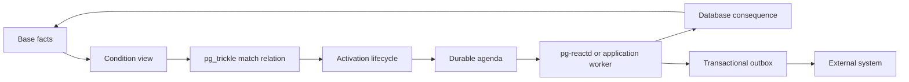

# pg-react

**Turn changing PostgreSQL data into durable decisions and work.**

> [!IMPORTANT]
> pg-react v1 is extension version `0.1.1`; the M5 repository candidate is extension `0.2.0`. Both use worker protocol `1`. The v1 contract remains intentionally narrow, and the M5 candidate must not merge until the exact `v0.1.1` release artifacts are published and verified. Read the [v1 contract](docs/v1-contract.md), [M5 rule-pack guide](docs/m5-rule-packs.md), and [known limitations](docs/v1-release-notes.md#known-limitations). Physical backup/PITR is supported; logical restore of live rule state is not.

An order crosses a risk threshold. An invoice becomes overdue. Available stock falls below committed demand.

SQL can describe each condition, but a query result does not remember when a match first appeared, whether someone already handled it, or what should happen if it changes or disappears. pg-react is designed to add that memory.

A PostgreSQL view defines what is true now. [pg_trickle](https://github.com/trickle-labs/pg-trickle) maintains the result incrementally. pg-react turns meaningful changes in that result into durable lifecycle events and, when needed, work for a database function or external worker.

```text
ordinary PostgreSQL data
          |
          v
    condition view       SQL says what is true
          |
          v
      pg_trickle         keeps the result current
          |
          v
       pg-react          remembers what changed and records work
          |
          v
 function, worker,       acts inside PostgreSQL or through an outbox
 or outbox
```

## A rule in three steps

Suppose every high-value order from a high-risk customer needs manual review.

First, describe the condition with an ordinary view:

```sql
CREATE VIEW rule_def.high_value_risky_order AS
SELECT
    o.id          AS order_id,
    o.customer_id AS customer_id,
    o.amount
FROM app.orders AS o
JOIN app.customers AS c ON c.id = o.customer_id
WHERE o.amount > 10000
  AND c.risk_level = 'HIGH';
```

Then define a typed PostgreSQL function for the consequence:

```sql
CREATE FUNCTION rule_action.open_review(
    context pgreact.activation_context,
    match   rule_def.high_value_risky_order
)
RETURNS void
LANGUAGE SQL
BEGIN ATOMIC
    INSERT INTO app.manual_review_tasks (
        activation_id, order_id, customer_id, amount, condition_active
    )
    VALUES (
        (context).activation_id,
        (match).order_id,
        (match).customer_id,
        (match).amount,
        true
    )
    ON CONFLICT (activation_id) DO UPDATE
       SET customer_id = EXCLUDED.customer_id,
           amount = EXCLUDED.amount,
           condition_active = true;
END;
```

Finally, register the view, its semantic key, and the consequence:

```sql
SELECT pgreact.create_rule(
    name        => 'manual_review_required',
    definition  => 'rule_def.high_value_risky_order'::regclass,
    key_columns => ARRAY['order_id'],
    on_activate => 'rule_action.open_review(
        pgreact.activation_context,
        rule_def.high_value_risky_order
    )'::regprocedure
);
```

If order 42 enters the view, pg-react records one activation and one durable episode of work. Further updates do not open duplicate reviews while the same condition remains true. If the order leaves the view and later returns, a new activation generation begins and the rule may act again.

The condition remains SQL. The consequence remains a PostgreSQL function. The state connecting them is explicit and queryable.

## The lifecycle model

A maintained result tells you which conditions are true now. pg-react is designed to preserve how each match develops over time:

| Transition | Meaning | Optional consequence |
|---|---|---|
| A keyed row enters the result | A condition became true | `on_activate` |
| Its watched values change | The same condition evolved | `on_change` |
| The row leaves the result | The condition stopped being true | `on_deactivate` |
| The row stays unchanged | Nothing new happened | None |

All projected non-key columns are watched by default. A rule can choose a smaller `change_columns` set when some values are needed by a consequence but should not create a new revision.

Three kinds of state stay separate:

1. The match relation contains current truth.
2. Activation state records the lifecycle of each semantic match.
3. The agenda records requested work, leases, retries, and outcomes.

This separation preserves history when a condition disappears, prevents a rebuild from looking like new work, and gives operators a direct path from source facts to a completed or failed consequence.

## What pg-react is trying to achieve

- Use PostgreSQL SQL as the condition language. Views stay directly queryable, explainable, typed, and governed by normal permissions.
- Reuse incremental query maintenance. pg_trickle owns joins, aggregates, negation, windows, recursion, change capture, and refresh ordering.
- Give business matches stable identity. Authors choose semantic keys such as `order_id` or `(tenant_id, account_id, policy_id)` instead of relying on physical rows.
- Make work durable. Activations, immutable rule versions, agenda episodes, attempts, leases, retries, and audit history live in PostgreSQL.
- Keep side effects honest. Database consequences run transactionally; external effects use an at-least-once outbox with deterministic event identity that receivers must deduplicate.
- Stay inspectable. Conditions, current matches, pending work, execution history, source drift, and reconciliation state are available through SQL. Version one explains operational causality but does not promise automatic base-tuple lineage for every query.
- Leave room for reasoning. Later releases can add logical support, derived facts, provenance, and fixed-point evaluation without introducing a second truth store.

## Architecture



pg-react deliberately sits above pg_trickle instead of building another RETE or DBSP engine. It observes the maintained match relation and owns the rule-specific concerns: identity, activation generations, refraction, priorities, conflict handling, versioning, recovery, and audit history.

The proposed `pg-reactd` service executes command episodes outside PostgreSQL backend processes. It may claim several items efficiently, but it executes one episode per transaction by default and rechecks eligibility immediately before invoking a consequence. Slow network calls and external delivery remain outside the extension through an outbox.

## Rule types

**Constraint rules** maintain a live set of rows that satisfy or violate a condition. They need no worker and can power operational views, controls, and diagnostics.

**Command rules** add optional activation, change, and deactivation consequences. They support durable scheduling, retries, worker routing, priorities, and conflict keys.

**Derivation rules** are a later goal. They will represent logical support for derived facts and maintain those facts while at least one valid support remains.

## Where it fits

pg-react is a good fit when PostgreSQL holds the authoritative facts, conditions are naturally relational, actions may run asynchronously after commit, and durable SQL-visible lifecycle state matters. Examples include risk review, inventory intervention, billing controls, entitlement changes, fraud signals, SLA violations, approval queues, and data-quality remediation.

It is a poor fit when:

- the source write must wait for the action;
- one global total order is required;
- several systems must commit atomically;
- the workload is warehouse-scale distributed processing;
- the primary abstraction is a long-running human workflow; or
- arbitrary untrusted code must execute dynamically.

Those requirements need a synchronous application path, an ordered workflow engine, a distributed transaction protocol, a batch platform, or a sandbox designed for untrusted code. Any future synchronous pg-react mode would be a narrowly restricted database-local fixed-point facility, not a general workflow engine.

## Relation to traditional rules engines

Martin Fowler’s [critique of rules engines](https://martinfowler.com/bliki/RulesEngine.html) warns that they can become difficult to understand when rules form implicit chains: one action changes facts, activates other rules, and creates control flow that is distributed across the rule set. He also cautions against treating rule engines as a way for non-programmers to maintain complex application behavior without normal engineering discipline.

`pg-react` treats those concerns as design constraints. It is not intended to be a universal workflow or no-code programming system. Instead, it provides a durable reaction layer for bounded domains where PostgreSQL contains the authoritative facts:

* Conditions are ordinary, directly queryable PostgreSQL views rather than a proprietary rule language.
* Consequences are explicit typed functions or transactional outbox messages.
* Current matches, activations, agenda episodes, retries, leases, and execution history remain visible through SQL.
* Immutable rule versions and definition fingerprints prevent deployed behavior from changing silently.
* Each episode executes in its own transaction by default and is revalidated immediately before execution.
* Priorities and agenda groups help coordinate work but do not pretend to provide one global firing order.
* External effects use at-least-once delivery and deterministic idempotency keys rather than an unrealistic exactly-once guarantee.

These mechanisms make rule behavior more explicit, durable, and explainable, but they do not eliminate the complexity of interacting rules. Rule sets should remain narrowly scoped, feedback loops should be bounded, and views and consequence functions should be reviewed, tested, versioned, and deployed like other application code.

## Project status

M0 is implemented as a deliberately narrow walking skeleton for PostgreSQL 18.3, `pgrx` 0.18.0, and pinned pg_trickle 0.81.0. It includes the portable identity/lifecycle core, installable SQL extension, coordinated `DIFFERENTIAL` refresh path, durable catalogs and barriers, typed consequence execution, and seed-replayable Docker integration gates.

M1 developer alpha is implemented on that same coordinator-owned boundary: view-backed constraint and activate-only command rules, public validation/inspection APIs, pause/resume/drained replacement/removal, one-item leases with audited manual recovery, and the `pg-reactd` coordinator script. The executable evidence is [M1 evidence](docs/m1-evidence.md). Automatic pg_trickle scheduler refreshes remain ineligible for command rules.

M2 reliability beta is implemented on that same boundary: complete lifecycle payloads, heartbeats, bounded multi-worker claims, retry backoff, stale-lease rejection, audited reconciliation, and registered transactional outbox sinks. M3 operational RC is implemented as extension 0.1.1: compatibility/recovery runbooks, migration and OID rebuild, private-by-default role access, audited retention, fair bounded claims, backpressure, health/metrics, and a controlled pilot. The executable evidence is [M3 evidence](docs/m3-evidence.md).

M4 v1 GA is implemented without widening that boundary: the public SQL API,
worker protocol, migration and delivery policies are frozen; task guides and
release notes are complete; and one exact `linux/amd64` image runs every prior
gate, the README workflow, a physical backup/restore pilot, and the direct
upgrade exercise before publication. See [M4 evidence](docs/m4-evidence.md)
and the [internal pilot record](docs/m4-pilot.md).

M5 safe rule-set deployment is implemented as the `0.2.0` repository candidate. A portable versioned manifest can validate, preview, atomically add/replace/remove related rules, reject stale or invalid plans, preserve declared old-work behavior, and expose deployment history and diagnostics. The complete M0–M5 artifact gate passes, including rollback injection, DDL/deployment races, direct upgrade, and two-environment promotion. The external `v0.1.1` publication entry gate is still unmet, so M5 is not release-ready. See the [rule-pack guide](docs/m5-rule-packs.md), [evidence](docs/m5-evidence.md), and [readiness record](docs/m5-readiness.md).

The design is specific about the difficult parts up front: semantic transition coalescing, crash recovery, source-definition drift, immutable versions, concurrency, reconciliation after rebuilds, typed payloads, and the exact boundary of external delivery guarantees.

## Read more

- [CONTEXT.md](CONTEXT.md) defines the canonical rule-lifecycle vocabulary.
- [DESIGN.md](DESIGN.md) contains the product semantics, SQL API, catalog, worker architecture, security model, and testing strategy; [ROADMAP.md](ROADMAP.md) is the delivery plan.
- [v1 contract](docs/v1-contract.md) freezes the supported API and compatibility boundary; [M4 evidence](docs/m4-evidence.md) records the GA qualification.
- [M5 rule packs](docs/m5-rule-packs.md) documents portable preview and atomic deployment; [M5 evidence](docs/m5-evidence.md) records the executable gate.
- The v1 task guides cover [installation](docs/v1-installation.md), [authoring](docs/v1-authoring.md), [operations](docs/m3-operations.md), [security](docs/v1-security.md), [backup/restore](docs/v1-backup-restore.md), [upgrades](docs/v1-upgrades.md), and [troubleshooting](docs/v1-troubleshooting.md).
- [When PostgreSQL Data Needs to Do Something](the-trifecta.md) explains how pg_trickle, pg-react, and pg_tide divide the work.
- [PostgreSQL as an Operational Data Platform](operational-data-platform.md) places the projects in a broader operational loop.
- [pg_trickle](https://github.com/trickle-labs/pg-trickle) is the incremental view-maintenance engine pg-react is designed to build on.
- [pg_tide](https://github.com/trickle-labs/pg-tide) provides transactional messaging when consequences need to cross the database boundary.

## Naming

The project is **pg-react**. PostgreSQL and Rust identifiers use underscores: install `pg_react`, call functions in the `pgreact` schema, and run the optional worker as `pg-reactd`.

## License

This project is licensed under the [Apache License 2.0](LICENSE).
